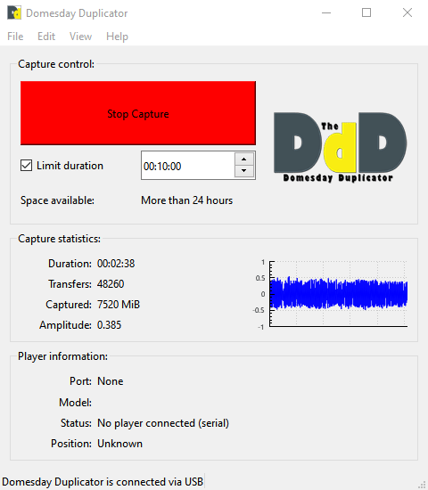

# Domesday Duplicator (DdD)

Please see the [Project Documentation](https://simoninns.github.io/DomesdayDuplicator-docs) for details of the project and for access to the project documentation.

For contributing guidelines, see [CONTRIBUTING.md](CONTRIBUTING.md).


The Domesday Duplicator is a LaserDisc capture focused, USB 3.0 based DAQ capable of 40 million samples per second acquisition of analogue RF data at 10-bits resolution.

Capture is via a easy to use GUI capture application.



# Cloning the DomesdayDuplicator GitHub

The Domesday Duplicator project uses git sub-modules to cleanly separate the distinct parts of the project:

- DomesdayDuplicator → system / integration
- DomesdayDuplicator-hardware → PCB / KiCad / fabrication
- DomesdayDuplicator-firmware → FPGA / GPIF / USB3
- DomesdayDuplicator-gui-app → GUI / Host USB

To clone this repo and all the sub-modules use the following command:

```
git clone --recursive git@github.com:simoninns/DomesdayDuplicator.git
```

# The Decode Family 

The samples the DdD capture can be used with the whole family of decoders that make the FM RF Archival workflow ready to use today.

The original design was for the wide bandwidth of LaserDisc RF - making it suitable for all of the more bandwidth restricted mediums too (that have a single stream of RF).

[Please see the documentation for more details](https://simoninns.github.io/DomesdayDuplicator-docs/Related-Projects/The-ld-decode-Family.html)

# 3D Printed Case 

The DomesDay Duplicator also has a [3D models](https://github.com/simoninns/DomesdayDuplicator-Case) and ready to use STL files for producing 3D printed cases, to protect from dust or line with copper tape for affordable EMI shielding for example.


## Authors

Domesday Duplicator was written & designed by [Simon Inns](https://github.com/simoninns).

Additional documentation supplied by [Harry Munday](https://github.com/harrypm). 


## Licences

- [Software License - (Creative Commons BY-SA 4.0)](https://github.com/simoninns/DomesdayDuplicator/blob/master/LICENSE)
- [Hardware License - (GPLv3)](https://creativecommons.org/licenses/by-sa/4.0/)
