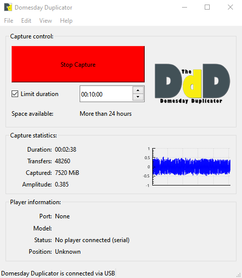
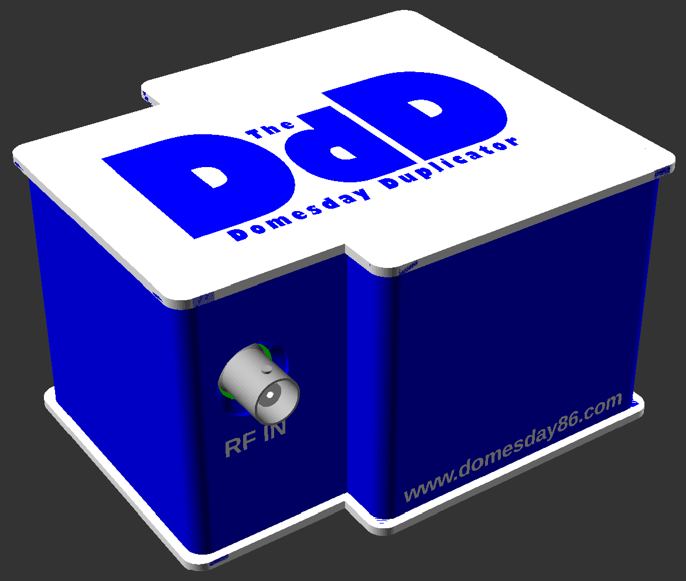

# Domesday Duplicator (DdD)

Please see the [Project Documentation](https://simoninns.github.io/domesdayduplicator) for details of the project and for access to the project documentation.

For contributing guidelines, see [CONTRIBUTING.md](CONTRIBUTING.md).


The Domesday Duplicator is a LaserDisc capture focused, USB 3.0 based DAQ capable of 40 million samples per second acquisition of analogue RF data at 10-bits resolution.

Capture is via a easy to use GUI capture application.



# Cloning the DomesdayDuplicator GitHub

Everything is in this one repository. There are no git submodules, so a plain clone gives
you the complete project:

```
git clone https://github.com/simoninns/DomesdayDuplicator.git
```

The project was previously split across five repositories
(`DomesdayDuplicator-hardware`, `-firmware`, `-gui-app` and `-gui-docs`). Their history has
been imported here, and **this repository is now the only place to work** — changes pushed
to the old repositories will not reach the project.

## Repository layout

| Directory | Contents |
| --- | --- |
| [hardware/](hardware/) | KiCad design for the custom DdD board, plus hardware documentation |
| [fpga/](fpga/) | Verilog gateware for the Terasic DE0-NANO (Cyclone IV) |
| [fx3/firmware/](fx3/firmware/) | Cypress FX3 USB 3.0 controller firmware |
| [fx3/programmer/](fx3/programmer/) | Host-side tool for programming the FX3 |
| [fx3/sdk/](fx3/sdk/) | Vendored Cypress FX3 SDK the firmware builds against |
| [gui/](gui/) | Qt 6 capture application, and the Flatpak/DMG/MSI packaging under `gui/packaging/` |
| [docs/](docs/) | Source of the project documentation website |
| [nix/](nix/) | The single flake's shared helpers, default dev shell, NixOS module and whole-tree checks |
| [tools/](tools/) | Repository-wide scripts, run both by hand and by the checks |

# Building it yourself

**If you only want to use a Domesday Duplicator, you do not need any of this.** The capture
application ships as a Flatpak, a macOS DMG and a Windows MSI on the
[releases page](https://github.com/simoninns/DomesdayDuplicator/releases), and the
[installation pages](https://simoninns.github.io/domesdayduplicator/capture-application/)
cover each one. What follows is for developing the project.

Every component builds two ways, and **neither is second class**: with ordinary distribution
packages, or with the Nix flake. Nix is never required — no build here may be made Nix-only —
but it is the reproducible route, and it is what CI uses, so a Nix build failing is a real
failure rather than an environment quirk.

| Component | Native | Nix |
| --- | --- | --- |
| Capture application | `cmake -B gui/build -S gui && cmake --build gui/build` | `nix build .#gui` · `nix develop .#gui` |
| FX3 firmware | `cmake -B fx3/firmware/build -S fx3/firmware -DCMAKE_TOOLCHAIN_FILE=../arm-none-eabi-toolchain.cmake && cmake --build fx3/firmware/build` | `nix build .#fx3-firmware` · `nix develop .#fx3` |
| FX3 programmer | `cmake -B fx3/programmer/build -S fx3/programmer && cmake --build fx3/programmer/build` | `nix build .#fx3-programmer` · `nix develop .#fx3` |
| FPGA gateware | `./fpga/build-local.sh` (needs Quartus Prime Lite) | `nix build .#bitstream` · `nix develop .#fpga-quartus` |
| Documentation site | `mkdocs build -f docs/mkdocs.yml` | `nix build .#docs-site` · `nix develop .#docs` |
| PCB | Open `hardware/pcb/` in KiCad | `nix develop .#hardware` |

The toolchain each native build expects — Qt 6, libusb, libFLAC, `arm-none-eabi-gcc`,
Quartus, MkDocs — is listed with per-distribution install lines in the component's own
`README.md` and in [gui/BUILD.md](gui/BUILD.md). A `nix develop` shell supplies all of it
already.

Two Nix outputs have no native equivalent, and both are worth knowing:

```
nix develop                          # every component's tools in one shell
nix flake check                      # build everything and run the whole T1–T4 test suite
```

**Run any of these from anywhere in the working tree.** There is exactly one `flake.nix`, at
the repository root, and exactly one `flake.lock`; Nix walks up to find them, so `.#gui`
resolves identically from `gui/` and from the root. Components deliberately carry no flake of
their own: an earlier layout gave each one a thin flake for the `cd gui && nix develop`
shorthand, and every one of those resolved `nixos-unstable` into a lock file of its own — so
entering the tree through a component quietly got a different nixpkgs from the root pin. The
reasoning is in the header comment of [flake.nix](flake.nix).

Two caveats on the FPGA row. Quartus Prime Lite is unfree, `x86_64-linux` only and cannot be
served from a binary cache, so `nix build .#bitstream` means a multi-gigabyte first download
and is excluded from `nix flake check` — the per-commit tier must never require an unfree
download of anyone. It *is* built by CI, in a workflow of its own that runs on gateware
changes and from release tags, so every released bitstream is CI-built from the tagged commit
([release pipeline](https://simoninns.github.io/domesdayduplicator/development/release-pipeline/)).
`nix develop .#fpga` — without `-quartus` — gives the free tools instead: Verilog lint,
simulation and a language server, with no Quartus at all, and that covers most gateware work.

Build directories are `build/` under each component and are gitignored. Never build in-tree:
in the gateware's project directories in particular, Quartus rewrites the tracked `.qsf` on
every compile.

[AGENTS.md](AGENTS.md) records the project conventions and [TESTING.md](TESTING.md) the test
tiers, including the hardware-in-the-loop capture-integrity procedure that is the most
important test in the project.

# The Decode Family 

The samples the DdD capture can be used with the whole family of decoders that make the FM RF Archival workflow ready to use today.

The original design was for the wide bandwidth of LaserDisc RF - making it suitable for all of the more bandwidth restricted mediums too (that have a single stream of RF).

[Please see the documentation for more details](https://simoninns.github.io/domesdayduplicator/related-projects/the-ld-decode-family/)

# 3D Printed Case 

The DomesDay Duplicator also has a [3D models](https://github.com/simoninns/DomesdayDuplicator-Case) and ready to use STL files for producing 3D printed cases, to protect from dust or line with copper tape for affordable EMI shielding for example.



## Authors

Domesday Duplicator is designed and maintained by [Simon Inns](https://github.com/simoninns).

## Licences

- [Software Licence — GPLv3](LICENSE)
- [Hardware Licence — Creative Commons BY-SA 4.0](https://creativecommons.org/licenses/by-sa/4.0/)
  (full text in [hardware/pcb/LICENSE.txt](hardware/pcb/LICENSE.txt))
