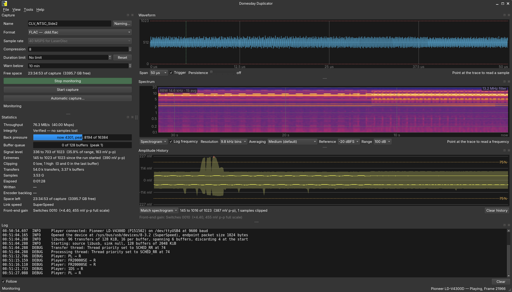

# Domesday Duplicator (DdD)

The Domesday Duplicator is a LaserDisc capture focused, USB 3.0 based DAQ capable of 40
million samples per second acquisition of analogue RF data at 10-bits resolution.

Please see the [Project Documentation](https://simoninns.github.io/DomesdayDuplicator/) for
details of the project and for access to the project documentation. For contributing
guidelines, see [CONTRIBUTING.md](CONTRIBUTING.md).


## The capture application

Capture is via an easy to use GUI capture application, with real-time signal analysis —
waveform, spectrum analyser and spectrogram, amplitude history and live capture statistics —
so you can see the RF while it is being sampled rather than after the fact.



The application also drives a Pioneer LaserDisc player over serial, runs whole-disc automatic
captures, and updates the Duplicator's own firmware and gateware over USB. The
[Capture Application documentation](https://simoninns.github.io/DomesdayDuplicator/capture-gui/)
covers every panel.

## Installing — no compilation required

**There is absolutely no need to compile anything.** All end-user installs must be performed
using the provided binary packages and firmware images. Building from source is a development
activity only, and nothing you need as a user requires it.

### The capture application

Download from the [releases page](https://github.com/simoninns/DomesdayDuplicator/releases)
and follow the installation page for your platform:

| Platform | Package | Installation |
| --- | --- | --- |
| Linux | `DomesdayDuplicator-<version>.flatpak` | [Linux (Flatpak)](https://simoninns.github.io/DomesdayDuplicator/capture-gui/install-flatpak/) |
| macOS | `DomesdayDuplicator-<version>-macos-arm64.dmg` | [macOS (DMG)](https://simoninns.github.io/DomesdayDuplicator/capture-gui/install-dmg/) |
| Windows | `DomesdayDuplicator-<version>-windows-x64.msi` | [Windows (MSI)](https://simoninns.github.io/DomesdayDuplicator/capture-gui/install-msi/) |

Every release also carries `SHA256SUMS` and a `PROVENANCE.txt` recording the commit each
asset was built from. Verify your download against `SHA256SUMS`.

### Firmware and gateware

You do not build these either. Firmware releases publish a single signed update bundle,
`domesday-duplicator-update-<version>.dddfw`, and the capture application installs it for you:
**Tools → Firmware → Update firmware…**. The application verifies the bundle's signature and
every payload digest before it writes anything, and reports the version it reads back off the
live device afterwards. See
[Updating your Domesday Duplicator](https://simoninns.github.io/DomesdayDuplicator/capture-gui/updating-your-domesday-duplicator/).

A board that has never been programmed is handled the same way, with no jumper and no shell —
see [Bringing up a new or legacy board](https://simoninns.github.io/DomesdayDuplicator/capture-gui/bringing-up-a-board/).
Firmware releases also publish the raw images (`firmware.img`, the provisioning `.jic` and the
factory `.svf`) for bench recovery, but the bundle is the supported route.

Every released artefact is built by CI from the tagged commit; nothing is built on a
maintainer's machine or attached by hand
([release pipeline](https://simoninns.github.io/DomesdayDuplicator/development/release-pipeline/)).

## Cloning the repository

Everything is in this one repository. There are no git submodules, so a plain clone gives
you the complete project:

```
git clone https://github.com/simoninns/DomesdayDuplicator.git
```

### Repository layout

| Directory | Contents |
| --- | --- |
| [hardware/](hardware/) | KiCad design for the custom DdD board, plus hardware documentation |
| [fpga/](fpga/) | Verilog gateware for the Terasic DE0-NANO (Cyclone IV) |
| [fx3/firmware/](fx3/firmware/) | Cypress FX3 USB 3.0 controller firmware |
| [fx3/programmer/](fx3/programmer/) | Host-side tool for programming the FX3 |
| [fx3/mkimage/](fx3/mkimage/) | `fx3-mkimage`, the project's own ELF-to-boot-image tool |
| [fx3/sdk/](fx3/sdk/) | Vendored Cypress FX3 SDK the firmware builds against |
| [ddd-gui/](ddd-gui/) | Qt 6 capture application, and the Flatpak/DMG/MSI packaging under `ddd-gui/packaging/` |
| [docs/](docs/) | Source of the project documentation website |
| [docs-vendor/](docs-vendor/) | Transcribed vendor service documentation for supported players |
| [nix/](nix/) | The single flake's shared helpers, default dev shell, NixOS module and whole-tree checks |
| [tools/](tools/) | Repository-wide scripts, run both by hand and by the checks |

## Developing the project

**Do NOT install from source unless you intend to develop the software** — see
[Installing](#installing--no-compilation-required) above for user installations.

### Nix on Linux is the only supported environment

**The only supported development and build environment is Nix on Linux.** There is exactly one
`flake.nix`, at the repository root, and exactly one `flake.lock`; every toolchain the project
needs is pinned by it, and CI builds through the same flake, so a build that fails under Nix
is a real failure rather than an environment quirk.

**Pull requests that introduce another development or build environment will not be accepted.**
That includes alternative build systems, per-distribution dependency lists, and packaging
intended to make a component build without Nix. If you develop on macOS or Windows, use a
Linux virtual machine — that is the supported route, and it is the only one.

### Building

Run any of these from anywhere in the working tree; Nix walks up to find the flake at the
root, so `.#ddd-gui` resolves identically from `ddd-gui/` and from the repository root.

| Component | Build | Development shell |
| --- | --- | --- |
| Capture application | `nix build .#ddd-gui` | `nix develop .#ddd-gui` |
| FX3 firmware | `nix build .#fx3-firmware` | `nix develop .#fx3` |
| FX3 programmer | `nix build .#fx3-programmer` | `nix develop .#fx3` |
| FX3 boot-image tool | `nix build .#fx3-mkimage` | `nix develop .#fx3` |
| FPGA gateware | `nix build .#bitstream` | `nix develop .#fpga` · `nix develop .#fpga-quartus` |
| Documentation site | `nix build .#docs-site` | `nix develop .#docs` |
| PCB | — | `nix develop .#hardware` |

```
nix develop                          # every component's tools in one shell
nix flake check                      # build everything and run the whole T1–T4 test suite
```

The capture application installs three binaries: `ddd-gui`, plus `ddd-update` and `ddd-jtag`,
which drive the same engine from a shell.

Components deliberately carry no flake of their own: an earlier layout gave each one a thin
flake for the `cd ddd-gui && nix develop` shorthand, and every one of those resolved
`nixos-unstable` into a lock file of its own — so entering the tree through a component quietly
got a different nixpkgs from the root pin. The reasoning is in the header comment of
[flake.nix](flake.nix).

Two caveats on the FPGA row. Quartus Prime Lite is unfree, `x86_64-linux` only and cannot be
served from a binary cache, so `nix build .#bitstream` means a multi-gigabyte first download
and is excluded from `nix flake check` — the per-commit tier must never require an unfree
download of anyone. It *is* built by CI, in a workflow of its own that runs on gateware
changes and from release tags, so every released bitstream is CI-built from the tagged commit.
`nix develop .#fpga` — without `-quartus` — gives the free tools instead: Verilog lint,
simulation and a language server, with no Quartus at all, and that covers most gateware work.

Build directories are `build/` under each component and are gitignored. Never build in-tree:
in the gateware's project directories in particular, Quartus rewrites the tracked `.qsf` on
every compile.

On NixOS, device permissions come from the flake's module — set
`hardware.domesdayDuplicator.enable = true;`, which covers the Duplicator, the FX3 and the
on-board USB-Blaster together. Elsewhere, see
[Linux device access](https://simoninns.github.io/DomesdayDuplicator/development/hardware-programming/linux-device-access/).

[AGENTS.md](AGENTS.md) records the project conventions and [TESTING.md](TESTING.md) the test
tiers, including the hardware-in-the-loop capture-integrity procedure that is the most
important test in the project.

## The Decode Family

The samples the DdD captures can be used with the whole family of decoders that make the FM RF
archival workflow ready to use today.

The original design was for the wide bandwidth of LaserDisc RF — making it suitable for all of
the more bandwidth restricted mediums too (that have a single stream of RF).

[Please see the documentation for more details](https://simoninns.github.io/DomesdayDuplicator/general/overview/)

## 3D Printed Case

The Domesday Duplicator also has [3D models](https://github.com/simoninns/DomesdayDuplicator-Case)
and ready to use STL files for producing 3D printed cases, to protect from dust or line with
copper tape for affordable EMI shielding for example.


## Authors

Domesday Duplicator is designed and maintained by [Simon Inns](https://github.com/simoninns).

## Licences

- [Software Licence — GPLv3](LICENSE)
- [Hardware Licence — Creative Commons BY-SA 4.0](https://creativecommons.org/licenses/by-sa/4.0/)
  (full text in [hardware/pcb/LICENSE.txt](hardware/pcb/LICENSE.txt))
