# LD-V4400 Level I & III Documentation

*For Manual and Computer Control*

Pioneer LD-V4400 Industrial LaserDisc Player — User's Manual and Programmer's
Reference Guide, covering Level I (manual control) and Level III (computer control).

Pioneer New Media Technologies, Inc. · Pioneer Technical Publication TP 116 v1.1 · 9/93

## 1. Introduction

Please refer first to the Operating Instructions, packaged with the LD-V4400, for essential information about player operation and safety.

### 1.1 Scope

This manual is a reference guide to assist programmers and developers in using the Pioneer Industrial Laser Videodisc Player, Model LD-V4400. It contains information for basic Level I direct player control using the front panel buttons, the remote control unit (RU-V103), or a Pioneer Barcode Reader (UC-V108BC, UC-V109BC, or the discontinued UC-V104BC) and technical information to assist programmers in the design and development of Level III program applications to run under computer control.

The LD-V4400 includes the following features:

- Digital audio and analog audio playback.
- External sync, with loop-through for syncing multiple players together.
- Two video output jacks, one BNC jack, and one RCA jack, for playback on two monitors simultaneously.
- A slot for an optional add-on LD-ROM board (Model #UK-V112).
- RS-232C interface, compatible with the Pioneer LD-V8000, CLD-V2400, CLD-V2600, LD-V2200, and the LD-V4200 (discontinued), LC-V330 Autochanger, the LD-V4100 (PAL player), and the LD-V4300 (Dual Standard NTSC/PAL player).
- Built-in LaserBarcode 2 capability.
- Optional wireless/wired remote control.
- Fully automatic disc loading system.
- Software controlled On-Screen Function Switches, similar to the LD-V8000.
- One second average search time after initialization (CAV), six seconds (CLV).

All Pioneer Industrial Laser Videodisc Players, Models LD-V4400, LD-V8000, CLD-V2400, CLD-V2600, LD-V2200, and the LD-V2000, can be used as stand-alone systems. When connected to a television and/or video monitor, they become self-contained interactive audio-video retrieval and display systems for Level I use. They may also be connected to and controlled by an external computer for Level III applications, often working in conjunction with computer databases.

How to control the LD-V4400 as part of a Level I or Level III delivery system is the main focus of this manual.

### 1.2 Player Control Methods

The LD-V4400 player can be used for any operations under Level I or Level III control. The LD-V4400 does not have built in Level II capability. The three control methods commonly referred to in the industry are:

- Level I — Manual Control using a Remote Control Unit (RU-V103), using a Pioneer Barcode Reader, such as the UC-V108BC or the UC-V1109BC, or using the player's Front Panel Buttons.
- Level II — Internal Program Control by loading Level II programs into a Level II compatible player's memory. Usually the programs are specially encoded onto a Level II videodisc.
- Level III — External Computer Control by sending commands from an external computer to the player via the RS-232C serial interface.

Levels I, II and III describe the delivery platforms for interactive videodisc applications:

- A Level I system consists of a videodisc player and a monitor. It is controlled by using a remote control unit or a Laserbarcode Reader or the front panel buttons on the player. Level I is used mainly for playing videodiscs continuously, for simple searches, for searching to and stepping through a specific series of still frames, or for playing discrete motion video segments.
- Level II systems are comprised of various hardware configurations. A Level II system usually consist of only a videodisc player with a programmable memory, such as the LD-V8000, a monitor and a remote control unit. However, Level II systems can include additional hardware such as a touch screen, printer, etc.. In Level II, these systems are controlled by loading a Level II program into the memory of the player from a program specially encoded Level II videodisc, or by sending ASCII-Hex commands to the player's memory from the remote control unit or via the RS-232C interface from an external computer. The LD-V4400 videodisc player does not support Level II applications by itself.

For more information on Level II, refer to Pioneer's LD-V8000 Level II User's Manual/ Programmer's Reference Guide, TP 114 v.1.1 8/92, available through Pioneer Communications of America, Inc., Multimedia Systems Division, Engineering/Technical Support, 201-327-6400.

- A Level III system generally consists of an LD player, a monitor and a computer. The system is controlled by the computer. This is a complex interactive system allowing access to computer data as well as access to audio-video material on the videodisc.

See Figures 1-A, 1-B, 1-C, on pages 1-3 through 1-5 for diagrams of Level I and Level III hardware configurations using the LD-V4400.

#### Controlling the LD-V4400 Videodisc Player

- Level I — Manual Control
  Player is controlled using a Remote Control, Barcode Reader or Front Panel Buttons
- Level III — Computer Control
  Commands to control the player are sent via RS-232C from a computer or external controller

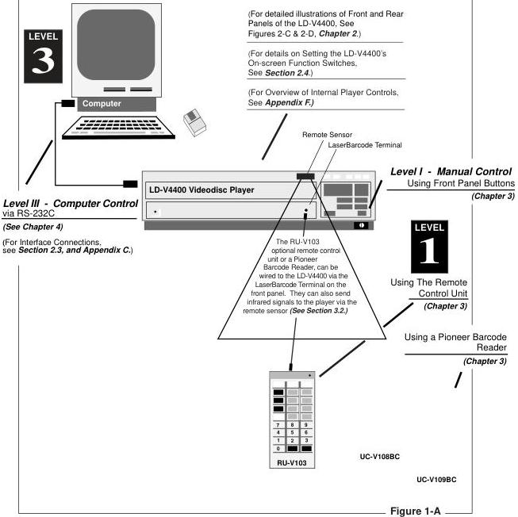

#### Level I — Manual Control

In Level I, the player is controlled by using Remote Control Buttons on the RU-V103, by scanning Standard LaserBarcodes, or by using the Front Panel Buttons. Manual Control (Level I) allows simple control of the videodisc player using such commands as Play, Stop, Still, Step Forward, etc.

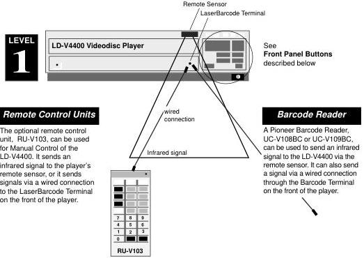

UC-V108BC

UC-V109BC

OPEN /CLOSE

Opens and closes disc drawer.

DISPLAY

Turns on-screen display ON / OFF. (Also used with Power-ON button to set On-Screen Function Switches.)

POWER ON/OFF

Powers the player ON / OFF.

PLAY

Spins-up & plays videodisc.

STILL/STEP

Forward & Reverse

Holds a still frame on CAV, Pauses on CLV, and steps forward or back one frame at a time.

SCAN

Forward & Reverse

Moves rapidly forward or backward through video material on a disc.

LD-V4400D Front Panel Buttons

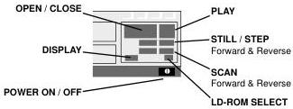

*Figure 1-B*

PAL/NTSC Select

Selects video format, if no disc is loaded.

For information about using the Front Panel Buttons, the Remote Control Unit (RU-V103) or a Barcode Reader (UC-V108BC or UC-V109BC) for Manual Control (Level I Control) of the LD-V4400, see Chapter 3.

#### Level III — External Computer Control

Level III programs are used to control the videodisc player from an external computer attached to the player's RS-232C port. The player's Level III mnemonic command set is used to develop interactive programs for the LD-V4400. (See Appendix A for the list of mnemonic commands available on the LD-V4400.) Level III mnemonic commands are also used to control the LD-V8000, CLD-V2600, CLD-V2400, LD-V2200, and the discontinued LD-V4200, (NTSC players), the LD-V4300D & CLD-V2300D (NTSC/PAL players) the LD-V4100 (PAL player). (See Pioneer Technical Bulletin #143A for a comparison chart, showing the Mnemonic Commands available on Pioneer NTSC industrial videodisc players.) Level III is often used when a program designer wants users to access a large database from a computer, along with video and audio material on a videodisc. Level III requires that a computer be connected to every videodisc player. A file server may be used to network the computers at the various workstations.

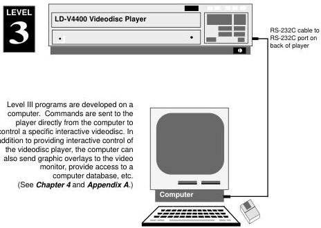

*Figure 1-C*

For detailed information about Computer Control of the LD-V4400, see Chapter 4 and Appendix A of this manual.

### 1.3 Chapter Highlights

This manual provides:

- An overview of player operating processes.
- How to customize player functions by using On-Screen Function Switches and On-Screen Status Displays.
- Specific information about Manual and Computer control.

It is divided into chapters providing the following information:

#### Chapter One — Introduction

This chapter describes the scope and overview of the Pioneer LD-V4400 Level I and III User's Manual and explains how information is organized. It also defines Level I, II, III as they relate to three different hardware configurations, and illustrates Level I and III configurations for the LD-V4400.

#### Chapter Two — Operational Basics

This chapter gives an overview of the player's internal operating processes, describing Operating Modes and Active States, and the front panel indicators. It also describes player interfaces: The infrared sensor, used to receive infrared LaserBarcode and remote control signals; the LaserBarcode terminal, used to receive wired LaserBarcode and remote control signals; and the RS-232C serial interface.

There are also illustrations of the front and rear panels of the player that include the external sync, the two video outputs and the two audio output channels.

There is a section describing the player's On-Screen Function Switches. As on the LD-V8000, function switches of the LD-V4400 are set On-Screen, rather than with DIP switches. On-Screen Status Displays are also described.

#### Chapter Three — Manual Control — Level I

This chapter describes the player's front panel buttons, the remote control buttons on the RU-V103, and Pioneer Barcode Readers. All of these can be used for Level I control of the LD-V4400.

#### Chapter Four — External Computer Control — Level III

This chapter explains how commands are sent to the LD-V4400 from an external computer, what error messages may be returned, the default settings, a basic list of Level III commands and descriptions of each command.

Commands are described by categories: Player Control Commands, Player Control Switch Commands, Display Control Commands, Request Commands, Video Memory Commands, Communication Control Commands, Register Control Commands, and Input/Output Device Commands.

For additional information see the attached Appendices:

- **Appendix A** Level III commands on the LD-V4400
- **Appendix B** LD-V4400 Remote Control Unit — *RU-V103*
- **Appendix C** LD-V4400 Interface Cable Specifications
- **Appendix D** LaserBarcode 2 Standard Commands; LB2 & LB Logos
- **Appendix E** Using the Pioneer Barcode Readers —
  *UC-V108BC, UC-V109BC*
- **Appendix F** LD-V4400 Internal Player Controls

Further questions should be referred to:

**Pioneer New Media Technologies, Inc.**
Pioneer New Media Technologies, Inc.
Technical Support & System Integration
2265 E. 220th St.
Long Beach, CA 90810

310-952-2111
FAX: 310-952-3031

## 2. Operational Basics

This chapter provides an overview of the player's internal operations — Operating Modes and the player's Active States; diagrams of the player's front and rear panels; a description of the player's Front Panel Indicators, Player Interfaces, On-Screen Function Switches and details about each specific switch. Before developing or presenting programs on the LD-V4400, the user should read this chapter and become familiar with the introductory concepts, illustrations and operational basics. (See Appendix F, LD-V4400 Internal Player Controls, for more details.)

### 2.1 Internal Operations

The player's internal operating processes are classified into two groups: Operating Modes indicating player operation status, and Active States indicating player processing status.

#### 2.1.1 Operating Modes

The LD-V4400 has the following three Operating Modes: Normal Control Mode; Function Switch Setting Mode; Test Mode

These modes are defined as follows:

1) Normal Control Mode

When the LD-V4400 player power is turned on, the player enters Normal Control Mode. In this mode, the player can be controlled by pressing buttons on the front panel of the player, by pressing buttons on the remote control unit, by sending commands via a Pioneer Barcode Reader, or by sending commands from a computer via the RS-232C connector.

2) Function Switch Setting Mode

The player enters Function Switch Setting Mode when the LD-V4400 player is powered-on while simultaneously pressing the front panel DISPLAY button. In this mode, function switch parameters are confirmed or modified. See Section 2.4 On-Screen Function Switches for details.

3) Test Mode

The Test Mode is used for player maintenance and management. This mode is used primarily by Authorized Service Company (ASC) personnel to determine key part numbers of the player and to service the player. Generally, the player is not controlled in this mode. Select or deselect Test Mode from page - 2 of the on-screen function switch settings. (See Section 2.4 On-Screen Function Switches for details.) Or turn ON (1) bit 7 of Register C via computer control to make the LD-V4400 enter this mode. Turn OFF (0) bit 7 of Register C to change the operating mode from Test Mode to Normal Control Mode.

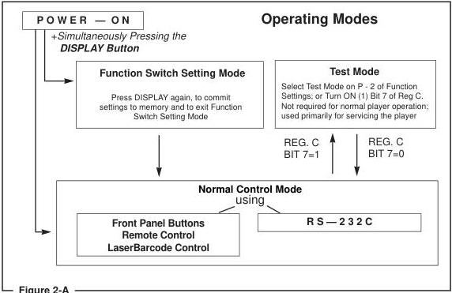

#### 2.1.2 Active States

LD-V4400 processing is performed within several distinct Active States. When a command is executed, the Active State changes inside the player. If you consider player processing as a series of events within the Active States listed below, it is easier to understand the effects of various commands. The Player's five main Active States are:

- Door Open
- Park
- Spin-up
- Random Access
- Spin-down

The player is in Door Open before the disc is loaded into the drawer. After the door is closed, the player enters Park. When a START or PLAY command is input while the player is in Park, the disc starts rotating and the player enters Spin-up. When the player is ready to play images, it enters Random Access. Random Access is further divided into Play, Still, Scan, Pause, Multi-Speed, and Search.

When a REJECT command is received, the player enters Spin-down Mode. Image playback stops immediately, and disc rotation is gradually stopped, then the player enters Park. The Figure 2-B, below, describes how the active states change within the player.

Transitions Between Active States

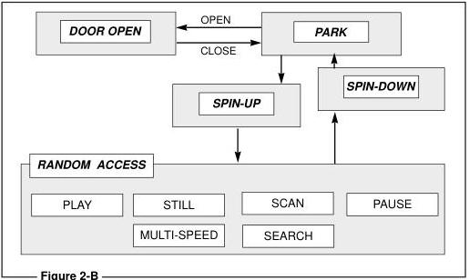

### 2.2 Player Indicators

The LD-V4400 has seven indicator lights on the front panel. This section explains these indicators. (See diagram of LD-V4400's Front Panel, Figure 2-C, on page 2-5.)

#### Power Indicator (red)

The Power Indicator lights up when the player power is turned on.

LD-ROM Indicator (green) — Without the optional LD-ROM board #UK-V112) installed, this indicator does not light up. With the optional LD-ROM board installed, this indicator blinks when the player is in LD ROM Mode. It stops blinking and is not lit after the player terminates the LD-ROM mode.

Busy Indicator (green) — With the optional LD-ROM board installed, this light blinks when the player enters LD-ROM mode, until it is ready to receive SCSI commands. It also blinks during communications via SCSI and when the player exits LD-ROM mode and returns to park. Without the optional LD-ROM board installed, this light functions as an RS-232C indicator, blinking when signals are transferred via RS-232C.

**Park Indicator (green)** — The Park Indicator lights up if a disc has been placed in the disc tray and the player is in *Park*. It blinks while the player door is opening or closing. If no disc is in the tray, this indicator is not lit.

**Play Indicator (green)** — The Play Indicator lights up when the player is in *Random Access Mode* and a search is not being executed. It blinks when the the player is in *Setup* or *Reject Mode*, or when the lead-in or lead-out area is reached.

**Search Indicator (green)** — The Search Indicator lights up only when the player is searching.

**Key Lock Indicator (red)** — The Key Lock Indicator lights up if a command has been sent to the player to lock out the front panel control buttons, preventing them from being used during execution of a Level III program.

### 2.3 Interfaces

This Chapter explains the LD-V4400's interfaces that allow control signals to be received by the player:

- The *remote sensor* receives infrared signals from the RU-V103 remote control unit or a Pioneer Barcode Reader. (See *Section 2.3.1*, page 2-6, or details.)
- The *LaserBarcode terminal* receives signals from a wired connection to either the remote control unit or a Pioneer Barcode Reader. (See *Section 2.3.1*, page 2-6, for details.)
- The *RS-232C port* receives signals from an external computer via the appropriate RS-232 cable. (See *Section 2.3.2*, page 2-8; also see *Appendix C, Interface Cable Specifications*.)

(Please refer to diagrams of the Front and Rear Views of the player **Figures 2-C** and **Figure 2-D** on page 2-5 to locate each interface.)

#### LD-V4400 — Front Panel View

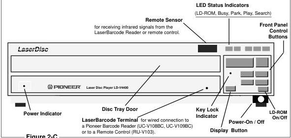

*Figure 2-C*

#### LD-V4400 — Rear Panel View

EXT SYNC Termination Selector Use this switch to select the signal input to the EXT SYNC IN: 75 Ω termination within the player (ON position) or looped through (OFF position). When using EXT SYNC IN only, set to ON. When looped through to daisy chain players using EXT SYNC OUT, set to OFF. Make sure the final player in the chain is set to ON. NOTE: External synchronization is possible only during CAV disc playback. Use an NTSC sync generator with compatible specifications; jitter and noise in the external sync signal may cause the player to operate improperly. Establish sync before the player is powered-on or before it finishes Set Up Mode. Error will occur if the composite sync signal enters the EXT SYNC IN after playback has started, or if the input to the EXT SYNC is interrupted during playback.

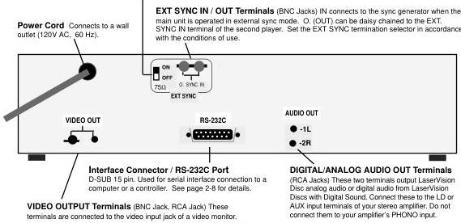

*Figure 2-D*

#### 2.3.1 Remote Sensor and the LaserBarcode Terminal

The remote sensor receives input via infrared signal and the LaserBarcode terminal receives input via a wired connection. Both the remote sensor and the LaserBarcode terminal can receive signals from either a Pioneer Barcode Reader or from the remote control unit (RU-V103). Both barcode and remote control commands are transmitted in serial data streams. NOTE: The infrared sensor and the LaserBarcode Terminal cannot be used simultaneously.

The remote sensor receives the RCU signals on a 48-KHz carrier, removes the carrier, shapes the waveform, and outputs the shaped waveform. See Figure 2-E.

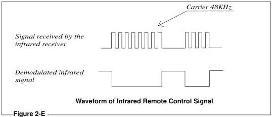

A stereo or mono mini-plug (Figure 2-F) can be used to input a signal to the LaserBarcode terminal, when a wired connection from the remote control unit or the LaserBarcode Reader is made. The RU-V103* remote control can be used with a cable that has a stereo mini-plug on each end, while the barcode readers are packaged with a wire that has a stereo mini-plug on the end that connects to the reader and a mono mini-plug on the end that connects to the player. RCU or Pioneer Barcode Reader signals transmitted via cable are input in the shape of the waveform shown in Figure 2-G, on the next page.

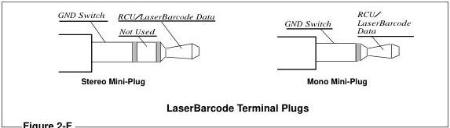

* The RU-V103 remote control unit is not packaged with a cable to connect to the LaserBarcode Terminal.

Signal carried by wired
connection from RCU or
LaserBarcode Reader

*Figure 2-G*

Waveform of Wired Remote Control Signal

The Ground Switch connection is used to make either the remote sensor or the
LaserBarcode terminal active. The LaserBarcode terminal becomes active when the
signal is low (or is closed). The remote sensor becomes active when the signal is
high (or is open).

RCU input is decoded by the RCU Decoder. See Figure 2-H and Appendix F,
LD-V4400 Internal Player Controls for details; page F-4 for Control Block Diagram.

The RCU Decoder interprets both commands and responses from an input device.
Note: The player's RCU decoder cannot simultaneously decode signals received via
remote sensor and LaserBarcode Terminal.

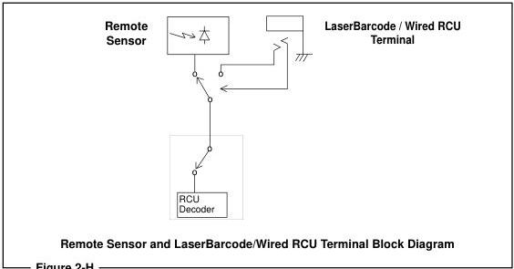

#### 2.3.2 RS-232C Interface Connector

The LD-V4400 can be controlled by a computer connected to the RS-232C port on the back of the player. This section gives specific information about: 1.) The RS-232C Connector; 2.) The pin outs of the Serial Interface; 3.) Signal Characteristics; 4.) Connection to a computer.

##### 1) The RS-232C Connector:

15-pin D-SUB connector, female, on the player.

15-pin D-SUB connector, male, on the cable.

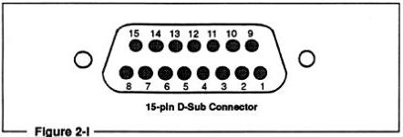

##### 2) Serial Interface Pin Outs

|  Pin # | Terminal | Input/Output | Level  |
| --- | --- | --- | --- |
|  1 | GND |  |   |
|  2 | TXD | OUTPUT | RS-232C  |
|  3 | RXD | INPUT | RS-232C  |
|  4 | DTR | OUTPUT | +10V PULLUP  |
|  5 | No Connection |  |   |
|  6 | Play Back V Sync | OUTPUT | TTL  |
|  7 | Playback H Sync | OUTPUT | TTL  |
|  8 | No Connection |  |   |
|  9 | TXD | OUTPUT | TTL  |
|  10 | RXD | INPUT | TTL  |
|  11 | GND |  |   |
|  12 | CH 2 (Non-DOC) | OUTPUT |   |
|  13 | AUX 1 | OUTPUT | TTL*  |
|  14 | AUX 2 | OUTPUT | TTL*  |
|  15 | GND |  |   |

*Figure 2-J*

* Internally pulled high to 5v when not used.

##### 2) The Serial Interface (cont.)

###### The Signal Level

RS-232C or TTL levels can be used. The signal level for the RS-232C is ± 12v and the TTL levels are 0 to 5v, with 5v having a logic “1” value. Signals in both levels cannot be used or connected at the same time.

###### The Data type

Parity bit : No parity.

Data length : 8 bits.

Stop bit : 1 bit.

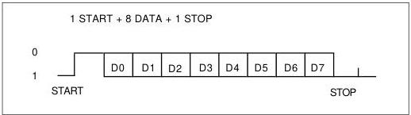

*Figure 2-K*

###### The Transmission speed

9600, 4800, or 1200 baud can be selected.

##### 3) Other Signal Output

###### The Signal Line

|  Pin # | Terminal | Input/Output | Level  |
| --- | --- | --- | --- |
|  11 | GND |  |   |
|  12 | CH 2 (Non-DOC*) | OUTPUT |   |
|  13 | AUX 1 | OUTPUT | TTL  |
|  14 | AUX 2 | OUTPUT | TTL  |
|  15 | GND |  |   |

*Figure 2-L*

* DOC = “Drop Out Compensated”

##### 3) Other Signal Input/Output (cont.)

###### The Signal Level

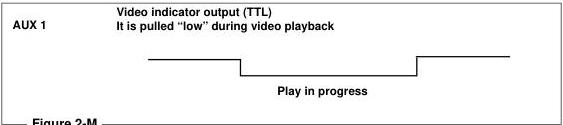

AUX 1 is pulled low only during playback or in still mode. It is not valid during a squelch, or search. During these operations it is off, or pulled high.

AUX 2 is an alternate output (TTL) and is pulled "high" to 5v when not in use.

##### 4) Connection to a Computer

The LD-V4400 player is connected to a computer via the RS-232C port as shown below. It is connected with three lines allowing commands to be sent from the computer to the player to control operations.

The player does not use hardware handshaking. Therefore, control or "handshaking" lines other than TxD and RxD are not required, even if the computer provides them.

Some computers, however, may require hardware handshaking. The player makes a line available to be used, as needed, by the computer. The DTR signal is always pulled high internally, within the LD-V4400.

The player is connected to the RS-232C port of the computer as follows:

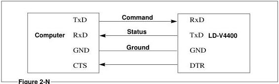

See Appendix C for specific interface cable pin configurations to use to connect various computers to the LD-V4400.

### 2.4 On-Screen Function Switches

The LD-V4400 videodisc player contains no physical dip-switches for setting various function parameters. Instead, the function parameters can be set by controlling on-screen menus with the buttons on the front panel of the player, or with buttons on an RU-V103 remote control unit.

NOTE: Some settings can be modified by entering data into Registers from a computer via the RS-232C port. (See Section 4.7.6 Register Control Commands, page 4-39.)

#### 2.4.1 Setting On-Screen Function Switches

Use the following steps to set the on-screen function switches:

##### 1) Function Switch Setting Mode

First, turn the player OFF using the power button on the front of the player. Then press the DISPLAY button on the front panel of the player while turning the power back ON. This sets the Function Switch Setting Mode and prepares the player to receive inputs to set the on-screen function switches. (In Function Switch Setting Mode, the LD-V4400's front panel LEDs cycle ON and OFF.) You will see a screen titled "KEY OPERATION P-0." This on-screen "page" explains which buttons on the front panel of the player allow you to locate, select and set the function switches. (See Figure 2-0, on page 2-13.)

##### 2) Setting Switches Using The Player's Front Panel Buttons or Remote Control Page Selection

By pressing the SCAN FORWARD button you can move forward through each of the five pages, one at a time. The SCAN REVERSE button lets you move through the pages in reverse order. Page 1 is titled "CONTENTS P-1." This tells you the particular page on which to find the function you want to set.

###### Selecting Functions and Parameters

When you locate the page that contains the function you want, press the STEP FORWARD button. This will highlight the top function on the page. Press the STEP FORWARD button until the function you want to set is highlighted. Pressing the STEP REVERSE button will toggle through the available options/parameters for that particular function, allowing you to select the one you want.

###### Modifying the Settings

Continue through additional pages (P-2 and P-3) to set the switches to your required "power on" settings. Page P-4 contains a summary of the seven bit settings for both switches. The diagram reflects parameters selected in the previous pages. The bits can also be selected by using the Step Forward button on the front panel or on the RCU, and set using the Step Reverse button. Digits 4,5,6 on the remote control can also be used to select the bits.

###### Initialization and Exiting Switch Setting Mode

When all the switches have been set, press DISPLAY. This does two things. It saves the settings you have selected to the player's non-volatile memory and it exits Function Switch Setting Mode, returning the player to Normal Control Mode. NOTE: Turning OFF the player before the DISPLAY button is pressed will ignore any changes made and the player will maintain previously selected and initialized settings.

Pressing the OPEN/CLOSE button in Function Switch Setting Mode returns all settings to their original factory default settings as follows:

|  Side Repeat | OFF | Test Mode | OFF  |
| --- | --- | --- | --- |
|  Load Start | OFF | Baud Rate | 4800  |
|  Power-On Start | OFF | TXD Terminator | <CR>  |
|  Squelch | BLUE |  |   |

##### 3) Setting the Baud Rate Using The Player's Front Panel Buttons

Enter Function Switch Setting Mode by pressing Power-ON and the DISPLAY button simultaneously. Press SCAN FORWARD to move through the on-screen "pages" to page three. The top of page three reads "RS-232C Switch P-3". You will see the following functions listed:

* BAUD RATE (4800 is the default setting; other options are 9600 and 1200.)
* TxD TERMINATOR (<CR> is the default; <CR> <LF> is another option.)

Press the STEP FORWARD button to highlight the specific function you wish to change (ie. BAUD RATE). Then press the STEP REVERSE button to toggle through and select the correct setting, as indicated by software you may be using with the player. Press the DISPLAY button to commit the settings to the player's memory and to exit Function Switch Setting Mode, returning the Player to Normal Control Mode.

Follow the steps described in Sub-Point 2 (Setting Switches) of this section to change the settings of any of the On-Screen Function Switches included on Pages P-2, P-3 or P-4. See also Figure 2-P on page 2-14; and page 2-16.

##### 4) Functions Listed on each On-Screen "Page"

Here is a short explanation of each of the terms you will find listed on each on-screen "page" while in Function Switch Setting Mode:

NOTE: In the descriptions of the On-Screen Menus for pages 2 - 4 that follow, the options for each function list the factory-set default first. If, at any time while in Function Switch Setting Mode you want to return to the player's default settings, press the OPEN/CLOSE button on the front panel of the player or press the REJECT Button on the remote control. The parameters will "default" to those listed first in the following descriptions.

##### ON-SCREEN FUNCTION SWITCHES & THEIR FACTORY SETTINGS

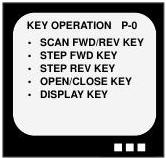

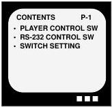

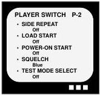

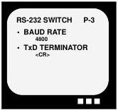

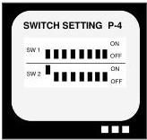

*Figure 2-O*

NOTE: How to set these switches, a description of each function, and the available parameters or options for each function are detailed in Sec 2.4, beginning on page 2-11 of this manual.

###### On Page Zero:

KEY OPERATION P-0

* SCAN FWD/REV KEY--- Moves forward or backward through the menu pages.
Select Page
* STEP FWD KEY--- Highlights the function with the parameter to be changed.
Select Item
* STEP REV KEY--- Toggles through the selectable options/parameters.
Select Parameter
* OPEN /CLOSE KEY--- Returns all settings to the default settings.
Initial Setting
* DISPLAY KEY--- Saves settings to memory and exits Function Switch Setting Mode.
Exit

See Figure 2-P below for descriptions of front panel buttons and RCU buttons used to move through the On-Screen Menus and to select functions and options:

Front Panel and RCU Button Functions

|  Front Panel Buttons | RCU Buttons | Function  |
| --- | --- | --- |
|  DISPLAY + Power-ON | — | Puts player into Function Switch Setting Mode  |
|  SCAN FWD | SCAN FWD | Moves forward through the menu pages  |
|  SCAN REV | SCAN REV | Moves backward through the menu pages  |
|  STEP FWD | STEP FWD or 6 | Moves forward through selectable items  |
|  * | 4 | Moves backward through selectable items or bits  |
|  * | 5 | Changes bit selection from SW 1 to SW2 on pg. 4  |
|  STEP REV | STEP REV | Toggles through selectable options/parameters  |
|  OPEN / CLOSE | REJECT | Returns all settings to the default settings  |
|  DISPLAY | DISPLAY | Saves settings to memory and exits Function Switch Setting Mode  |

*Figure 2-P*

* These two buttons facilitate moving the bit selection arrow through the bits for Switch One and Switch Two on page 4. There are no buttons on the front panel comparable to these. To move through the bits, using only the player's front panel buttons, use the Step Forward button.

###### On Page One:

CONTENTS P-1

* PLAYER CONTROL SW. (Switch)
P-2
* RS-232C CONTROL SW. (Switch)
P-3
* SWITCH SETTING
P-4

This page describes the “Contents” of the Function Switch Setting menus. It identifies the pages where function settings are listed for each general topic.

For example, the functions that determine Player Control are found on page 2.

###### On Page Two:

PLAYER CONTROL SW. P-2

* SIDE REPEAT --- When set to ON and the end of the videodisc is reached, the player automatically returns to the beginning of the disc and starts playing.
Off or On
* LOAD START --- When set to ON and a loaded disc tray is pushed in, playback starts automatically.
Off or On
* POWER-ON START --- When set to ON and Power is turned on, and there is a disc in the drawer, playback is started automatically.
Off or On
* SQUELCH --- Selects Blue or Black Squelch Screen seen during PAUSE, STOP or SEARCH
Blue Background
or Black Background
* TEST MODE SELECT --- This mode is usually left OFF. It is used by Service Center personnel when servicing the player.
Off or On

###### On Page Three:

RS-232C CONTROL SW. P-3

* BAUD RATE --- Sets the BAUD Rate.
4800, 1200 or 9600 BAUD
* TxD Terminator --- Establishes the terminator as either Carriage Return, or Carriage Return/Line Feed.
<CR> or <CR> <LF>

###### On Page Four:

SWITCH SETTING P-4

* Diagram of Switch Bank One and Switch Bank Two (See Figures 2-Q, R, S on next page.)

The Switch Setting diagram on Page 4 of the On-Screen Pages shows how all the other switches are set. To reach the Switch Setting diagram on Page 4, push the SCAN REV button once on the Front Panel or on the RCU, starting at Page 0. Or press SCAN FWD four times. Once you reach Page 4, you will see the Switch Setting diagram shown below. To select the bit you want to change, press STEP FORWARD. (Pressing STEP FORWARD 14 times will take you through all 14 bits of the two switches.) Pressing 4 on the RCU will move through the bits in reverse. To change the actual setting of a specific bit, press STEP REVERSE. The setting selected appears after the * and the state of the setting appears at the lower left of the menu page. For example, SIDE REPEAT OFF is selected below:

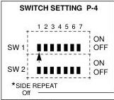

*Figure 2-Q*

The switch indicated by ▲ or ▼ can be changed.

The bit which is indicated by ▲ or ▼ is described by the * below.

This describes the state of the indicated bit.

###### How to select the Background Color bit of Switch 1:

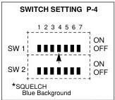

*Figure 2-R*

Select the Background Color bit 4 of switch 1, by pressing the STEP FORWARD button four times on the front panel of the player or on the RCU.

(To move the selection pointer backwards, you can press 4 on the RCU.)

###### How to select "Black" for the Background Color bit of Switch 1:

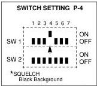

*Figure 2-S*

Once you have selected the Background Color bit, select BLACK Background by pressing the STEP REVERSE button on the front panel of the player or on the RCU.

(Toggle this bit of Switch 1 ON or OFF by pressing 5 on the RCU.)

#### 2.4.2 Specific Switch Settings

##### SWITCH BANK 1

This switch bank is set through the Function Switch Setting Mode and the settings are stored in Register C.

This switch sets the following player operating characteristics:

|  Switch Number 1 Bit Position | Function | On (=1) | Off (=0) | Initial Value  |
| --- | --- | --- | --- | --- |
|  0 | Side Repeat | On | Off | Off  |
|  1 | Load Start | On | Off | Off  |
|  2 | Power On Start | On | Off | Off  |
|  3 | Not Used |  | Off | Off  |
|  4 | Back Color Select | Black | Blue | Off (Blue)  |
|  5 | Not Used |  | Off | Off  |
|  6 | Not Used |  | Off | Off  |
|  7 | Test Mode | On | Off | Off  |

*Figure 2-T*

The default settings of the above bits are 0 (reset).

Bit 0: When this bit is set to ON, the player repeats playing the disc from the beginning to the end. When set to OFF, the player automatically Parks the disc after one side is played.

Bit 1: When this bit is set to ON, the player starts to play a disc if one is loaded.

Bit 2: When this bit is set to ON, the player starts to play a disc once power is turned on and a disc is loaded.

Bit 3: This bit is not used; set to 0.

Bit 4: This bit is used to select the background color for squelch screens. ON selects Black, OFF selects Blue.

Bit 5: This bit is not used; set to 0.

Bit 6: This bit is not used; set to 0.

Bit 7: When this bit is set to ON, Test Mode is enabled. Test Mode is used for servicing the player and should always be set to OFF for normal operation.

##### SWITCH BANK 2

This switch bank is set through the Function Switch Setting Mode and the settings are stored in Register D.

This switch sets the player's serial interface characteristics as follows :

|  Switch Number 2 Bit Position | Function | On (=1) | Off (=0) | Initial Value  |
| --- | --- | --- | --- | --- |
|  0 | Baud Rate Switch 0 | See Figure 2-X, below | See Figure 2-X, below | 01  |
|  1 | Baud Rate Switch 1 | See Figure 2-X, below | See Figure 2-X, below | 4800 bps  |
|  2 | Not Used | — | — | OFF  |
|  3 | Not Used | — | — | OFF  |
|  4 | Not Used | — | — | OFF  |
|  5 | Not Used | — | — | OFF  |
|  6 | TxD Terminator | <C/R> & <L/F> | <C/R> | OFF <CR>  |
|  7 | Not Used | — | — | OFF  |

*Figure 2-U*

Bit 0 & Bit 1: These bits set the player's serial interface communication speed as follows:

|  Switch 1 | Switch 0 | Baud Rate  |
| --- | --- | --- |
|  Off | Off | 9600 bps  |
|  Off | On | 4800 bps  |
|  On | Off | 1200 bps  |

*Figure 2-V*

Bit 2: This bit is not used; set to 0

Bit 3: This bit is not used; set to 0

Bit 4: This bit is not used; set to 0

Bit 5: This bit is not used; set to 0

Bit 6: This bit selects the termination code (& & & or & only).

Bit 7: This bit is not used; set to 0

### 2.5 On-Screen Status Displays in Manual Mode

The LD-V4400 displays messages on the monitor using its own internal character display. Display commands sent to the player by pressing the DISPLAY button on the remote control will cause the chapter and frame numbers (CAV discs) or chapter and time numbers (CLV discs) to be displayed in the upper left corner of the video monitor. NOTE: Chapter numbers will be displayed only if they have been encoded on the disc at the customer's request.

NOTE: The LD-V4400 can also access extended time numbers (hours, minutes, seconds and frame numbers) if these numbers have been encoded on a CLV disc.

Audio commands are sent to the player by pressing the AUDIO button on the RU-V103 remote control unit. The current audio status of the player is displayed in the upper right corner of the video monitor. Speed commands are sent to the player by pressing the remote control SPEED Buttons (Up or Down) on the RU-V103. The player's current speed setting is displayed in the upper right corner of the monitor.

The address flag the player uses to perform a search (Chapter, Frame, Time or Time number frame value) is established and displayed on the screen in Level I by pressing the Chapter/Frame Track/Time button on the remote control unit. These flags can be toggled through by pressing this button repeatedly.

#### 2.5.1 Chapter / Frame Number / Time Displays

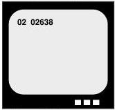

*Figure 2-W*

While playing a CAV disc, the player displays chapter and frame numbers as follows:

The two digit chapter number and five digit frame number are displayed on the top line of the monitor (display line 0) as in the example in Figure 2-W. The two digits indicating a chapter number are not displayed if chapter numbers have not been encoded on the disc.

While playing a CLV disc, the player displays chapters and time numbers as follows:

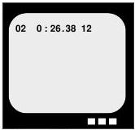

*Figure 2-X*

The two digit chapter and a five or seven digit time number are displayed on the top line (display line 0) in Figure 2-X. The two characters indicating a chapter number are not displayed if chapter numbers have not been encoded on the disc. The five digit time number (Hr. Min. Sec.) is displayed if the player is in Time Mode, and the seven digit extended time number (Hr. Min. Sec. Frame (1-30)) is displayed if the player is in Frame Mode.

A time number that indicates only the hour and minutes is displayed if the disc is not encoded with extended 24-bit code. (CLV discs pressed before the early 1980's may not have extended 24-bit code; discs pressed since then usually do.) Extended 24-bit code includes not only hours and minutes, but also seconds and frame numbers. It also has status information in it. (NOTE: The time number frame value will be displayed only if extended 24-bit code is encoded on the CLV disc and if the player has been set to Frame Mode.)

#### 2.5.2 Audio Status Display

Press the AUDIO button on the remote control unit to display the current audio output status on the two top display lines (display lines 0 and 1) in the upper right hand corner of the monitor. See Figure 2-Y and Figure 2-Z, below.

The first item, Digital or Analog, indicates whether audio output is to come from the analog or digital channels of the videodisc. Then, the following options available are: Stereo, 1/L, and 2/R and Audio Off. Digital, Analog and the options may be toggled through by pressing the AUDIO button repeatedly. Digital Stereo is the default setting, if digital audio is encoded on the disc.

|  Digital Stereo 1/L 2/R | Analog Stereo 1/L 2/R  |
| --- | --- |
|  Audio Off | Audio Off  |

*Figure 2-Y*

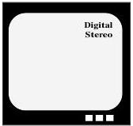

*Figure 2-Z*

#### 2.5.3 Speed Status Display

To set the playback speed of the player, press MULTI-SPEED SET ("Up" or "Down" on the RU-V103). The speed setting will be displayed in the upper right corner of the monitor on the first display line (display line 0). See the example below in Figure 2-A.1. The display in this example indicates the speed of the player in Multi-Speed will be 1/4 speed.

*Figure 2-A.1*

NOTE: Multi-Speed Set is not available on this player with CLV discs. If there is a CLV disc in the drawer when the MULTI-SPEED SET button is pressed, the letters CLV appear in the upper right hand corner of the monitor, and no speed change is set.

The table on the next page shows the speeds as they are displayed and corresponding speeds. (See Figure 2-B.1.)

|  Displayed Code | NTSC Speed Set  |   |
| --- | --- | --- |
|  x3 | 180 / 60 | 3x normal speed  |
|  x2 | 120 / 60 | 2x normal speed  |
|  x1 | 60 / 60 | normal speed  |
|  1 / 2 | 30 / 60 | 1/2 x normal speed  |
|  1 / 4 | 15 / 60 | 1/4 x normal speed  |
|  1 / 8 | 8 / 60 | 1/8 x normal speed  |
|  1 / 15 | 4 / 60 | 1/16 time normal speed  |
|  STEP 1 | 2 / 60 | 1 frame per second  |
|  STEP 2 | 1 / 60 | 1 frame every 2 seconds  |

*Figure 2-B.1*

#### 2.5.4 Arguments Displayed in Manual Mode

An "argument" displayed in Manual Mode is the numeric information preceding a search or play command that provides the player with the exact location (address) on the disc to search or play. It is displayed in the upper left corner of the video screen on the second display line (Line 1) after a search flag has been set by pressing the Chapter/Frame Track/Time button on the RCU, and after the numeric keys and then the SEARCH or PLAY button on the remote control are pressed (e.g. 1000 SEARCH).

The numbers are displayed according to the type of address flag that has been set: Chapter, Frame, or Time. (See Figure 2-E.1.) The LD-V4400 searches or plays to frame numbers on a CAV disc; to chapter numbers on a CAV or CLV disc that has chapters encoded on the disc; and to time numbers on a CLV disc or to extended time numbers on a CLV disc if seconds and frames are encoded on the disc.

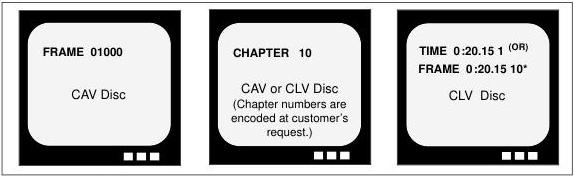

Figure 2-C.1 *NOTE: It is possible to do CLV Frame Accurate Searches on the LD-V4400, if extended time numbers are encoded on the disc, and if the Address Flag is set to FRAME Mode. The LD-V4400 plays immediately after completing the search; it cannot hold a CLV still frame.

#### 2.5.5 Address Flag Displayed in Manual Mode

To send the correct "address" to the player, indicating where it should search or play to, and to see the address accurately displayed on the video screen, the proper address flag must be set. On the RU-V103, the button labeled CHAP/FRAME TRACK/TIME is used to select the address flag (Chapter or Frame or Time number) before inputting the exact location to which the player will search or play. (For more information, see Section 3.2.2 #12 on page 3-12 & #13 on page 3-13.)

NOTE: The Frame/ Chapter /or Time number address flag must be set by sending the appropriate command, before a Search or Play command is sent from a computer. Neither the address flag, nor the characters of an address will be displayed on the video screen during a computer transmitted Search or Play. See Section 4.5 on page 4-7 for more information on Level III Command Formats; See Section 4.7 on page 4-11 for specific Level III Player Control Commands used to set the desired search flag.

NOTE: If address numbers are entered incorrectly in Manual Mode, press the CLEAR button to remove them, re-enter the numbers and then press SEARCH or PLAY.

#### 2.5.6 Repeat Mode Display

When the REPEAT button on the RU-V103 remote control is pressed, the player displays three repeat options: Auto Return, Repeat Side or Repeat Chapter. These may be toggled through by pressing the REPEAT button several times.

- When Auto Return is selected, the player will play through the video material* to the end of a disc. When it reaches the end, it will spin down the disc and enter Park Mode.
- When Repeat Side is selected, the player will play through the video material* to the end, then search to the beginning of the disc and play it again.
- Repeat Chapter is selected during playback of a particular chapter, the player will play through the end of the chapter*. When it reaches the chapter's end, it will search to the beginning of the chapter and play it again.

* If a picture stop is encountered during playback of a CAV disc, the player will stop and hold a still frame at that location and wait for the next motion command. Picture stops are often encoded on the first frame of a chapter but they also may be encoded at other locations.

#### 2.5.7 CLV Display

When a CLV disc is playing, the player cannot perform certain CAV special effects commands such as STILL/STEP or MULTI-SPEED SET or MULTI-SPEED. If these buttons are pressed on the remote control unit during CLV play, the letters CLV will appear on the upper right hand corner of the monitor, indicating that a CLV disc is playing and that certain commands (STILL/STEP FORWARD, MULTI-SPEED, etc.) are unavailable.

## 3. Manual Control — Level I

The LD-V4400 can be manually controlled by using the front panel buttons, by using the remote control unit RU-V103, or by using a Pioneer Barcode Reader.

### 3.1 Front Panel Buttons

Nine buttons are on the front of the player: POWER-ON; OPEN/CLOSE; PLAY; STILL/STEP (Forward and Reverse); SCAN (Forward and Reverse); and DISPLAY; and LD-ROM ON/OFF. This section describes how to use these buttons in Manual Mode for Level I control of the player. (Please refer to Section 2.4 On-Screen Function Switches on page 2-12 for information about using these front panel buttons in Function Switch Setting Mode.)

LD-V4400 Front Panel Buttons

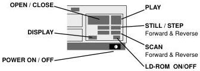

*Figure 3-A*

#### 3.1.1 OPEN/CLOSE

Function: Pressing this button opens or closes the disc tray door. If a disc is playing, pressing this button once spins down the disc, pressing it a second time opens the door and ejects the disc tray.

Explanation: The operation performed when the OPEN/CLOSE button is pressed depends on the active mode of the player.

In Spin-up or Random Access Mode

If the OPEN/CLOSE button is pressed when the player is in Spin-up or Random Access Mode, the active mode of the player changes to Spin-down Mode and the player enters Park when disc rotation stops.

In Spin-down Mode

If this button is pressed when the player is in Spin-down Mode, processing waits until the player enters Park. When the player enters Park, the door is opened.

In Park Mode or while door is closed

If this button is pressed when the player is in Park or while the door is closed, the player opens the door.

In Door Open Mode or while door is opened

If this button is pressed when the player is in Door Open Mode or while the door is opened, the player closes the door.

NOTE: To open the door when the player is in Random Access or Spin-up Mode, press the OPEN/CLOSE button twice.

#### 3.1.2 PLAY

**Function:** This button is used to start or resume playback of the video/audio material on the disc.

**Explanation:** Pressing this button has different effects, depending on the active mode of the player:

*In Door Open Mode or when door is opened*

If this button is pressed while the door is opening or when the door is open, the player closes the door. After the door is closed, the player enters *Park Mode* and then determines whether a disc is in the drawer. If there is no disc in the drawer, the player does nothing. If there is a disc in the drawer, it proceeds through the operations described in *Park Mode* below.

*In Park Mode*

In *Park Mode* the player determines whether or not there is a disc in the drawer. If there is no disc, the player does nothing. If there is a disc, the player enters *Setup Mode* and spins up the disc. When *Setup Mode* ends, the player enters *Random Access Mode* and begins playing the disc.

*In Random Access Mode (when player is not searching)*

The player starts or resumes playing the disc.

*While a search is in progress*

The player starts playing the disc after searching is completed.

#### 3.1.3 STEP FWD / REV

**Function:** Pressing this button makes the player step forward or reverse one frame at a time and then hold a still frame.

**Explanation:** This key is effective only in *Random Access Mode* with CAV discs. The effect of pressing this button differs depending when it is pressed. If this button is pressed while a CLV disc is playing, it will have no effect and the letters CLV will appear in the upper right corner of the monitor.

*If pressed during a search*

There is no effect, the player presents a still frame after the search is completed.

*If pressed during a still frame*

The player steps forward or reverse one frame at a time and then holds a still frame.

*If pressed during any other operation*

The player holds a still frame.

**NOTE:** During step and still frames, audio is squelched and not output.

#### 3.1.4 SCAN FWD / REV

Function: Pressing this button makes the player scan forward or reverse rapidly.

Explanation: The player scans as long as this button is pressed and audio is squelched during a scan. When the scan button is released, the player reverts to the mode it was in before scanning.

Note: If the player is in the process of searching to a target address when the SCAN button is pressed, the player continues and completes the search and ends in a still frame. Audio is squelched during scanning. The scanning speed of the player is about 40 times the normal speed.

#### 3.1.5 DISPLAY

Function: During normal player operation, pressing this button turns ON or OFF the on-screen display.

Explanation: The display may be toggled ON or OFF. If it is turned ON, the chapter, frame or time numbers, and characters generated by the user will be displayed on the monitor. The items displayed depend on the setting for Register A. The initial value of Register A is 3. This allows the chapter, frame and time numbers to be displayed. For more information on Register A, see page 4-39 of this manual. If the display is turned OFF, the items indicated by Register A will not be displayed.

NOTE: The On-Screen Audio Status Display and Speed Status Display are not affected by DISPLAY ON and OFF. These will continue to present information as described in Section 2.5 Status Displays in Manual Mode, page 2-20, whether DISPLAY is ON or OFF.

NOTE: The chapter, frame, and time numbers can be displayed only in Random Access Mode. If the power is turned on while the DISPLAY button is pressed, the player enters Function Switch Setting Mode. The player exits Function Switch Setting Mode when the DISPLAY button is pressed again. See Section 2.4 On-Screen Function Switches, page 2-12, for details about Function Switch Setting Mode.

#### 3.1.6 LD-ROM SELECT

Function: This button functions only if the optional LD-ROM card #UK-V112 is installed in the player. The LD-ROM card has four DIP Switches, accessible through a small door located on the top of the player. If Switch #1 is Up/On, the player automatically enters LD-ROM Mode when power is turned on and a disc is placed in the tray. If Switch #1 is Down/Off, the LD-ROM button on the front of the player is used to enable or disable LD-ROM Mode.

In LD-ROM Mode, the green LD-ROM indicator and the red BUSY indicator flash on and off and the LD-ROM disc spins up automatically when the player's door is closed. All of the front panel buttons except the OPEN/CLOSE button are locked. Also, RS-232C computer control is locked out.

When LD-ROM Mode is enabled, computer data can be retrieved from an LD-ROM disc via a SCSI connection and all control of the videodisc is done via SCSI commands.

NOTE: If LD-ROM Mode is disabled and an LD-ROM disc is placed in the player, it will revert to Manual Mode and play the disc as a LaserVision disc. If LD-ROM Mode is enabled and a non-LD-ROM disc is placed in the disc tray, the player will automatically cycle through LD-ROM Mode, then revert to Manual Mode.

Explanation: An LD-ROM disc can contain visual and audio information meeting the LaserVision Standard for CAV or CLV discs, as well as 270 megabytes (CAV) or 540 megabytes (CLV) of digital audio or computer data. For more information about LD-ROM see Pioneer's LD-ROM Technical Overview.

### 3.2 Remote Control

The LD-V4400 is not packaged with a remote control unit but a separate, optional remote control unit, the RU-V103, can be purchased and used with it. The RU-V103 is used to send commands to the player via an infrared signal. It can also be used with a stereo or mono mini-plug cable to provide a wired connection to the LaserBarcode Terminal on the front of the player. Note: A cable is not packaged with the RU-V103; although it includes a mini-plug jack, it is sold as a "wireless" remote.

#### 3.2.1 Remote Control RU-V103

The RU-V103 has easy-to-use functions and large flat keys. Its range of player control is limited to Level I, basic manual controls. It can also be used as an input device to select choices from within Level III program applications.

List of Remote Control Functions for Use with the LD-V4400

|   | Function | RU-V103 | Page #  |
| --- | --- | --- | --- |
|  1 | REJECT | ✓ | 3-6  |
|  2 | PAUSE | ✓ | 3-6  |
|  3 | PLAY | ✓ | 3-6  |
|  4 | REPEAT MODE | ✓ | 3-7  |
|  5 | STILL/STEP REV / FWD | ✓ | 3-9  |
|  6 | DISPLAY | ✓ | 3-9  |
|  7 | SCAN REV/ FWD | ✓ | 3-9  |
|  8 | AUDIO | ✓ | 3-10  |
|  9 | SPEED DOWN/UP | ✓ | 3-11  |
|  10 | CLEAR | ✓ | 3-11  |
|  11 | MULTI REV/FWD | ✓ | 3-12  |
|  12 | SEARCH | ✓ | 3-12  |
|  13 | CHAPTER / FRAME TRACK / TIME | ✓ | 3-13  |

*Figure 3-B*

##### RU-V103 Remote Control:

##### LEVEL I CONTROL

REJECT: Ceases playback and spins-down the disc.

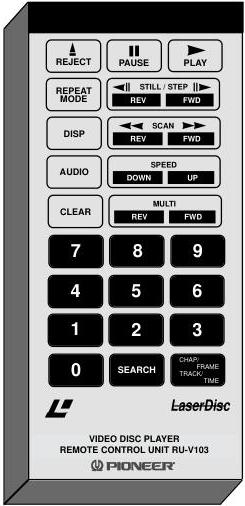

*Figure 3-C*

PAUSE: Ceases playback and displays a squelch screen. Press any motion button to resume.

PLAY: Begins playing a disc, or resumes play.

REPEAT MODE: This button can be pressed to set auto-return, side repeat, or chapter repeat may be selected while a specific chapter is playing.

STILL / STEP (FWD / REVERSE): Press either of these buttons to produce a still video image (CAV). Additional presses of the STEP FWD button moves the image forward one frame at a time. STEP REV moves the image in reverse one frame at a time.

DISP: Displays or removes the display of current chapter/frame/or time numbers on the screen.

SCAN (FWD / REVERSE): Press either of these buttons to move quickly forward or backward through the program material on a disc. Rapid scanning continues as long as the button is depressed.

AUDIO: Press this button to select audio output: Digital Stereo, Digital 1/L, Digital 2/R, Audio OFF, Analog Stereo, Analog 1/L, Analog 2/R, Audio OFF.

SPEED (DOWN / UP): Press these buttons to set the speed at which multi-speed play will occur.

CLEAR: Press this button to CLEAR erroneous inputs or to stop a Search operation.

MULTI-SPEED (REV / FWD): Press this button to initiate Multi-Speed Play forward or reverse in the speed that has been set with the SPEED button. (CAV).

NUMERIC BUTTONS (0-9): Use these buttons to enter locations on the disc for searches. (eg. Enter 1000 SEARCH to move to a certain frame (CAV) or time (CLV) location on the disc.) Use the CHAP/FRAME TRACK/TIME button to set an "address flag", indicating chapter, frame number or time number. Digits 1-9 can also be used for viewer responses during Level III program execution. See Level III Command Input Number Wait (7N).

SEARCH: Specify the number to be searched to by using the digit buttons. Press the SEARCH button to execute. (First set the "address flag" using the CHAP/

See Section 3.2.2, page 3-4, for details about the use of each specific remote control button.

FRAME TRACK/TIME button.) After searching, the player presents a still frame on CAV discs or immediately plays on CLV discs.

CHAP / FRAME TRACK / TIME: Press this button to set the address flag, indicating how a search will be performed, either by chapter or frame number (CAV), or chapter or time number (CLV).

Note: The RU-V103 Remote Control Unit is not packaged with a cable for connection to the LBC Terminal on the front of the player. A stereo or mono mini-plug cable can be purchased separately, however, and used to provide the wired connection.

#### 3.2.2 Description of Each Remote Control Function

Each remote control unit button associated with a corresponding command that may be used to control the LD-V4400 is described below. See Figure 3-C on page 3-5 and Appendix B for descriptive illustrations of the RU-V103.

##### 1) REJECT

Function: Pressing this button is effective only when the player is in Spin Up or Random Access Mode. When this command is sent to the player, the active mode of the player is changed to Spin Down, processing waits until the spindle stops, and then the active mode is changed to Park.

NOTE: This button cannot be used to open or close the player's disc drawer; it is used to put the player into Park.

##### 2) PAUSE

Function: Pressing this button causes the player to cease playback temporarily.

Explanation: The player enters Pause Mode when the PAUSE button is pressed. In Pause Mode, video is squelched. Press PLAY or any other motion button to exit Pause Mode.

NOTE: The player does not exit Pause Mode if the PAUSE button is depressed again while in Pause Mode. (The PAUSE button does not toggle PAUSE ON and OFF.)

##### 3) PLAY

Function: Pressing this button starts the player and plays the videodisc.

Explanation: The operation performed when the PLAY button is pressed differs depending on the active mode of the player:

While the door is opening or when the door is open

If this button is pressed while the door is opening or when the door is open, the player closes the door. After the door is closed, the player enters Park Mode and then determines whether a disc is in the drawer. If there is no disc in the drawer, the player does nothing. If there is a disc in the drawer, it proceeds through the operations described in Park Mode below.

In Park Mode

In Park Mode the player determines whether or not there is a disc in the drawer. If there is no disc, the player does not operate. If there is a disc, the player enters Spin Up Mode and spins-up the disc. When Spin Up Mode ends, the player enters Random Access Mode and begins playing the disc.

In Random Mode (when search is not in progress)
The player starts playing the disc.

During a search
After the search ends, the player starts playing the disc.

NOTE: Audio is not squelched while the disc is playing. When the lead-out area is reached during normal play, the player automatically spins down the disc, enters Park Mode and waits for one of several specific instructions — to reject the disc (by pressing the OPEN/CLOSE button on the front of the player), to play the disc again (by pressing PLAY on the front of the player or on the remote control), or to turn off the player by pressing the Power-OFF button on the front of the player.

If the “Repeat Side” On-Screen Function has been set to ON, the player automatically searches to the beginning of the disc and plays it again when lead-out is encountered. When a PLAY command is sent to the player either from the remote control, from the front panel buttons, or from a computer, the player enters Random Access Mode.

##### 4) REPEAT MODE

Function: Use this button for automatic repeat playback of one side of a disc, to repeat a specific chapter of a disc, or to automatically return to the beginning of one side of a disc.

Explanation: When the REPEAT MODE button is pressed, the display will show the currently valid repeat mode. Press the REPEAT MODE button again to change and select the desired Repeat Mode in the following sequence:

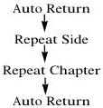

Note: The LD-V4400 defaults to Auto Return as the Repeat Mode at Power-ON.

Repeat Side: When the end of the disc is reached, the player will search to the beginning of the side and play it again.*

Repeat Chapter: When this mode is selected while a specific chapter is playing, the player will play to the end of the chapter, search to the beginning of the chapter and play it again.*

Auto Return: When this mode is selected, the player will play a disc to the end of one side, stop disc rotation and wait for the next motion command to spin up the disc and play it again.*

**NOTE:**

- The REPEAT MODE button functions only during playback.

- When using the RS-232C control, the REPEAT MODE button may not function, depending on the status of player operation.

- Repeat Chapter Mode is cancelled when a search command is sent to the player and executed. The player automatically switches to Repeat Side Mode.

- When the player is in Repeat Chapter Mode and the user sends commands under RS-232C control, the player automatically changes to Repeat Side Mode. When the RC command is used to set Register C, the player may be set to Auto Return.

- When MULTI-SPEED REVERSE playback is selected while the player is in Repeat Chapter Mode, the player will play backwards, at the speed indicated, to the beginning of the chapter and then will hold a still frame. When MULTI-SPEED FORWARD is selected in Repeat Chapter Mode, the player plays at the speed indicated to the end of the chapter, returns to the beginning of the chapter and immediately replays the chapter again in the speed that has been indicated.

Note: When the player searches to a chapter it will hold a still frame on a CAV disc. If Repeat Chapter is selected and there is no picture stop encoded on the disc, when the PLAY button is pressed, the player plays through the chapter, returns to the first frame of the chapter to be repeated, and immediately plays the chapter again. On a CLV disc, the player will search to the chapter and play it immediately. If Repeat Chapter is selected, the player will return to the first frame of the chapter and re-play it immediately, until another command is sent, or until the Repeat Mode is changed.

* If a picture stop is encoded on the CAV disc, the player will play to that frame, stop and hold a still frame, until it receives the next motion command. Picture Stops cannot be encoded on CLV discs.

##### 5) STILL/STEP FWD / REV

Function: Pressing this button makes the player step one frame forward or backward and present a still frame when a CAV disc is playing. Pressing this button has no effect when a CLV disc is playing, and the letters CLV appear in the upper right corner of the screen.

Explanation: This command is effective only when the player is in Random Access Mode. The result of sending this command differs, depending on the operation being performed when it is sent:

During a search

After the search, the player holds a still frame.

During a still operation

The player performs step forward or reverse then holds a still frame.

During any other operation

The player holds a still frame.

NOTE: Audio is squelched during step forward or step reverse. This command is ineffective when used with CLV discs.

##### 6) DISPLAY

Function: Pressing this button enables or disables the display of current chapter number and frame number (CAV discs) or the current chapter number and time code number (CLV discs). These numbers, indicating the current location on the disc, are displayed in the upper left corner of the monitor.

Explanation: The display may be toggled ON or OFF. If the display is turned ON, the chapter, frame or time numbers will be displayed on the monitor. If the display is turned OFF, these items will not be displayed.

##### 7) SCAN FWD / REV

Function: Pressing this button performs a rapid forward or reverse play.

Explanation: Pressing the SCAN FORWARD or REVERSE button is effective only when the player is in Random Access Mode. It is not effective if pressed during a search. The scan continues as long as the SCAN button is depressed. After the scan, the player enters the active mode it was in before scanning.

NOTE: Audio is squelched during scanning. The scanning speed of the player is about 40 times the normal speed.

##### 8) AUDIO

Function: Pressing this button sets the audio switches.

Explanation: The current audio set value is displayed when the audio button is pressed. Pressing this button successively will change the audio status display as shown below. The audio switch data is written into the Audio Control Register.

An NTSC disc may be encoded with digital and analog audio or with only analog audio. The on-screen displays show the outputs that are available depending on the audio that is encoded on the disc that is playing. See Figure 3-D, and Figure 3-E below. NOTE: See Section 2.5.2 Audio Status Display on page 2-21 for information about the relationship between audio status display and audio output.

NTSC Disc, encoded with both analog and digital audio:

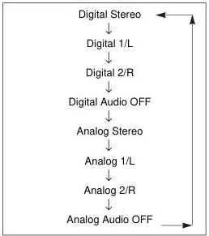

*Figure 3-D*

NTSC Disc encoded only with analog audio:

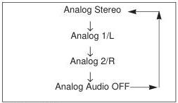

*Figure 3-E*

##### 9) SPEED SET DOWN / UP

Function: Pressing this button sets the speed for Multi-Speed play.

Explanation: This command sets the speeds listed below. If the button is pressed once, the current set speed is displayed on the screen. Keep pressing the Fast or Slow button to select a faster or slower speed until the desired speed is displayed. The speed is set when the speed data is written in the Speed Register. (See Figure 3-F, below, for speed settings.)

|  SPEED SETTING |   | Code Displayed on Monitor | Speed (x normal speed)  |
| --- | --- | --- | --- |
|  UP | DOWN  |   |   |
|  — | ↓ | x3 | 3 x normal speed  |
|  ↑ | ↓ | x2 | 2 x normal speed  |
|  ↑ | ↓ | x1 | normal speed *  |
|  ↑ | ↓ | 1 / 2 | 1/2 x normal speed  |
|  ↑ | ↓ | 1 / 4 | 1/4 x normal speed  |
|  ↑ | ↓ | 1 / 8 | 1/8 x normal speed  |
|  ↑ | ↓ | 1 / 16 | 1/16 x normal speed  |
|  ↑ | ↓ | STEP 1 | 1 frame per second  |
|  ↑ | — | STEP 2 | 1 frame per two seconds  |

*Figure 3-F*

*Normal Speed is 30 frames per second.

##### 10) CLEAR

Function: Pressing CLEAR will clear an argument input from the remote control unit or stop a search operation.

Explanation: When the CLEAR button is pressed while an argument is being input, all arguments are cleared and the displayed arguments are removed from the screen. If this button is pressed during a search, the search is stopped and the player presents a still screen (CAV) or pauses (CLV).

##### 11) MULTI SPEED FWD / REV

**Function:** Pressing this button plays the disc forward or reverse at a speed determined by first using the SPEED SET button.

**Explanation:** This command is effective only when the player is in *Random Access Mode* when a CAV disc is being played. If this button is pressed while a CLV disc is playing, it will have no effect and the letters CLV will appear in the upper right corner of the screen. The player plays forward or reverse at the speed set by using the SPEED DOWN/UP button, if a search is not in progress. If the MULTI SPEED command is sent while a search is in progress, the player completes the search and immediately starts playing the CAV disc at the speed and in the direction indicated.

**NOTE:** Audio is squelched and not output during a multi-speed play. This command is ineffective on CLV discs.

##### 12) SEARCH

**Function:** Pressing this button instructs the player to search for the address specified by the argument. When the search is completed, the player displays a still frame, if a CAV disc is being used. It immediately plays after the Search is completed, if a CLV disc is being used.

**Explanation:** This command searches for the address specified by the argument. Unless a button is pressed during the search, the player holds a still frame (on a CAV disc) when the search is completed. If the CLEAR button is pressed during a search, the player stops the search when the CLEAR command is received and holds a still frame (CAV) or plays (CLV). If the REJECT button is pressed during a search, the player stops the search and enters *Spin-down Mode*. If the PLAY or MULTI-SPEED button is pressed, the player continues the search, then starts to play or starts a multi-speed play after the search (CAV). A search is executed when a search address is written into the Search Register. The player then compares the current address with the address in the Search Register and moves the pickup at high speed until the difference between the search address and the current address becomes zero.

**NOTE:** If an argument is set to a chapter number larger than the ones stored on the disc, the player searches to the beginning of the chapter with the largest chapter number. If the argument is set to a frame number larger than the ones stored on the disc, the player searches to the final frame number encoded on the disc.

If the argument is set to a time number or an extended time number larger than the ones stored on a CLV disc, the player searches to the highest time or extended time number on the disc. The Player must be in *Frame Mode* to access an extended time number, which includes Hrs. Min. Sec. and Frame number.

##### 13) CHAPTER / FRAME TRACK / TIME

Function: Use this button to set the RCU address specification flag to a frame number, chapter number, time code or extended time code number

Explanation: The RCU address specification flag is displayed when this button is pressed. The address flag changes from one mode to another, as shown below, when this button is pressed successively, depending on what format disc is playing (CAV or CLV), and what type of information has been encoded on the disc:

###### CAV discs

CAV discs encoded with chapters

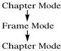

CAV discs without chapters

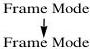

###### CLV discs

CLV discs encoded with chapters and time numbers, including seconds

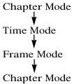

CLV discs encoded with chapters and time numbers but not seconds

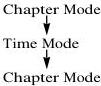

###### CLV discs (cont.)

CLV discs encoded with time numbers, including seconds, but not chapters

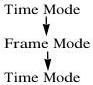

CLV discs encoded with time numbers, but without seconds and without chapters

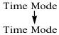

(Refer to Section 2.5.5 Search Flag Displayed in Manual Mode, page 2-23.)

### 3.3 Barcode Control

Barcode control provides a simple method of quickly retrieving specific frames or video/audio segments from a videodisc. By scanning a LaserBarcode with a Pioneer Barcode Reader (UC-V108BC, UC-V109BC, or the discontinued UC-V104BC) and sending the code to the LD-V4400 player via a wired connection or via infrared signal, the indicated frame or segment will appear on the video monitor.

NOTE: All current Pioneer industrial videodisc players support the original LaserBarcode standard commands. As of August 1, 1992 the LaserBarcode Association officially revised the LaserBarcode standard. This new standard, the LaserBarcode 2 Standard (LB2), has also been adopted by Pioneer. It includes all of the barcode functions available within the original LaserBarcode standard command set and provides "extended commands" for time searches and time segment plays on CLV discs, slow motion playback on CAV discs, and access to digital audio.

All production units of the LD-V4400, CLD-V2400 and CLD-V2600 players are LB2 compatible. LD-V8000 players above serial #ME3912276 are LB2 compatible. An EPROM Upgrade kit is available to provide LB2 compatibility to older LD-V8000 players. Discontinued LD-V4200 players with LBA/15, discontinued LD-V2000 players, and LD-V2200 players are LB-only compatible.

#### 3.3.2 LaserBarcode 2 Standard Commands

Appendix D, LaserBarcode 2 Commands and Logos, provides a list of commands that comprise the LB2 Standard. Notice, the list is divided into “Original Commands” and “Extended Commands”. LB2 includes all of the original LaserBarcode standard commands and 15 new LB2 “extended commands”: 12 new independent commands, one additional search command and two new segment play commands.

#### 3.3.3 Creating LaserBarcodes

Bar’n’Coder 3.0, Hypercard Barcode Printing Software for the Macintosh, can be used to create LaserBarcode 2 extended commands and original LaserBarcode commands. Barkoder for Windows v2.0 is a software package used to create LaserBarcodes on an IBM PC or compatible running DOS 3.0 and Windows 3.1 or above. LaserDisc Controller v3.1 is available for IBM PC and compatible machines running DOS 3.0 or above, without Windows. All three barcode creation software packages are available through Authorized Pioneer Dealers.

The LaserBarcode Association strongly recommends that all extended LB2 barcodes include a subscript 2 next to the barcode. Barcode creation software sold by Pioneer follows this recommendation: LB2 extended barcodes have a subscript 2 next to them. These LB2 extended commands must be played on LB2 compatible players. They will not play on LB-only compatible machines such as the discontinued LD-V4200 with a LaserBarcode Adapter/15, the LD-V2000, or on the LD-V2200 player. See Appendix D, LaserBarcode 2 Commands and Logos, for sample LB and LB2 barcodes. Notice the subscript 2 next to the LB2 barcodes.

#### 3.3.4 The LaserBarcode Logos

Developers and publishers of barcode applications should pay particular attention to the LaserBarcode and LaserBarcode 2 extended command sets and their respective logos. When creating applications that are intended to work with all LaserBarcode (LB) compatible players, developers and publishers must use only the original LaserBarcode standard command set. When creating barcode applications to work with LB2 compatible players, developers and publishers can use original LB barcodes as well as LB2 extended commands.

NOTE: LaserBarcode standard commands are a sub-set of the LaserBarcode 2 Standard. Applications using only original LaserBarcode standard commands will play on all LB compatible players and on all LB2 compatible players. If, however, an application uses LB2 extended commands (distinguished by the subscript 2 next to the code), the LB2 extended commands will not play on LB-only compatible players.

The symbols below indicate that an application bearing it supports the LaserBarcode standard command set or the LaserBarcode 2 standard command set as established by the LaserBarcode Association. These symbol may be used only on applications that adhere to the LaserBarcode or LaserBarcode 2 standards. Customers look for these logos to assure the application can be used with their particular player that is LB or LB2 compatible.

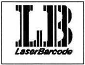

*Figure 3-H*

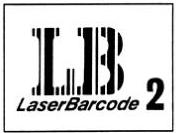

*Figure 3-I*

NOTE: Contact Pioneer New Media Technologies, Inc. Multimedia Systems Division, Engineering/Technical Support, 201/327-6400, for more information on the LaserBarcode System and for information on licensing the LaserBarcode logos.

#### 3.3.5 Pioneer Barcode Readers

All Pioneer Barcode readers, the UC-V108BC, the UC-V109BC, and the discontinued UC-V104BC can be used to scan and send LB2 "original" and "extended" commands to the LD-V4400. For details about current Pioneer readers, see Appendix E, Using Pioneer Barcode Readers.

## 4. External Computer Control — Level III

This chapter describes the computer control protocol and specific commands used for Level III control of the LD-V4400. To attach a computer to the LD-V4400 via the player's RS-232 port, refer to Appendix C, Interface Cable Specifications. See Section 2.4 On-Screen Function Switches, page 2-12, to select Baud Rate, etc.

### 4.1 Command and Status

In the LD-V4400 external computer control protocol, the computer transmits a command; when the player completes execution of the command, it returns an "R". ASCII character codes are used for the actual commands and status responses. The command mnemonic is expressed as two ASCII characters. In most cases, there is no distinction between the use of uppercase or lowercase letters, and the use of uppercase letters is recommended.

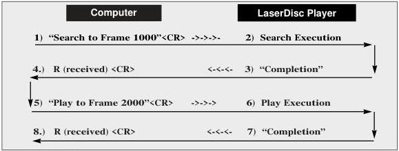

*Figure 4-A*

Arguments may be set to specify the frame number, speed or other values for a command. The argument is always placed before the command. The command is also used as the terminator of the argument. In the simplest protocol, the player immediately executes one command as soon as the terminator of the command line, a <CR> (carriage return), is received.

Example: 1000SE<CR> : Search to frame 1000.

The player has a command buffer that allows multiple commands to be sent from the external controller in the same command string.

Example: 1000SE 2000PL <CR> : Search to frame 1000, then play to frame 2000.

In this example, when the <CR> is received, commands are executed sequentially from the first command of the buffer. The "R" is returned to the computer after the play segment is completed. If a <CR> is sent before a command or command string has completed execution, the command is cleared and execution is cancelled. See Section 4.5, page 4-7 & 8 for more information about command formats.

In the command line, codes such as <SPACE> or <LF> (line feed) that do not affect player operation are ignored. The length of the command line is limited to the buffer size. For the LD-V4400, the length of a command string is limited to 20 characters. The <CR> or <LF> are not included in the buffer size.</LF></CR></LF></LF>

When all the commands in a string are completely executed, the player transmits the "completion" message. (It sends an "R" <CR>.) If an error occurs, an error message such as E04 <CR> is returned by the player. This indicates the error occurrence, along with the error code. See Sec. 4.2 Error Messages, page 4-3.

The automatic return of an "R" following command execution is called Automatic Status. Automatic Status is very useful when working with some computer programs, because it allows the program to know the appropriate time to send the next command. If this function is not used, the command processing time must be taken into consideration before the next command is sent. (To set Automatic Status ON or OFF, see the Level III command for Communication Control on page 4-38.)

#### 4.1.1 Request Status

When an error message is received, it may be necessary to determine the player's current status in order to continue a program. A variety of conditions can occur which may cause an error code to be sent. Since actual hardware failure in the player is a relatively rare event, other conditions may be detected which would allow a program to recover and continue operation. Even when there is no error, there are occasions when player status or disc information is useful. In such a case, the Request Status function can be used.

The user may want to find out the current frame number even if there is no error. Request Status commands can be useful under these conditions. Fifteen Request Status commands are available on the LD-V4400. The main Request Status commands in Level III are as follows:

1) To know the active mode of the player: ?P
2) To know the current frame, time, or chapter number: ?F, ?T, ?C

NOTE: These and additional Request commands are described in Section 4.7.4 on page 4-31 through Section 4.7.7 on page 4-47.

The status functions are summarized below:

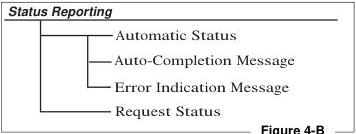

*Figure 4-B*

### 4.2 Error Messages

|  Code | Message | Meaning  |
| --- | --- | --- |
|  E00 | Communication error | Communication line error, framing error, buffer overflow error.  |
|  E04 | Feature not available | Non-usable function has been tried. The command mnemonic is wrong. A command specific to CAV or CLV is sent while the wrong type of disc is in the drawer. Standard User Code is not found on the disc.  |
|  E06 | Missing argument | Necessary parameter is not specified.  |
|  E11 | Disc is not loaded | There is no disc in the drawer.  |
|  E12 | Search error | Search or Stop Marker address cannot be found.  |
|  E13 | De-focusing error | Laser error: Unfocused  |
|  E15 | Picture stop | Playing has been stopped by a picture stop code.  |
|  E16 | Other device Input | The command(s) sent via the serial line were not executed before commands were sent from the front panel keys, and/or the RCU.  |
|  E99 | Panic | Unrecoverable error occurred. Disc cannot be loaded. Playing cannot be continued.  |

*Figure 4-C*

### 4.3 Initial Settings

The internal registers and switches are set to the following conditions when power is turned on. The settings are not re-initialized when the player is put into *Park* or *Door Open Mode*. Do not forget to set them to the parameters needed when creating an application program. Some of the switch settings can be set via Registers under computer control. For more information see *Section 4.7.6 Register Control Commands*, page 4-39, and *Section 2.4 On Screen Switch Settings*, page 2-11.

|  Register/Switch | Initial Setting | Status  |
| --- | --- | --- |
|  Key lock | 0 | Unlocked  |
|  Video switch | 1 | ON  |
|  Audio switch | 3 | Digital Stereo (If digital audio is encoded on the disc.)  |
|  Display switch | 0 | OFF  |
|  Address flag |  | Chapter (CAV & CLV)  |
|  Speed parameter | 60 | Normal (X1) speed  |
|  Communication Control | Mode 3 | Automatic Status  |
|  REG. A | 3 | Frame/Chapter display  |
|  REG. B | 0 | Normal squelch  |
|  REG. C - D |  | Set to the value of the On-Screen function switches.  |
|  AUX Port | 1: 2: | High High  |

*Figure 4-D*

### 4.4 List of Level III Commands

The following commands are available in Level III with the LD-V4400. The page number refers to the page that contains a detailed description and examples of how to use the specific command. NOTE: An address or argument contained in parentheses can be omitted.

|   | Command | Mnemonic | Page  |
| --- | --- | --- | --- |
|  1 | Door Open | OP | 4-11  |
|  2 | Door Close | CO | 4-11  |
|  3 | Reject | RJ | 4-12  |
|  4 | Start | SA | 4-12  |
|  5 | Play | (Address) PL | 4-13  |
|  6 | Pause | PA | 4-14  |
|  7 | Still | ST | 4-14  |
|  8 | Step Forward | SF | 4-15  |
|  9 | Step Reverse | SR | 4-15  |
|  10 | Scan Forward | NF | 4-15  |
|  11 | Scan Reverse | NR | 4-15  |
|  12 | Multi-Speed Forward | (Address) MF | 4-16  |
|  13 | Multi-Speed Reverse | (Address) MR | 4-16  |
|  14 | Speed Set | Integer SP | 4-17  |
|  15 | Search | Address SE | 4-18  |
|  16 | Multi-Track Jump Forward | Integer JF | 4-19  |
|  17 | Multi-Track Jump Reverse | Integer JR | 4-19  |
|  18 | Stop Marker | Address SM | 4-20  |
|  19 | Frame Set | FR | 4-21  |
|  20 | Time Set | TM | 4-22  |
|  21 | Chapter Set | CH | 4-22  |
|  22 | Clear | CL | 4-23  |
|  23 | Lead-Out Symbol | LO | 4-23  |
|  24 | Audio Control | Integer AD | 4-24  |
|  25 | Video Control | Integer VD | 4-26  |
|  26 | Key Lock | Integer KL | 4-27  |

*Figure 4-E*

List of commands continued on next page

List of Level III Commands for the LD-V4400 (continued)

|   | Command | Mnemonic | Page  |
| --- | --- | --- | --- |
|  27 | Display Control | Integer DS | 4-28  |
|  28 | Clear Screen | CS | 4-29  |
|  29 | Print Character | Integer PR | 4-30  |
|  30 | Frame Number Request | ?F | 4-31  |
|  31 | Time Code Request | ?T | 4-32  |
|  32 | Chapter Number Request | ?C | 4-32  |
|  33 | Player Active Mode Request | ?P | 4-33  |
|  34 | Disc Status Request | ?D | 4-34  |
|  35 | LDP Model Name Request | ?X | 4-34  |
|  36 | Pioneer User's Code Request (Disc ID) | ?U | 4-35  |
|  37 | Standard User's Code Request (Disc ID) | $Y | 4-36  |
|  38 | Television System Request | ?S | 4-37  |
|  39 | Communication Control | Integer CM | 4-38  |
|  40 | CCR Mode Request | ?M | 4-38  |
|  41 | Register A Set (Display) | Integer RA | 4-39  |
|  42 | Register B Set (Squelch Control) | Integer RB | 4-42  |
|  43 | Register C Set (Miscellaneous) | Integer RC | 4-43  |
|  44 | Register D Set (RS-232) | Integer RD | 4-44  |
|  45 | Register A Request (Display) | $A | 4-45  |
|  46 | Register B Request (Squelch Control) | $B | 4-45  |
|  47 | Register C Request (Miscellaneous) | $C | 4-46  |
|  48 | Register D Request (RS-232) | $D | 4-46  |
|  49 | Input Unit Request | #I | 4-47  |
|  50 | Input Number Wait | ?N | 4-47  |

*Figure 4-E (continued from previous page)*

### 4.5 Command Formats

Level III commands on the LD-V4400 are expressed as “Command Mnemonics”, so they are easy to remember. “Command Mnemonics” are also used for Level III control of the LD-V8000, CLD-V2600, CLD-V2400, LD-V2200, the LD-V4200 (a discontinued model), the LC-V330 Auto Changer. They are also used to control the LD-V4100 (PAL player), and the LD-V4300D (NTSC/PAL player) and the CLD-V2300D (NTSC/PAL player). Some commands are preceded by an “argument” that may indicate a specific “address” or an “integer”. See Technical Bulletin #143 for a comparison of commands available on each player sold in the United States.

**Command Mnemonic** — Each Level III command is expressed as two ASCII alphabetic characters, as the command mnemonic. There is no distinction between uppercase letters and lowercase letters.

*Example:* PL (Play); Pl (Play); pl (Play)

**Argument** — An argument is expressed in ASCII digits and it is placed before the command. When a command requiring an argument has no argument, an error occurs. An argument consists of one of the following:

1) **An Address** — The address can be a frame number, time number, extended time number or chapter number, depending how the address flag is set. When an address larger than the maximum allowable value is input, correct evaluation cannot be made. Addresses are expressed as frame, time, or chapter numbers:

|  FRAME MODE |   |
| --- | --- |
|  Frame number eg. 35756 | CAV: N1 N2 N3 N4 N5 minimum = 0 0 0 0 0 » maximum = 65535  |
|  Extended time number eg. 0:23:34.12 | CLV: N1 N2 N3 N4 N5 N6 N7 (N1=hour, N2 N3=minutes, N4 N5=seconds, N6 N7=frame) minimum = 0 0 0 0 0 0 0 » maximum = 9595929  |
|  TIME MODE |   |
|  Time number eg. 0:23:34 | CLV: N1 N2 N3 N4 N5 (N1=hour, N2 N3=minutes, N4 N5=seconds) minimum = 00000 » maximum = 95959  |
|  CHAPTER MODE |   |
|  Chapter number eg. 12 | CAV or CLV: N1 N2 minimum = 00 » maximum = 79  |

*Figure 4-F*

2) Integer — This indicates that the argument should be an integer number. The value is used to set a control register to some specified value or condition.
N1 N2 N3 N4 N5
minimum = 00000 » maximum = 65535

NOTE: The maximum value used to set a control register is 255. For details see Section 4.7.6 Register Control Commands, page 4-39. The maximum value for a Track Jump is 99999. See Level III Multi-Track Jump Forward and Reverse commands on page 4-19.

A Search command can accept up to the last frame number encoded on a disc. (Maximum number of frames on a CAV disc is 54,000.) If a frame number larger than the last frame number of a disc is entered, the player will search to the last frame encoded on the disc and hold a still frame. If an extended time code number is sent via Level III that is larger than the last time code frame encoded on a CLV disc, the player will search to the last one encoded on the disc and land in pause. See Search command on page 4-18.

3) (Address) or (Integer) — When an argument, an address or an integer, is indicated in parentheses, it is optional and can be omitted.

4) Command String — A command string consists of multiple commands. The maximum length of a command string is 20 characters and it is terminated by the <C/R>. Example: FR2000SE 2300PL <C/R>

- After the termination, the command string is evaluated, and executed sequentially from the first command.
- The <L/F> code (0A hex) and <SPACE> code (20 hex), even if contained in the command string, will be ignored because <L/F>, <C/R> and <SPACE> are not included in the number of characters which can be transmitted in the command string.
- When an error occurs, subsequent commands in a string will not be executed.
- If a new command string is input before execution of a current string has been completed, the remaining commands are cleared and execution is cancelled. Thus, in order to cancel a currently executing command or command string, simply send the <C/R> without a preceding command.
- When the player is put into Spin-Up, Spin-Down or Search Mode, by external commands SA, RJ, or SE, subsequent commands issued will be executed and an "R" will be returned after the Spin-Up, Spin-Down or Search Mode cycle is finished, due to the player's communication protocol. If the user wants to check the player's status or set player control flags while the mode cycles are in progress, send a command to request status (?P, ?D, etc.) or send a command to set the address flag, (CH, FR, TM). The player will process the command, but won't send a completion status.

### 4.6 Status Returns

The player can return codes to the computer indicating certain status conditions:

#### 1) Completion Message

The completion message used in Automatic Status is “R”.

R <C/R>

#### 2) Error Message

The error message is indicated by the letter “E” followed by a two-character error number.

E N1 N2 <C/R>

The error message occurs when the given command is non-executable and hinders continued control. A list of the error messages appears in Section 4.2 Error Messages, page 4-3

#### 3) Request Status Return

- In response to a single request command, the status is displayed as the appropriate character string with a termination code at the end. A termination code of either <C/R> or <C/R> <L/F> can be selected by using function switch S2, bit 6.

Note: The termination code can also be selected from among the On-Screen Switch Settings by pressing the DISPLAY and Power-ON button on the front panel of the player simultaneously. Press SCAN FORWARD to move to page 3 of the On-Screen Settings. Then press STEP FORWARD twice to select the TxD Terminator, then press STEP REVERSE to toggle through the options. Press DISPLAY again to commit the selection to the player’s memory.

- If multiple request commands are sent to the player within the same command string, each status value is returned as the appropriate character string with a <C/R> (or <C/R> <L/F>) termination code.

?C?F<C/R> 02 <C/R> 10260 <C/R>

- When the request command is at the end of the command string, “R” of the completion message is omitted.

ST?F <C/R> 23005 <C/R>

?FST <C/R> 23005 <C/R> R <C/R>

#### 4) Timing

The timing from the receipt of a command to the return of the status value is as follows:

- T1 is the time from the receipt of <C/R> at the end of the command string to the start of command execution, and is within a maximum of 20 ms.
- T2 is the command execution time, and is at least 14 ms.
T2 before the <C/R> increases depending on the type of command.
- The minimum processing time for any command (total of T1 and T2) is 14 ms.

Timing Diagram

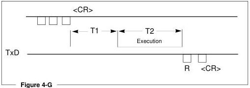

### 4.7 Level III Command Descriptions

This section of the manual contains a detailed explanation of each Level III command available for use when controlling the LD-V4400 from an external computer or controller. The format used to describe each command is as follows:

Function: A description of what the command does.

Format: The command mnemonic used to send the command to the player.

Explanation: A description of how the command is executed.

Execution: An example of how to execute the command.

#### 4.7.1 Player Control Commands

##### 1) DOOR OPEN

Function: Door is opened.

Format: O P

Explanation: The Door Open Mode is the state where the disc tray is opened to change the disc, or the tray is drawn out.

If this command is sent when the player is in Park, the door is opened and the Door Open Mode starts. This command is also effective in other modes. In such a case, the disc rotation stops and then the door is opened.

Execution: * Park Mode

O P  R

* Door Open Mode

##### 2) DOOR CLOSE

Function: Door is closed.

Format: C O

Explanation: When the player door is open and this command is received, the player closes the door and enters Park. The completion status is returned just after the door has closed. If this command is entered when the player is in some mode other than Door Open, an error message will be returned.

Execution: * Door Open Mode

C O  R

* Park Mode

##### 3) REJECT

Function: Disc rotation is stopped.

Format: R J

Explanation: If this command is sent when the player is in Random Access Mode or Spin-up Mode, the Spin-down Mode starts and disc rotation stops. When disc rotation completely stops, the completion status is returned, and the player enters Park.

Execution: * Random Access Mode
R J  R
* Park Mode

##### 4) START

Function: Disc rotation is started.

Format: S A

Explanation: If this command is sent when the player is in Park or Spin-down Mode, the Spin-up Mode starts and disc rotation begins. When the player is ready to begin playing the audio and video content of the disc, it enters Pause Mode at the first position in the program area of the disc. Then the completion status is returned.

Execution: * Park Mode, disc in tray.
S A  R
* Pause Mode: Disc is successfully loaded.
or
* Park Mode, no disc in tray.
S A  E 11
* Park Mode: There is no disc in the disc tray.

##### 5) PLAY

Function: Pictures and sound are reproduced.

Format: (Address) P L

Explanation: 1) If this command is sent when the player is in Random Access Mode, Play Mode is the only mode in which sound is automatically reproduced simultaneously with video.

2) If an address is specified, the player will play to that address and stop automatically. The specified address is written in the Mark Frame or Mark Chapter Register and compared with the current address. When both values are the same, Still Mode (CAV) or Pause Mode (CLV) occurs; then the completion status is returned. Command completion also occurs when lead-out is found before the specified address is reached.

**IMPORTANT NOTE**

When using the PLAY command with an address, the auto stop function will be released if any other command, including a status request, is sent to the player before the specified address is reached.

Use the Stop Marker command to achieve an auto stop PLAY function that will allow for status requests and maintain the end address marker.

3) If this command is sent when the player is in Park, Setup Mode is executed and the disc plays from the beginning of the program area. As soon as the disc begins to play, the completion status is returned. Playback continues until another motion command is received.

Execution #1: * Pause Mode

P L <C/R> R <C/R>

* Play Mode

Execution #2: * Still Mode (CAV)

F R 3 2 4 0 0 P L <C/R>

* Play Mode

Frame 32400 reached and player enters Still Mode R <C/R>

* Still Mode (CAV)

Execution #3: * Park Mode

P L  R

* Play mode

##### 6) PAUSE

Function: Picture ceases and pausing occurs.

Format: P A

Explanation: If this command is sent to the player while it is in Random Access Mode, pausing occurs at that position and a blue (or black) screen appears.

Execution: * Play Mode

P A  R

* Pause Mode

P L  R

* Play Mode

##### 7) STILL (CAV Only)

Function: Playback is stopped with picture displayed.

Format: S T

Explanation: If this command is sent to the player when it is in Random Access Mode, playback stops at that position and Still Mode occurs.

Execution: * Play Mode

S T  R

* Still Mode

P L  R

* Play Mode

##### 8) STEP FORWARD (CAV Only)

##### 9) STEP REVERSE (CAV Only)

Function: Pictures are moved one frame forward or reverse.

Format: S F - STEP FORWARD
S R - STEP REVERSE

Explanation: If this command is sent to the player when it is in Random Access Mode, the pictures will move one frame forward or reverse, and then Still Mode occurs.

Execution: * Play Mode
S F <C/R> R <C/R>
* Still Mode
S R S R S R <C/R> R <C/R>
* Still Mode

##### 10) SCAN FORWARD

##### 11) SCAN REVERSE

Function: Quick forward or reverse scanning of the disc.

Format: N F - SCAN FORWARD
N R - SCAN REVERSE

Explanation: If this command is sent to the player when it is in the Random Access Mode, the pictures will move at high speed about 500 frames forward or reverse. This movement is referred to as Scan Mode. When the Scan is completed, the original mode is restored and the completion status is returned.

Execution 1: * Play Mode
N F <C/R> R <C/R>
* Play Mode
N R N R N R <C/R> R <C/R>
* Play Mode

Execution 2: * Still Mode
N F <C/R> R <C/R>
* Still Mode

##### 12) MULTI-SPEED FORWARD (CAV Only)

##### 13) MULTI-SPEED REVERSE (CAV Only)

Function: Playing is done at the speed set in the speed register.

Format: (Address) M F - MULTI-SPEED FORWARD
(Address) M R - MULTI-SPEED REVERSE

Explanation: 1) If this command is sent to the player when it is in *Random Access Mode*, the *Multi-Speed Mode* occurs. In *Multi-Speed Mode*, the pictures are reproduced at a speed specified by the Speed Register.

2) If an address is specified, playing is done at the speed specified in the Speed Register. The specified address is written in the Mark Frame Register or Mark Chapter Register and compared with the current address. When both values are the same, *Still Mode* occurs. Then the completion status is returned.

**IMPORTANT NOTE**

*When using the MULTI-SPEED command with an address, the auto stop function will be released if any other command, including a status request, is sent before the specified address is reached.*

*Use the Stop Marker command to achieve an auto stop MULTI-SPEED function. This will allow for status requests and maintain the end address marker.*

Execution #1: * Play Mode
M F <C/R> R <C/R>
* Multi-Speed Mode

Execution #2: * Still Mode
F R 3 4 5 0 0 M F <C/R>
* Multi-Speed Mode
Frame 34500 reached R <C/R>
* Still Mode

Execution #2: * Still Mode
F R 3 4 5 0 0 M F 3 4 5 0 0 SM* ?F <C/R>
* Multi-Speed Mode, returns current frame number
Frame 34500 reached R <C/R>
* Still Mode

*Note: Without the Stop Marker, the player would return the Current frame number, then play past frame 34500.

##### 14) SPEED SET (CAV Only)

Function: Speed for Multi-Speed playing is specified.

Format: Integer S P

Explanation: Contents of the Speed Register are rewritten with this command. Immediately, the completion status is returned. The active mode of the player does not change. This command is accepted even when Multi-Speed Mode is in effect.

The relationship between the speed parameter specified by the integer and the actual play speed is as follows:

Play speed = normal speed x Parameter /60 NTSC

The speed parameter indicates the number of fields moved per second, and it is specified in range from 1 to 255. It is 60 for normal play. A value of 0 is the same as 1. The initial value is 60.

The relationship between representative play speeds and parameters is as follows:

|  Integer | Speed | Integer | Speed  |
| --- | --- | --- | --- |
|  240 | X4 | 30 | 1/2  |
|  180 | X3 | 20 | 1/3  |
|  120 | X2 | 15 | 1/4  |
|  60 | X1 | 10 | 1/6  |

*Figure 4-H*

Execution: * Play Mode

30SPMF \(<  \mathbb{R} <   \mathbb{R}>\)
* 1/2 speed Multi-Speed play (NTSC)
20SP \(<  \mathbb{R} <   \mathbb{R}>\)
* 1/3 speed Multi-Speed play (NTSC)

To calculate Play speed: $$\frac{30 \text{ Frames}}{1 \text{ Sec.}} \times \frac{\text{Parameter}}{60} = \text{Play Speed}$$

##### 15) SEARCH

Function: Search to disc location specified by the address value.

Format: Address S E

Explanation: The specified address is written in the Search Frame Register, or Search Chapter Register, in accordance with the addressing flag. When the search is started, the search address is compared with the current address and the pickup is moved so that the difference becomes 0. If a specified address cannot be reached, an error message is returned.

The player squelches during searches, unless the search distance is ±100 frames on a CAV disc. The LD-V4400 has a one-second search time across an entire CAV disc after initialization, i.e. after the player searches to the highest frame number on the disc. Searching to the highest frame number on the disc “maps” the CAV disc so the player can then search across the disc in one second or less. When the specified address is reached on a CAV disc, Still Mode occurs. When the specified address is reached on a CLV disc, Pause Mode occurs.

|  Execution: | * **CAV disc in Play Mode** F R 4 5 0 0 S E <C/R> * Still Mode C H 5 S E <C/R> * Still Mode 6 S E <C/R>4 <C/R> * Still Mode * **CLV disc in Play Mode** F R 5 6 3 4 1 2 S E <CR> * Searches to 0 hours, 56 minutes, 34 seconds, 12 frames, then lands in Pause. Mode T M 5 6 3 4 S E <CR> * Searches to 0 hours, 56 minutes, 34 seconds, and lands in Pause. C H 5 S E <C/R> * Searches to Chapter 5, then lands in Pause 6 S E <C/R> * Searches to Chapter 6, then lands in Pause | **FR sets address flag to Frame** R <C/R> **CH sets address flag to Chapter** R <C/R> R <C/R> (Maintains Chapter Mode, Searches to beginning of Chapter 6) **FR sets address flag to Frame** R <CR> **TM sets address flag to Time** R <CR> **CH sets address flag to Chapter** R <C/R> R <C/R> (Maintains Chapter Mode.) * Searches to Chapter 6, then lands in Pause  |
| --- | --- | --- |

(See Note on next page, regarding CLV discs that do not have extended time code.)

NOTE:

If a CLV disc without extended time code (seconds and frame numbers encoded) is being played, the player will search to the beginning frame of the minute. This means the player will search to 56 minutes and pause immediately, even if it is set to frame mode and the command 5 6 3 4 1 2 S E

 is sent to the player.

When using the RU-V103 remote control unit to send a Search command when a CLV disc is loaded, the LD-V4400 will search to the specified address and immediately play.

If a

 is sent to the player from the computer or controller before a search is completed, the player will behave as if a CL command were sent.

##### 16) MULTI-TRACK JUMP FORWARD (CAV Only)

##### 17) MULTI-TRACK JUMP REVERSE (CAV Only)

Function: Jump the designated number of tracks.

Format: Argument J F - Jump Forward
Argument J R - Jump Reverse

Explanation: When this command is sent to player, the player jumps in either a forward or reverse direction by the number of tracks described in the argument. Compared to the search command, which is an absolute address search ending in Still Mode, track jump is a relative address search and does not change the player mode operating at the time the command is sent. The argument is limited to 99999. If the jump ends in the lead-in or lead-out area, the player will stop at the outer-most or inner-most frame in the program area.

If the track jump distance is within ±100 frames, then no apparent video disturbance is seen. It is possible to track jump forward or reverse more than 100 frames, but video disturbance will be apparent.

The player mode does not change after track jump is executed and a completion status is returned after the jump is completed.

Execution: * Play Mode (at frame 1000)
1 0 0 J F

 R

 * Play Mode (from 1100)

NOTE: This command cannot be executed if a CLV disc is being played. If a Track Jump Forward or Reverse command is sent while a CLV disc is playing, an error E04 is returned.

##### 18) STOP MARKER

Function: Stop marker is set to the specified address.

Format: Address S M

Explanation: The specified address is written in the Mark Frame Register or Mark Chapter Register in accordance with the addressing flag, and the completion status "R" is returned immediately. When the stop marker address is reached in Play or Multi-Speed Mode, Still Mode occurs if a CAV disc is in the drawer or Pause Mode occurs if the disc is CLV and the stop marker is cleared. The stop marker is also cleared when the step command is issued to step through the address marker.

Here, the completion status "R" is returned when the command is received and the stop marker is set, not when the address marker is reached. Whether the stop marker address is reached or not can be established by issuing the Frame or Chapter Number Request.

If a Clear or Reject command is sent before the stop marker is reached, it is cleared.

The stop marker is functionally similar to the auto stop operation of the Play and the Multi-Speed commands. However, the auto stop and the stop marker return a completion status at different times. In an auto stop operation, the completion status is returned when the marked address is reached. In the stop marker operation, the completion status is returned when the stop marker is set.

The stop marker command is used when status requests are sent to the player before the address marker is reached; it is also useful when the operation mode is changed before the marked address is reached.

Execution: * Still Mode

F R 3 2 4 0 0 S M P L  R  R

* Play Mode

M F  R  R

* Multi-Speed Mode

P L  R  R

* Play Mode

* Still Mode at Frame 32400

NOTE: If CLV disc is playing which does not have extended time code (seconds and frame numbers encoded), the marker will be set at the beginning frame of the minute.

##### 19) FRAME SET

Function: Address flag is set to “frame.”

Format: F R

Explanation: This command sets the address flag to “frame” prior to searches. The player recognizes this address flag until a command indicating a different one (chapter or time code ) is sent.

If this command is sent when a CLV disc is being played and the addressing flag is set to “frame,” the subsequent addresses to be handled are evaluated as extended time codes that include frame numbers, as in the example below.

F1 F2 F3 F4 F5 F6 F7

F1 = 1 digit for hour F2 & F3 = 2 digits for minutes
F4 & F5 = 2 digits for seconds F6 & F7 = 2 digits for frame numbers

Frame mode must be used when executing a CLV extended time number frame search.

Execution: * CLV Play Mode

F R 0 0 1 2 4 1 6 S E <c/r> R <c/r></c/r>

* Searches to 0 hours. 01 minute, 24 seconds, 16 frame, begins playing.

T M 1 2 4 1 6 S E<c/r> R <c/r></c/r>

* Searches to 1 Hr. 24 Min. 16 Sec. begins playing.

F R 0 1 0 8 0 34 S E <c/r> R <c/r>

* Searches to 0 Hr. 10 Min. 80 Sec. 04 Frame, begins playing

* Searches to 0 Hr. 11 Min. 21 Sec. 04 Frame, begins playing.

**NOTE:** This command cannot be executed if a CLV disc is being played which does not have extended time code (seconds and frame numbers encoded).

##### 20) TIME SET

Function: Address flag is set to “time.”

Format: T M

Explanation: If this command is sent when a CLV disc is being played, the address flag is set to “time,” and the subsequent addresses to be handled are evaluated as time codes.

If a CAV disc is playing and this command is sent to the player, an error message will be returned.

Execution: * CLV Play Mode

T M 1 2 4 1 6 S E R R

* Search 1 Hr. 24 Min. 16 Sec. 00 Frame.

##### 21) CHAPTER SET

Function: Address flag is set to “chapter.”

Format: C H

Explanation: If this command is given, the address flag is set to “chapter,” and the subsequent addresses to be handled are evaluated as chapter numbers.

Execution: * Address flag = frame

C H R R

* Address flag = chapter

1 5 S E R R

* Search to Chapter 15

F R 1 0 0 S E R R

* Address flag = frame, Search to Frame 100

##### 22) CLEAR

Function: To clear a value entry or a player mode.

Format: C L

Explanation: 1) Contents of the digit buffer (input value) are cleared. Immediately, the completion status is returned.

2) Search, Auto Stop, Auto Stop Multi-Speed or Stop Marker Mode are released. If cleared during a search, the clearance is made near the current pickup position, and Still Mode occurs if a CAV disc is in the drawer, or Pause Mode occurs if a CLV disc is being used.

If cleared during auto stop or stop marker operation, normal play occurs. If cleared during auto stop multi-speed operation, regular multi-speed play occurs.

Execution: * Play Mode
2 2 0 0 0 C L 2 3 0 0 0 S E
* Search mode
C L
* Still mode

##### 23) LEAD-OUT SYMBOL

Function: Lead-out is set for an address.

Format: L O

Explanation: As a target address for search or auto stop, this symbol can be used in place of the value. At that time, the LO is evaluated as follows:

|  Frame number | 65535 (CAV), 9595929 (CLV)  |
| --- | --- |
|  Time Code | 95959 (9 hour 59 minutes 59 seconds)  |
|  Chapter number | 79  |

In the LD-V4400, when the lead-out search is made, the convergence occurs immediately before the lead-out area, i.e. at the end of the program area.

Execution #1: L O S E
?F
R
5 0 4 0 0

* The last address of the program area is searched and the value is returned in response to ?F.

Execution #2: L O P L
R
* Plays to last chapter, frame or time number before lead-out when the last address is unknown. Set Chapter, Frame or Time Mode first.

#### 4.7.2 Player Control Switch Commands

##### 24) AUDIO CONTROL

Function: The audio output condition is selected.

Format: Integer A D

Explanation: The contents of the Audio Control Register are rewritten. The completion status is returned immediately. The relationship between the contents of the register specified by the integer and the output audio channel is indicated in the diagram on the next page.

Execution: 3 A D <CR> R <CR>

* Play stereo analog tracks only

AUDIO CONTROL REGISTER

|  ARG. | FUNCTION | S0 | S1 | S2 | S3 | S4 | S5 | S6 | S7 | S8 | S9  |
| --- | --- | --- | --- | --- | --- | --- | --- | --- | --- | --- | --- |
|  0 | OFF | 0 | 0 | 0 | 0 | 0 | 0 | 1 | 0 | 1 | 0  |
|  1 | ANALOG CH1 | 1 | 0 | 1 | 1 | 0 | 1 | 1 | 0 | 1 | 0  |
|  2 | ANALOG CH2 | 0 | 1 | 1 | 0 | 1 | 1 | 1 | 0 | 1 | 0  |
|  3 | ANALOG STEREO | 1 | 1 | 0 | 1 | 1 | 0 | 1 | 0 | 1 | 0  |
|  4 | OFF | 0 | 0 | 0 | 0 | 0 | 0 | 0 | 1 | 0 | 1  |
|  5 | DIGITAL CH1 | 1 | 0 | 1 | 1 | 0 | 1 | 0 | 1 | 0 | 1  |
|  6 | DIGITAL CH2 | 0 | 1 | 1 | 0 | 1 | 1 | 0 | 1 | 0 | 1  |
|  7 | DIGITAL STEREO | 1 | 1 | 0 | 1 | 1 | 0 | 0 | 1 | 0 | 1  |
|  * 8 | DIGITAL STEREO | 1 | 1 | 0 | 1 | 1 | 0 | 0 | 1 | 0 | 1  |

*Figure 4-I*

* This argument (8), can only be used when the player is in LD-ROM Mode. When an optional LD-ROM card #UK-V112 is installed in the player and the first switch on the card is Up/On or the front panel button for LD-ROM On/Off is On, the instruction 8AD is used to reproduce the ADPCM signal in CD-ROM XA format. For more information, see Pioneer's LD-ROM Technical Overview, or call Pioneer Communications, Multimedia Systems Division, Engineering/Technical Support, East Coast at 201/327-6400 or West Coast at 310/518-0710, x350 or x310.

###### Audio Switch Diagram

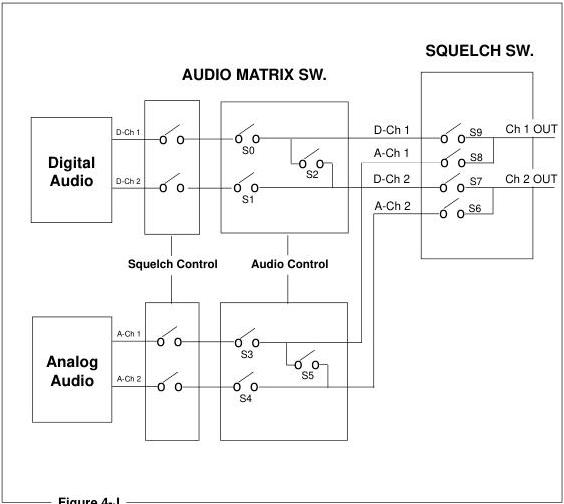

*Figure 4-J*

##### 25) VIDEO CONTROL

Function: Video switch is turned ON/OFF.

Format: Integer V D

Explanation: The Video Control Register is reset.

The initial value of the register is 1 (the video switch is ON). In this state, the video output is controlled by means of the squelch switch. When in Park or Pause Mode, the switch is set to 1.

When pictures are reproducible, the squelch condition is not active.

When the video switch is turned OFF, the screen is squelched at all times.

The squelch condition may be set to show a blue screen or a black screen by using the background color selection in Register C.

|  Integer | Function | Video Switch  |
| --- | --- | --- |
|  0 | Off | 0  |
|  1 | On (Normal) | 1  |

Video Control Diagram

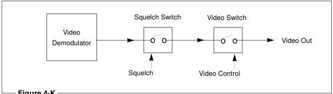

*Figure 4-K*

Execution: * Video Switch = ON
O V D <C/R> R <C/R>
* Video Switch = OFF

##### 26) KEY LOCK

Function: The key lock switch is turned ON/OFF.

Format: Integer K L

Explanation: Operation of the front panel keys and RCU input are locked or unlocked.

The completion status is returned immediately. The initial value of OFF means the unlocked state exists. A value of 1 means ON, and the locked state is activated. At that time, the key lock LED is set ON and operation of all keys on the player (other than the power switch) and the remote control unit are not accepted.

KEY LOCK SWITCH

|  Integer | Function  |
| --- | --- |
|  0 | Unlock  |
|  1 | Lock  |

Execution: 1 K L &lt;C/R&gt; R &lt;C/R&gt;

* Key Lock ON

0 K L &lt;C/R&gt; R &lt;C/R&gt;

* Key Lock OFF

#### 4.7.3 Display Control

##### 27) DISPLAY CONTROL

Function: Character display is turned ON/OFF.

Format: Integer D S

Explanation: Contents of the Display Control Register are displayed.

The initial value of the register is 0 and the display switch is OFF. If it is turned on, the chapter number, frame number or time code, and user's area can be displayed. The display lines are determined by the Register A setting. At power-on, the default setting for Register A is 3RA. This makes available the frame, time code and chapter numbers, if they are encoded on the disc, and if the Display is turned on 1DS. The actual items to be displayed are determined by the contents of Register A. See page 4-39 for details.

|  Integer | Function | Display Switch  |
| --- | --- | --- |
|  0 | Off | 0  |
|  1 | On | 1  |

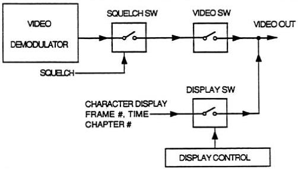

*Figure 4-L*

Execution: Display switch \(=\) OFF.
1DS \(<  C / R>\) R \(<  C / R>\)
- Display switch = ON

##### 28) CLEAR SCREEN

Function: The characters shown in the User Display Area are cleared.

Format: C S

Explanation: Characters on all of the lines are cleared. To clear only a particular line, overwrite the line with spaces by means of the PR command.

Execution: C S 3 P R  R
HELLO !  R

* All the lines are cleared and a string of seven characters is written in Line 3.

4 P R  R

SELECT A MENU ITEM  R

* A string of 18 characters is written in Line 4.

3 P R  R

string of seven spaces  R

* Spaces overwrite the seven character word in line 3, so it appears only line 3 is cleared.

CS R

* All lines are cleared.

##### 29) PRINT CHARACTER

Function: Characters are written into the User's Display Area.

Format: Integer P R <C/R>
Character string <C/R>

Explanation: This command is used to enter a line of characters to be displayed on the video monitor. Set Register A so User's Display is ON (4RA).

First, enter an integer to specify a line number from 0 to 11, then send the command "PR" and terminate it with a <C/R>. Next send the characters to be displayed. Up to 20 characters can be entered as a string. Terminate the character string with a <C/R>. Any characters following the PR <CR>, but prior to the character string's <C/R>, are interpreted as characters to be printed to the User Display Area.

Usable characters are shown in the Character Code Table below.

High-order Byte

Low-order Byte

|   | 0 | 1 | 2 | 3 | 4 | 5 | 6 | 7 | 8 | 9 | A | B | C | D | E | F  |
| --- | --- | --- | --- | --- | --- | --- | --- | --- | --- | --- | --- | --- | --- | --- | --- | --- |
|  2 |  | ! | * | $ | % | & | ' | ( | ) | * | + | , | - | . | / |   |
|  3 | 0 | 1 | 2 | 3 | 4 | 5 | 6 | 7 | 8 | 9 | : | ; | < | = | > | ?  |
|  4 | ● | A | B | C | D | E | F | G | H | I | J | K | L | M | N | O  |
|  5 | P | Q | R | S | T | U | V | W | X | Y | Z | ← | ¥ | → | ■ | —  |
|  6 | ` | a | b | c | d | e | f | g | h | i | j | k | l | m | n | o  |
|  7 | p | q | r | s | t | u | v | w | x | y | z | ↑ | | | ↓ |  |   |
|  8 | Ç | ü | é | â | ä | à | á | ç | ê | ë | è | ï | î | ì | Ä | Â  |
|  9 | É | æ | Æ | ô | ö | û | û | ÿ | Ö | Ü | ø | £ | ß | Þ | ſ | ſ  |

The character "7F" is not available.

*Figure 4-M*

|  Execution: | 4 R A 1 D S <C/R> | R <C/R>  |
| --- | --- | --- |
|   |  4 P R <C/R> | R <C/R>  |
|   |  *** <C/R> | R <C/R>  |
|   |  5 P R <C/R> | R <C/R>  |
|   |  * PROGRAM START * <C/R> | R <C/R>  |
|   |  6 P R <C/R> | R <C/R>  |
|   |  *** <C/R> | R <C/R>  |

NOTE: Refer to Technical Bulletin #141, On-Screen User Display Area, for a comparison of the number of user lines and available characters by player model.

#### 4.7.4 Request Commands

##### 30) FRAME NUMBER REQUEST

Function: The frame number which is currently being played is returned.

Format: ? F

Explanation: Contents of the current Frame Register are returned.

During the play of a CAV disc, a 5-digit frame number is returned. During the play of a CLV disc, a 7-digit extended time number is returned (hours, minutes, seconds, frame numbers). As seen from the example, continuous frame numbers may not be received due to timing delays between the computer and the player.

Correct values will not be shown if the player is not in Random Access Mode, or if the player is in the lead-in or lead-out area of a disc. If a frame number code of the disc cannot be correctly read, the previous value is used.

Execution: * Play Mode (CAV)

|  ? F <C/R> | 0 2 0 4 4 <C/R>  |
| --- | --- |
|  ? F <C/R> | 0 2 0 4 5 <C/R>  |
|  ? F <C/R> | 0 2 0 4 5 <C/R>  |
|  ? F <C/R> | 0 2 0 4 7 <C/R>  |

* Play Mode (CLV)

|  ? F <C/R> | 0 1 2 3 3 2 9 <C/R> (0 Hr 12 Min 33 Sec 29 Fr)  |
| --- | --- |
|  ? F <C/R> | 0 1 2 3 4 0 0 <C/R> (0 Hr 12 Min 34 Sec 00 Fr)  |

##### 31) TIME REQUEST

Function: The time code which is currently being played is returned (CLV).

Format: ? T

Explanation: Contents of the current Time Register are returned.

When a CLV disc is being played, time numbers are contained in the Frame Register. Time numbers consist of the hour and minutes, while most consist of extended time numbers: hour, minutes, seconds, and frames. When a disc not encoded with seconds is played, the seconds unit is fixed to 0.

Correct values will not be shown if the player is not in Random Access Mode, or if the player is in the lead-in or lead-out area of a disc. If a time number on the disc cannot be correctly read, the previous number is used.

Note: CLV frame numbers are part of the extended time number. If frame numbers are encoded on a disc, they are not shown when the address flag is set to Time nor are they returned when a Time Request is sent to the player. To access CLV frame numbers, the frame address flag must be set by sending the Frame Mode (F) command. The Frame Number Request (?F) command the queries the player and the time number frame value is returned. (See page 4-21 for Frame Mode; see page 4-31 for Frame Number Request.)

Execution: * Play Mode
? T 0 3 2 1 3
(0 hour, 32 minutes, 13 seconds)

##### 32) CHAPTER NUMBER REQUEST

Function: The chapter number which is currently being played is returned.

Format: ? C

Explanation: Contents of the Chapter Number Register are returned.

The chapter number is a 2-digit integer. Some discs are not encoded with chapter numbers. When playing a disc without chapters, an error is returned when this request is issued. Correct values will not be shown if the player is not in Random Access Mode, or if the player is in the lead-in or lead-out area of a disc.

Execution: * Play Mode
? C 1 2

##### 33) PLAYER ACTIVE MODE REQUEST

Function: The value representing the current active mode of the player is returned.

Format: ? P

Explanation: Active modes are returned according to the classification shown in the following table. This command is useful in confirming whether the player has already been started and placed in Random Access Mode.

|  Player Active Mode Request Codes  |   |   |   |
| --- | --- | --- | --- |
|  Code | Player Mode | Code | Player Mode  |
|  P00 | Door Open | P05 | Still  |
|  P01 | Park | P06 | Pause  |
|  P02 | Set Up | P07 | Search  |
|  P03 | Disc Unloading | P08 | Scan  |
|  P04 | Play | P09 | Multi-Speed  |

*Figure 4-N*

- P00 (Door Open): Door is open
- P01 (Park): Disc rotation is stopped or drawer is closing or drawer is closed and no disc is loaded
- P02 (Set Up): Preparing to Play
- P03 (Disc Unloading): Disc tray is opening
- P04 (Play): Images and sound are reproduced at normal speed
- P05 (Still): Picture is displayed as a still
- P06 (Pause): Pausing occurs without picture display
- P07 (Search): Search is executed
- P08 (Scan): Scan is executed
- P09 (Multi-Speed): Playing in Multi-Speed

Execution: * Play Mode

? P <C/R> P 0 4 <C/R>

S T <C/R> R <C/R>

* Still Mode

? P <C/R> P 0 5 <C/R>

##### 34) DISC STATUS REQUEST

Function: Attributes of the disc being played are returned.

Format: ? D

Explanation: Status information concerning the disc is returned in the following format.

C1 C2 C3 C4 C5 <C/R>

C1: disc loading 0 = not loaded 1 = loaded

C2: CAV/CLV 0 = CAV 1 = CLV X = unknown

C3: disc size 0 = 12 inch 1 = 8 inch X = unknown

C4: disc side 0 = Side 1 1 = Side 2 X = unknown

C5: chapter code 0 = no 1 = yes X = unknown

Execution: ? D <C/R> 0 X X X X <C/R>

* Disc is not loaded.

? D <C/R> 1 0 0 0 1 <C/R>

* The disc loaded is a 12-inch CAV disc, Side 1, with chapters.

##### 35) LDP MODEL NAME REQUEST

Function: Player's model name is returned.

Format: ? X

Explanation: For the LD-V4400 the player's name is returned as follows:

P1516XX

First 5 characters (P1516) are the player series or model identification, and the last two characters (XX) represent the player version number. NOTE: Please be advised that the version numbers are updated as running changes are made to the player.

Execution: ? X <C/R> P 1 5 1 6 0 1 <C/R>

In this example the last two digits (XX) = 01, which was the first version number of the LD-V4400.

##### 36) PIONEER USER'S CODE REQUEST (Disc ID)

Function: Returns the contents of the Pioneer User's Code.

Format: ?U

Explanation: The Pioneer User's Code is a Pioneer standard and is encoded in the last 100 frames (200 fields) of lead-in on the videodisc as per IEC specifications. It is 200 characters in length (one character for each field) and contains three types of data:

##### 1) Disc Control Data - 60 frames (120 fields) 120 characters

##### 2) Key Data - 30 frames (60 fields) 60 characters

3) Control Data- 10 frames (20 fields) 20 characters

The Key Data area of the Pioneer User's Code Standard can contain a maximum of 60 characters of disc identifying information specified by the customer. The Key Data is specially encoded on the videodisc during the mastering process and is always located after the Disc Control Data and before the Control Data.

Execution: When the disc is spinning and the player receives the ?U command it automatically searches to lead-in and returns 200 characters of Pioneer's User's Code, including Key Data (as ASCII data) encoded in the Pioneer User's Code.

If the disc is in play when this command is sent, the player will perform the search to lead-in and return the Key Data. Therefore, it is recommended that this command be issued after the start (SA) command and before any other player control command is issued.

If there is no data encoded in the Pioneer User's Code, the player returns the E04 error code (unavailable command).

If the player experiences an error in reading the data an "`" (60 HEX) character is returned.

It takes approximately 10 seconds for the player to read this data from the disc.

* A sample disc, “Laser Jukebox Information Disc” is in the player’s disc tray, spun-up to and waiting at frame #1 and then the Pioneer User’s Code Request is sent:[{"box_2d": [262, 188, 356, 203], "label": "text", "caption": "?U "](("}]

The player returns the following:

#PTJ-01••••*LASER JU
KEBOX INFORMATION VO
L1!1 %0192429@@@@@@
#PTJ-01••••*LASER JU
KEBOX INFORMATION VO
L1!1 %0192429@@@@@@
••••••••••••••••••
••••••••••••••••••
••••••••••••••••••

888888888888888888

<CR>

(• is Null [00H])

NOTE: Implementation and operation of this feature may differ in other Pioneer players. Refer to your player’s User’s Manual for details on if and how a particular player supports the ?U command.

##### 37) STANDARD USER’S CODE REQUEST (Disc ID)

Function: Returns the contents of the Standard User’s Code.

Format: $Y

Explanation: The Standard User’s Code is encoded in lead-in of the videodisc and consists of four characters. This command returns these characters in the following format:

Y C4 C3 C2 C1

If the disc does not have a Standard User’s Code encoded on it, and this request is made, the player will return an error code “E04”

Execution: $Y (Y4256 ((

##### 38) TV SYSTEM REQUEST

Function: Returns information describing the TV System and connection to an external sync generator.

Format: ?S

Explanation: The player returns the information regarding the TV System in the following format:

C3 C2 C1

C3: The TV System currently being output

C2: TV System of the disc

C1: TV System of the External Sync

|   | Data  |   |
| --- | --- | --- |
|   |  0 | 1  |
|  C3 | — | NTSC  |
|  C2 | Unknown | NTSC  |
|  C1 | Unknown or No Sync | NTSC  |

Execution: ?S <CR> 110 <CR>

* Currently selected System = NTSC

Disc = NTSC

External Sync = Not connected.

?S <CR> 111 <CR>

* Currently selected System = NTSC

Disc = NTSC

External Sync = Connected.

NOTE: The LD-V4400 uses only NTSC videodiscs and puts out an NTSC signal. The bit C1 that is returned in response to the ?S command indicates whether or not the NTSC signal is input to an external sync generator.

#### 4.7.5 Communication Control Commands

##### 39) COMMUNICATION CONTROL

Function: Communication mode is selected.

Format: Integer C M

Explanation: Contents of the communication control register (CCR) are rewritten. For the LD-V4400, the Automatic Status can be selected ON or OFF. When Automatic Status is ON the Player returns an R upon execution of a command, when it is OFF, it does not.

|  Integer | Mode | Auto-Status  |
| --- | --- | --- |
|  2 | MODE-2 | OFF — "R" not returned  |
|  3 | MODE-3 | ON — "R" returned  |

The initial value (default value) of the CCR is set to Mode 3. With this command, it is possible to change the communication mode as required. If an unsupported mode is specified, an error occurs.

Execution: * CCR = 3 Communication Mode 3, no "R" is returned

2 C M <C/R> (Note: No"R" is returned here)
* CCR = 2 Communication Mode 2, "R" is returned

3 C M <C/R> R <C/R>
* CCR = 3 Communication Mode 3, no "R" is returned

##### 40) CCR MODE REQUEST

Function: Current communication mode is returned.

|  CM2 | MODE-2  |
| --- | --- |
|  CM3 | MODE-3  |

Format: ? M

Explanation: Contents of the communication control register (CCR) are returned.

Execution: * CCR = 3
? M <C/R> CM3 <C/R>

#### 4.7.6 Register Control Commands

##### 41) REGISTER A SET

Function: Changes the current setting of Register A. (Display)

Format: Integer R A

Explanation: In Register A, detailed attributes concerning the display are set. The LD-V4400 has three types of display settings: Frame Number or Time Code (depending whether a CAV or CLV disc is being played), Chapter Number, and User's Display. Available combinations of the three display settings are shown in the following table. The initial value is 3.

|  Integer | Function | User's | Chapter | Frame  |
| --- | --- | --- | --- | --- |
|  0 | Display Off | 0 | 0 | 0  |
|  1 | Frame Number or Time Code | 0 | 0 | 1  |
|  2 | Chapter Number | 0 | 1 | 0  |
|  3 | Frame or Time Code and Chapter | 0 | 1 | 1  |
|  4 | User's Display | 1 | 0 | 0  |
|  5 | User's Display, Frame or Time Code | 1 | 0 | 1  |
|  6 | User's Display and Chapter | 1 | 1 | 0  |
|  7 | User's Display, Frame or Time Code, Chapter | 1 | 1 | 1  |

*Figure 4-O*

All the character displays are turned ON/OFF by the display control command. The display contents are determined by Register A.

*Figure 4-P*

The display positions on the screen for LD-V4400 are pictured below:

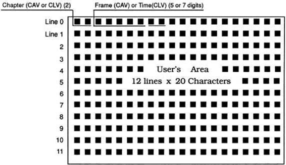

*Figure 4-Q*

Line 0 is used for displaying chapter number and frame number or time code.

Line 0 and 1 are sometimes used for displaying remote control inputs.

Line 2 to 11 are used exclusively as the User's Display Area.

If Line 0 and 1 are not used for the player's display system, if there is no data input to be displayed from the remote control, and if the frame or time code or chapter number display is disabled, then those two lines can also be used as part of the User's Display Area.

###### To activate the User Display Area:

- Set the User's Display using the Register A command.
- Turn ON the display switch.
- Identify the line the characters will appear on by means of an integer (0-11) and send the Print Character command (PR)
- Then send the character string to be displayed followed by
.

(See next page for execution example.)

NOTE: The display switch can be turned ON or OFF at any time. However, if Register A is changed so that the User's Display Area is disabled, the contents of the User's Display Area will be cleared. Also, if the Print Character command is issued before Register A is set for the User's Display Area, the character string will not be seen. 3RA is the power-On default, allowing Frame and Chapter number to be seen when display is turned on if no changes are made to Register A.

Execution: * Display OFF

1DS <C/R> R <C/R>

* Display ON - Frame, Chapter Display

1RA <C/R> R <C/R>

* Only frame number is displayed

7RA <C/R> R <C/R>

3PR <C/R> R <C/R>

HELLO WORLD R <C/R>

* Frame, Chapter and "HELLO WORLD" message on Line 3 of User's Display Area is displayed.

##### 42) REGISTER B SET

Function: Changes the current setting of Register B. (Squelch Control)

Format: Integer R B

Explanation: In Register B, attributes concerning the squelch switch for video and audio are set. The squelch switch is normally controlled automatically in accordance with the operating mode of the player.

In the modes where pictures and sound are not clearly reproduced, the squelch switch prevents the noise from being displayed or heard. (eg. During scanning, audio is squelched.)

By rewriting the contents of the Register B, it is possible to make the squelch switch invalid. In this state, the video and audio signals are always going out.

The initial value is 0.

It must be noted that these signals may contain noise components which may adversely affect equipment connected to the output of the player. Therefore, the operation must be fully understood before this function is used.

|  Integer | Function | Video | Audio  |
| --- | --- | --- | --- |
|  0 | Normal | 0 | 0  |
|  64 | Audio Squelch Invalid | 0 | 1  |
|  128 | Video Squelch Invalid | 1 | 0  |
|  192 | VD/AD Squelch Invalid | 1 | 1  |

*Figure 4-R*

Execution: * Disable the video squelch during searching.
128 R B 23000 S E 0 R B <C/R> R <C/R>

* Play at 1/2 speed while outputting sound.
64 R B 30 S P M F <C/R> R <C/R>

* Set to Still and return to normal squelch.
STORB <C/R> R <C/R>

##### 43) REGISTER C SET

Function: Changes the current setting of Register C. (Miscellaneous)

Format: Integer R C

Explanation: Register C contains the settings of the function switches which are stored in the EPROM. These settings are copied to this register when power is turned on or after they have been selected in the Function Switch Setting Mode. Once power is turned on or you have exited the Function Switch Setting Mode, the settings cannot be changed. This command can be used to temporarily change the settings of the functions. It must be noted that changes to some functions may suspend playback or disable further control.

The following functions can be set. To set a function to 1 (ON), give the value indicated by the integer.

|  Integer | Function | 1 | 0  |
| --- | --- | --- | --- |
|  1 | Side-Repeat | AUTO | OFF  |
|  2 | Load-Start | AUTO | OFF  |
|  4 | Power-on-Start | AUTO | OFF  |
|  8 | (Not Used) |  | OFF  |
|  16 | Background Color | BLACK | BLUE  |
|  32 | (Not Used) |  | OFF  |
|  64 | (Not Used) |  | OFF  |
|  128 | Test Mode | ON | OFF  |

*Figure 4-S*

To set multiple functions to 1 (ON), the integer values must be added up. All eight functions can be specified in combination by using the decimal values from 0 to 255. The completion status is returned immediately. NOTE: When "Repeat Side" or "Chapter Repeat" is specified by the RCU, the Side Repeat function of Register C goes to "1 (ON)" and when "Auto Return" is specified by the RCU, the Side Repeat Function of Register C goes to "0 (OFF)".

Execution: • Initial value 0

3 R C <C/R> R <C/R>

• Side-Repeat, Load-Start to ON, background color BLUE

1 6 R C <C/R> R <C/R>

• Background Color BLACK; Side-Repeat and Load-Start to OFF

##### 44) REGISTER D SET

Function: Changes the current setting of Register D. (RS-232)

Format: Integer R D

Explanation: Register D contains the settings of the function switches which are stored in the EPROM. These settings are copied to this register when power is turned on or when they are selected in the Function Switch Setting Mode. Once power is turned on or you have exited the Function Switch Setting Mode, the settings cannot be changed. This command can be used to temporarily change the settings of the functions. It must be noted that changes to some functions may suspend playback or disable further control.

The following functions can be set. To set a function to 1 (ON), give the value indicated in the Integer.

To set multiple functions to 1, the integer values must be added up. All eight functions can be specified in combination by using the decimal values from 0 to 255.

The completion status is returned immediately.

|  Integer | Function | 1 | 0  |
| --- | --- | --- | --- |
|  1 | Baud Rate | 9600 (00) | 4800 (01)  |
|  2 |  | 1200 (10) | NOT USED (11)  |
|  4 | Not Used |  |   |
|  8 | Not Used |  |   |
|  16 | Not Used |  |   |
|  32 | Not Used |  |   |
|  64 | TXD Terminator | <C/R> & <L/F> | <C/R>  |
|  128 | Not Used |  |   |

*Figure 4-T*

Execution: * Set Initial value 4800 Baud, &lt;CR&gt; &lt;LF&gt;

65 R D &lt;C/R&gt; R &lt;C/R&gt; &lt;LF&gt;

* Set value to 9600 Baud, &lt;CR&gt;

0 R D &lt;C/R&gt; R &lt;C/R&gt;

0RD = 9600 Baud + &lt;CR&gt;; 1RD = 4800 Baud + &lt;CR&gt;; 2RD = 1200 Baud + &lt;CR&gt;;

64RD = 9600 Baud + &lt;CR&gt; &lt;LF&gt;; 65RD = 4800 Baud + &lt;CR&gt; &lt;LF&gt;; 66RD = 1200 Baud+ &lt;CR&gt; &lt;LF&gt;; 67RD = None.

##### 45) REGISTER A REQUEST

Function: Returns the contents of Register A. (Display)

Format: $ A

Explanation: Returns detailed attributes of Register A in the following format:

|  A | C8 | C7 | C6 | C5 | C4 | C3 | C2 | C1 | <C/R>  |
| --- | --- | --- | --- | --- | --- | --- | --- | --- | --- |
|  C1: | Frame number display |   |   |   |   |   | 1 = ON; |   | 0 = OFF  |
|  C2: | Chapter number display |   |   |   |   |   | 1 = ON; |   | 0 = OFF  |
|  C3: | User Area display |   |   |   |   |   | 1 = ON; |   | 0 = OFF  |
|  C4 to C8 are set to "0".  |   |   |   |   |   |   |   |   |   |

Execution: 7 R A &lt;C/R&gt; R &lt;C/R&gt;

$ A &lt;C/R&gt; A 0 0 0 0 0 1 1 1 &lt;C/R&gt;

* Frame numer, chapter number and UserAre Display are enabled.

##### 46) REGISTER B REQUEST

Function: Returns the contents of Register B. (Squelch Control)

Format: $ B

Explanation: Returns Register B video and audio squelch attributes in the following format:

|  B | C8 | C7 | C6 | C5 | C4 | C3 | C2 | C1 | <C/R>  |
| --- | --- | --- | --- | --- | --- | --- | --- | --- | --- |
|  C8: | Video squelch disabled; |   |   |   |   |   | 1 = ON; |   | 0 = OFF  |
|  C7: | Audio squelch disabled |   |   |   |   |   | 1 = ON; |   | 0 = OFF  |
|  C1 to C6 are set to "0".  |   |   |   |   |   |   |   |   |   |

Execution: 1 2 8 R B &lt;C/R&gt; R &lt;C/R&gt;

$ B &lt;C/R&gt; B 1 0 0 0 0 0 0 0 &lt;C/R&gt;

* Video squelch is disabled; Audio squelch is enabled.

##### 47) REGISTER C REQUEST

Function: Returns the contents of Register C. (Miscellaneous)

Format: $ C

Explanation: Returns function switch setting data in the following format:

|  C | C8 | C7 | C6 | C5 | C4 | C3 | C2 | C1 | <C/R>  |
| --- | --- | --- | --- | --- | --- | --- | --- | --- | --- |
|  C1: | Side Repeat  |   |   |   |   |   |   |   |   |
|  C2: | Load Start  |   |   |   |   |   |   |   |   |
|  C3: | Power-On Start  |   |   |   |   |   |   |   |   |
|  C4: | Not Used  |   |   |   |   |   |   |   |   |
|  C5: | Back Color Select (0 = Blue; 1 = Black)  |   |   |   |   |   |   |   |   |
|  C6: | Not Used  |   |   |   |   |   |   |   |   |
|  C7: | Not Used  |   |   |   |   |   |   |   |   |
|  C8: | Test Mode  |   |   |   |   |   |   |   |   |

Execution: * R C = 0

16R C &lt;C/R&gt; R &lt;C/R&gt;

* Background color set to Black

$ C &lt;C/R&gt; C 0 0 0 0 1 0 0 0 &lt;C/R&gt;

* Indicates that background color has been set to Black.

##### 48) REGISTER D REQUEST

Function: Returns the contents of Register D. (RS-232)

Format: $ D

Explanation: Returns function switch data in the following format:

D C8 C7 C6 C5 C4 C3 C2 C1: &lt;C/R&gt;

C1 &amp; C2: Baud Rate

00: 9600 Baud 01: 4800 Baud

10: 1200 Baud 00: Not used

C3: Not Used

C4: Not Used

C5: Not Used

C6: Not Used

C7: TxD Terminator (1 = C/R &amp; L/F, 0 = C/R)

C8: Not Used

Execution: * Set 4800 baud with & & &

65 R D &lt;C/R&gt; R &lt;C/R&gt;&lt;L/F&gt;

$ D &lt;C/R&gt; D 0 1 0 0 0 0 0 1 &lt;C/R&gt;&lt;LF&gt;

#### 4.7.7 Input/Output Device Control Commands

##### 49) INPUT UNIT REQUEST

Function: Reports input data from the remote control unit.

Format: # I

Explanation: The RCU input data is always two ASCII-HEX codes. After several buttons are pressed, the latest digit will be returned.

If no buttons are pressed after the last data has been read, a No Input Code (FF) will be returned.

Execution: • No RCU button previously pressed

`# I <C/R> FF <C/R>`

• Key Input 23517

`# I <C/R> 07 <C/R>`

• The last digiti is returned, in this case, "7".

##### 50) INPUT NUMBER WAIT

Function: Awaits digit input data from remote control.

Format: ? N

Explanation: When this command is entered, the player returns the first digit that is entered through the remote control (0 -9). Only one digit is returned and any other character or non-digit button is ignored.

Execution: • RCU

? N <C/R>

• Digit 1 Input 1 <C/R>

Note: To regain control of the player if no button is pressed, use the CLEAR command.

## Appendix A: Level III Commands for the LD-V4400

|   | Command | Mnemonic | Page  |
| --- | --- | --- | --- |
|  **Player Control Commands**  |   |   |   |
|  1 | Door Open | OP | 4-11  |
|  2 | Door Close | CO | 4-11  |
|  3 | Reject | RJ | 4-12  |
|  4 | Start | SA | 4-12  |
|  5 | Play | (Address) PL | 4-13  |
|  6 | Pause | PA | 4-14  |
|  7 | Still | ST | 4-14  |
|  8 | Step Forward | SF | 4-15  |
|  9 | Step Reverse | SR | 4-15  |
|  10 | Scan Forward | NF | 4-15  |
|  11 | Scan Reverse | NR | 4-15  |
|  12 | Multi Speed Forward | (Address) MF | 4-16  |
|  13 | Multi Speed Reverse | (Address) MR | 4-16  |
|  14 | Speed | Integer SP | 4-17  |
|  15 | Search | Address SE | 4-18  |
|  16 | Multi Track Jump Forward | Integer JF | 4-19  |
|  17 | Multi Track Jump Reverse | Integer JR | 4-19  |
|  18 | Stop Marker | Address SM | 4-20  |
|  19 | Frame Set | FR | 4-21  |
|  20 | Time Set | TM | 4-22  |
|  21 | Chapter Set | CH | 4-22  |
|  22 | Clear | CL | 4-23  |
|  23 | Lead Out Symbol | LO | 4-23  |
|  **Control Switch Commands**  |   |   |   |
|  24 | Audio Control | Integer AD | 4-24  |
|  25 | Video Control | Integer VD | 4-26  |
|  26 | Key Lock | Integer KL | 4-27  |

|   | Command | Mnemonic | Page  |
| --- | --- | --- | --- |
|  **Display Control Commands**  |   |   |   |
|  27 | Display Control | Integer DS | 4-28  |
|  28 | Clear Screen | CS | 4-29  |
|  39 | Print Character | Integer PR | 4-30  |
|  **Request Control Commands**  |   |   |   |
|  30 | Frame Number Request | ?F | 4-31  |
|  31 | Time Code Request | ?T | 4-32  |
|  32 | Chapter Number Request | ?C | 4-32  |
|  33 | Player Active Mode Request | ?P | 4-33  |
|  34 | Disc Status Request | ?D | 4-34  |
|  35 | LDP Model Name Request | ?X | 4-34  |
|  36 | Pioneer User's Code Request | ?U | 4-35  |
|  37 | Standard User's Code Request | $Y | 4-36  |
|  38 | TV System Request | ?S | 4-37  |
|  **Communication Control Commands**  |   |   |   |
|  39 | Communication Control | Integer CM | 4-38  |
|  40 | CCR Mode Request | ?M | 4-38  |
|  **Register Control Commands**  |   |   |   |
|  41 | Register A Set (Display) | Integer RA | 4-39  |
|  42 | Register B Set (Squelch Control) | Integer RB | 4-42  |
|  43 | Register C Set (Miscellaneous) | Integer RC | 4-43  |
|  44 | Register D Set (RS-232 Parameter) | Integer RD | 4-44  |
|  **Register Request Commands**  |   |   |   |
|  45 | Register A Request (Display) | $A | 4-45  |
|  46 | Register B Request (Squelch Control) | $B | 4-45  |
|  47 | Register C Request (Miscellaneous) | $C | 4-46  |
|  48 | Register D Request (RS-232) | $D | 4-46  |
|  **Input/Output Device Control Commands**  |   |   |   |
|  49 | Input Unit Request | #I | 4-47  |
|  50 | Input Number Wait | ?N | 4-47  |

## Appendix B: LD-V4400 Remote Control Unit

*The RU-V103*

RU-V103

### RU-V103 Remote Control:

LEVEL I CONTROL

REJECT: Ceases playback and spins-down the disc.

PAUSE: Ceases playback and presents a squelch screen. Press any motion button to resume.

PLAY: Begins playing a disc, or resumes play.

REPEAT MODE: This button can be pressed to select auto return, side repeat; or chapter repeat may be selected while a specific chapter is playing.

STILL STEP (FWD / REVERSE): Press either of these buttons to produce a still video image (CAV). Additional presses of the STEP FWD button moves the image forward one frame at a time. STEP REV moves the image in reverse one frame at a time.

DISP: Displays or removes the display of current chapter/frame/or time numbers on the screen.

SCAN (FWD / REVERSE): Press either of these buttons to move quickly forward or backward through program material on the disc. Rapid scanning continues as long as the button is depressed.

AUDIO: Press this button to select audio output: Digital Stereo, Digital 1/L, Digital 2/R, Audio OFF, Analog Stereo, Analog 1/L, Analog 2/R, Audio OFF.

SPEED (DOWN / UP): Press these buttons to set the speed at which multi-speed play will occur.

CLEAR: Press this button to CLEAR erroneous inputs or to stop a Search operation.

MULTI-SPEED (REV / FWD): Press this button to play forward or reverse in the speed that is set with the SPEED button (CAV).

NUMERIC BUTTONS (0-9): Use these buttons to enter locations on the disc for searches. (eg. Enter 1000 SEARCH to move to a certain frame (CAV) or time (CLV) location on the disc.) Use the CHAP/FRAME TRACK/TIME button to set an "address flag", indicating chapter, frame number or time. (These buttons can also be used for viewer responses during Level III program execution.) See Level III Command Input Number Wait (?N).

SEARCH: Specify the number to be searched to by using the digit buttons. Press the SEARCH button to execute. (First set the "address flag" using the CHAP/

See Section 3.2.2, page 3-4, for details about the use of each specific remote control button.

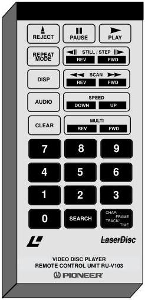

The RU-V103 Remote Control Unit

FRAME TRACK/TIME button.) After searching, the player presents a still frame on CAV discs or immediately plays on CLV discs.

CHAP / FRAME TRACK / TIME: Press this button to set the address flag, indicating how a search will be performed, either by chapter or frame number (CAV), or chapter or time number (CLV).

Note: The RU-V103 Remote Control Unit is not packaged with a cable for connection to the LBC Terminal on the front of the LD-V4400. A stereo or mono mini-plug cable can be purchased separately, however, and used to provide the wired connection.

## Appendix C: LD-V4400 Interface Cable Specifications

### Connecting the LD-V4400 to IBM & Compatible Computers

The LD-V4400 uses the following cables to attach to the computers listed below:

|  Computer | Pioneer Cable # | Connections  |
| --- | --- | --- |
|  IBM PC/XT & Compatibles | CC - 12 | DB-15 male to DB-25 female  |
|  IBM PS/2 & Commodore Amiga | CC - 12 | DB-15 male to DB-25 female  |
|  IBM AT & Compatibles | CC - 13 | DB-15 male to DB-9 female  |
|  IBM Info Window | CK - 15P | DB-15 male to DB-25 male  |

#### Pin Configurations for Specific Cables

CC-12 DB-15 male to DB-25 female

|  LD Player |   | Computer  |   |
| --- | --- | --- | --- |
|  GND 1 | — | 7 | GND  |
|  TxD 2 | — | 3 | RxD  |
|  RxD 3 | — | 2 | TxD  |
|  DTR 4 | — | 5 | CTS  |
|   | — | 6 | DSR  |
|  Conn. Housing | Shield | Conn. Housing |   |

CC-13 DB-15 male to DB-9 female

|  LD Player |   | Computer  |   |
| --- | --- | --- | --- |
|  GND 1 | — | 5 | GND  |
|  TxD 2 | — | 2 | RxD  |
|  RxD 3 | — | 3 | TxD  |
|  DTR 4 | — | 8 | CTS  |
|   | — | 1 | Carrier Detect  |
|   | — | 4 | DTR  |
|   | — | 6 | DSR  |

Jumper pins 1, 4, & 6 together on DB-9

The CC-12 is an RS-232C cable which interfaces Pioneer's LD-V4400, LD-V8000, LD-V4200, LD-V2200, the LC-V330 AutoChanger and the LD-V4100 and LD-V4300D videodisc players to Commodore Amigas and any IBM PC or compatible computer that supports a DB-25 female connector.

The CC-13 is an RS-232C cable which interfaces Pioneer's, LD-V4400, LD-V8000, LD-V4200, LD-V2200, the LC-V330 AutoChanger and the LD-V4100 and the LD-V4300D videodisc players to IBM PC/ATs or compatibles that support a 9-pin female D-Sub Connector.

CK-15P Kit DB-15 male to DB-25 male

|  LD Player |   | Computer  |   |
| --- | --- | --- | --- |
|  GND 1 | — | 7 | GND  |
|  TxD 2 | — | 3 | RxD  |
|  RxD 3 | — | 2 | TxD  |
|  DTR 4 | — | 5 | CTS  |
|   | — | 6 | DSR  |
|  Conn. Housing | Shield | Conn. Housing |   |

with two WRAP PLUGS

|  Male 25-PIN D-Sub Connector | Female 15- PIN D-Sub Connector  |
| --- | --- |
|  Internal Jumper List | Internal Jumper List  |
|  2 — 3 | 2 — 3  |
|  4 — 5 | 4 — 5  |
|  6 — 20 | 6 — 20  |

This kit contains the CC-03 cable, an RS-232C cable designed to interface Pioneer's LD-V4400 and the LD-V8000, LD-V4200, LD-V2200 and the LD-V4300D videodisc players to the IBM InfoWindow. However, the CC-03 can also be used to interface the above videodisc players to Pioneer's UC-V102 Videodisc Controller and, with a 25-pin female-to-female adapter, to an IBM PC or compatible that supports a 25-pin RS-232C port. Two wrap plugs, used to test the RS-232C cable in the InfoWindow configuration, are included.

#### BASIC Sample Program to Test Interface Connections on IBM / Compatible Computers:

10 OPEN "COM1:4800,N,8,1,CS1,DS0,CD0" AS#1
20 INPUT C$: PRINT #1, C$
30 INPUT #1, S$: Print S$
40 GOTO 20

(If the adapter is set to #2, the device name is COM2. PC-DOS access: If LDP. SYS is registered in CONFIG. SYS, access can be made as LDP. If both adapters #1 and #2 of the serial interface are connected, #2 has priority.

### Connecting the LD-V4400 to Macintosh and Apple II Computers

The LD-V4400 uses the following cables to attach to the computers listed below:

|  Computer | Pioneer Cable # | Connection  |
| --- | --- | --- |
|  Macintosh Plus, SE, II & Apple IIGS | CC - 04 | DB-15 male to Mini-Din 8  |
|  Apple II, II+, IIE with Super Serial Card | CC - 03 | DB-15 male to DB-25 male  |

#### Pin Configurations for Specific Cables

|  CC-03 | DB-15 male to DB-25 male  |   |
| --- | --- | --- |
|   | LD Player | Computer  |
|   | GND 1 | 7 GND  |
|   | TxD 2 | 3 RxD  |
|   | RxD 3 | 2 TxD  |
|   | DTR 4 | 5 CTS  |
|   |  | 6 DSR  |
|   | Shield | Conn. Housing  |

The CC-03 is an RS-232C cable which interfaces Pioneer's LD-V4400, LD-V8000, LD-V4200 and LD-V2200 videodisc players, the LC-V330 AutoChanger, and the LD-V4300D to the IBM InfoWindow*, the Apple II series Super Serial Card and to Pioneer's UC-V102 Videodisc Controller.

|  CC-04 | DB-15 male to Mini-Din 8 male  |   |
| --- | --- | --- |
|   | LD Player | Computer  |
|   | GND 1 | 4 & 8 SG & + RxD  |
|   | TxD 2 | 5 RxD  |
|   | RxD 3 | 3 TxD  |
|   | DTR 4 | 1 HS OUT  |
|   | Conn. Housing | Conn. Housing  |
|   | Shield |   |

The CC-04 is an RS-232C cable which interfaces Pioneer's LD-V4400, LD-V8000, LD-V4200 and LD-V2200 videodisc players, the LC-V330 AutoChanger, and the LD-V4300D to the Macintosh Plus, SE, Macintosh IIs, and Apple II GS computers. It connects the 15-pin RS-232C port on the player to the Circular-8 Modem port on the Apple/Macintosh.

NOTE: Pioneer Cable CC-03, CC-04, CC-12 and CC-13 also interface to Pioneer's CLD-V2400 and CLD-V2600 videodisc players.

RS-232C Player Control — This is a simple method of testing the com port to assure the computer and player are communicating. By opening the communication port, and sending command mnemonics, users can control the LD-V4400 (and other Pioneer Industrial Videodisc players) directly from the computer. Check to make sure that the BAUD Rate of the player is set to match the BAUD rate of the software you are using, and make sure you have the proper cable connected. Send a command mnemonic, followed by a carriage return. (See Appendix A, List of Level III Commands.) If communications has been established, the player will execute the command and send back an "R". If the player and computer are communicating, but for some reason, the player cannot execute the command, it will send back a specific error message beginning with an "E". See Chapter 4, for more information.

Communications software, such as Qmodem™, PROCOMM™ or the terminal program that is included with Microsoft Windows™ 3.xx, can be used to establish communications and send mnemonic commands to the player.

Microsoft Windows is a Registered Trademark of Microsoft Corp.

Qmodem is a Registered Trademark of Mustang, Inc.

PROCOMM is a Registered Trademark of DataStorm Technologies, Inc.

## Appendix D: LaserBarcode 2 Standard Command Set

LB2 & LB Logos

### 1. Overview

As of September 1, 1992, the LaserBarcode Association* in Japan officially revised the original LaserBarcode standard command set to include 15 new “extended” commands. The new standard is called the LaserBarcode 2 Standard, or LB2. It includes all of the barcode functions available within the “original” LaserBarcode standard command set, and provides for time searches and time segment plays on CLV discs, slow motion playback on CAV discs and control of digital audio playback. The full complement of LB2 commands, (the “original” and “extended” commands) is supported by videodisc players that claim LaserBarcode 2 compatibility. Pioneer New Media Technologies, Inc. has adopted the LB2 standard created by the LaserBarcode Association.

The following Pioneer industrial videodisc players support LB2:

- All production units of the CLD-V2600, LD-V4400 and the CLD-V2400. LD-V4400 and CLD-V2400 units produced before September 1, 1992, however, do not carry the LaserBarcode 2 logo because the standard was not announced at that time.
- LD-V8000 players manufactured after May, 1992, with serial numbers greater than ME3912276. An EPROM Upgrade Kit (Part # LDV8EP92) is available for LD-V8000 players manufactured before September 1, 1992 to make them LaserBarcode 2 compatible. LD-V8000 players manufactured in October 1992 and later with serial number MJ3914776 and above carry the LB2 logo.

NOTE: The Pioneer LD-V2000 and the LD-V2200 support only the original LaserBarcode commands. They are LaserBarcode (LB) compatible, because they support the complete *original* LaserBarcode standard command set. They are *not* LB2 compatible.

CAUTION: Customers may find that the LD-V2200 and the LD-V2000 will execute LB2 time code searches or time code segment plays. However, these players do not support the full complement of LB2 commands and, therefore, are *not* LB2 compatible. Customers are cautioned not to rely on time code functionality on the LD-V2000 or the LD-V2200, because there is no guarantee that these player models will support LaserBarcode time code searches or segment plays in the future.

* The LaserBarcode Association consists of representatives from several major companies, including Pioneer Electronic Corporation, Sanyo, Sharp, Sony, Toshiba, Toppan Printing, NEC, Matsushita (Panasonic), Yamaha, Dai Nippon Printing, Nippon Colombia, Nippon Marantus, Fujitsu General.

### 2. The LB2 Standard Command Set

The LB2 Standard Command Set is listed below. Notice that the list is divided into “Original Commands” and “Extended Commands”. LB2 includes all of the “original” LaserBarcode standard commands and adds 15 “extended” commands: 12 new independent commands, one additional search command and two new segment play commands.

#### LaserBarcode 2 Standard Command Set

##### LB2 Independent Commands

##### Original LB Independent Commands

- Analog Audio Stereo
- Analog Audio Ch1/Left
- Analog Audio Ch2/Right
- Audio Off
- Audio - No Change
- Video On
- Video Off
- Video - No Change
- Play
- Pause
- Step Forward (CAV)
- Step Reverse (CAV)
- Debug On
- Debug Off

##### Extended Independent Commands

- Start
- Digital Audio Stereo
- Digital Audio Ch1/Left
- Digital Audio Ch 2/Right
- Slow Forward 1 (CAV)
- Slow Forward 2 (CAV)
- Slow Forward 3 (CAV)
- Slow Forward 4 (CAV)
- Slow Reverse 1 (CAV)
- Slow Reverse 2 (CAV)
- Slow Reverse 3 (CAV)
- Slow Reverse 4 (CAV)

##### LB2 Search Commands

##### Original Search Commands

- Frame Search (CAV)*
- Chapter Search*

##### Extended Search Commands

- Time Search (CLV)

##### LB2 Segment Play Commands

##### Original Segment Play Commands

- Frame Segment (CAV)*
- Chapter Segment*

##### Extended Segment Play Commands

- Time Segment (CLV)
- Special Effects Segment (CAV)

Each LaserBarcode 2 command is shown in the charts below with a sample barcode and a description of how the player responds when the code is scanned and transmitted to the player. LaserBarcode 2 Sample Barcodes include: Original Independent Commands; Extended Independent Commands; Original and Extended Search Commands; Original and Extended Segment Play Commands.

**NOTE:** LB2 “extended” commands can be identified by a subscript 2 next to the barcode. (See examples on page D-4.) Remember, extended LB2 commands are supported only by LB2 compatible players, as indicated on page 1 of this bulletin. (See player compatibility chart on page **D-10**.)

* Under LB2, these commands have been expanded to include control of digital audio playback.

### LaserBarcode 2 Sample Barcodes

#### Original LaserBarcode Independent Commands

|  Play |  | Plays the videodisc inserted in drawer.  |
| --- | --- | --- |
|  Audio Off |  | Sets Audio OFF.  |
|  Analog Audio 1/Left |  | Sets the audio control attribute to "analog channel 1," plays back analog left channel only.  |
|  Analog Audio 2/Right |  | Sets the audio control attribute to "analog channel 2," plays back analog right channel only.  |
|  Analog Audio Stereo |  | Sets the audio control attribute to "analog stereo," plays back left and right analog audio channels simultaneously.  |
|  Video Off |  | Sets Video OFF.  |
|  Video On |  | Sets Video ON.  |
|  Pause |  | Pauses playback, displays a squelch screen.  |
|  Step Forward (CAV Only)** |  | Steps forward one frame at a time.  |
|  Step Reverse (CAV Only)** |  | Steps reverse one frame at a time.  |
|  Reject/Spin Down |  | Spins down and parks disc, displays a squelch screen.  |
|  Marker Clear |  | Clears, and plays through stop marker. *  |
|  Debug On |  | Instructs player to maintain various player settings so barcodes can be tested. *  |
|   |  | Turns debug feature OFF.  |

* See text description of Original LaserBarcode commands on pages 6 and 7.

(continued on next page)

### LaserBarcode 2 Sample Barcodes (cont.)

#### Extended Independent Commands

Start

2

Instructs the player to spin up the disc from a park position and pause at frame 1 (CAV discs) or at time number 0:00:00 (CLV discs) with video squelched.*

Digital Audio Stereo

2

Sets the audio control attribute to "digital stereo," plays back left and right digital audio channels simultaneously.

Digital Audio Ch 1/L

2

Sets the audio control attribute to "digital channel 1," plays back digital left channel only.

Digital Audio Ch 2/R

2

Sets the audio control attribute to "digital channel 2," plays back digital right channel only.

Slow Forward 1 (CAV)**

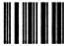

2

Slow Forward 1 - Instructs the player to play forward at 1/4 the normal speed.

Slow Forward 2 (CAV)

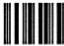

2

Slow Forward 2 - Instructs the player to play forward at 1/8 the normal speed.

Slow Forward 3 (CAV)

2

Slow Forward 3 - Instructs the player to play forward, displaying 1 frame / second.

Slow Forward 4 (CAV)

2

Slow Forward 4 - Instructs the player to play forward direction, 1 frame / 3 seconds.

Slow Reverse 1 (CAV)

2

Slow Reverse 1 - Instructs the player to play in reverse at 1/4 the normal speed.

Slow Reverse 2 (CAV)

2

Slow Reverse 2 - Instructs the player to play in reverse at 1/8 the normal speed.

Slow Reverse 3 (CAV)

2

Slow Reverse 3 - Instructs the player to play in a reverse direction, 1 frame / second.

Slow Reverse 4 (CAV)

2

Slow Reverse 4 - Instructs the player to play in reverse, 1 frame / 3 seconds.

* See text description of Extended LaserBarcode commands on pages 7 and 8.

** NOTE: The Slow Forward and Slow Reverse commands function with CAV discs only. The Slow Forward and Slow Reverse playback speeds described above relate to the playback speed of Pioneer players only. These Slow Forward and Slow Reverse barcode commands may execute differently on other manufacturer's players. The LB2 format allows the following range of speeds for these commands:

- Slow Forward or Reverse \(1 = 1 / 4\) to \(1 / 3\) speed;
- Slow Forward or Reverse \(2 = 1 / 12\) to \(1 / 8\) normal speed;
- Slow Forward or Reverse \(3 = 1\) frame per second;
- Slow Forward or Reverse \(4 = 1\) frame every 2 or 3 seconds.

(continued on next page)

### LaserBarcode 2 Sample Barcodes (cont.)

#### Original LaserBarcode Search Commands

Frame Search (CAV only)

Search to Frame 1000

Chapter Search (CAV & CLV)

Search to Chapter 2

#### Extended LaserBarcode Search Command

Time Search (CLV)

Search Time 0:34:56

2

#### Original LaserBarcode Segment Play Commands

Frame Segment Play (CAV only)
In this example, Analog Audio Stereo is ON.

Play from Frame 1000 to Frame 1200

Chapter Segment Play (CAV & CLV)
In this example, Analog Audio Stereo is ON.

Play from Chapter 2 to Chapter 5

#### Extended LaserBarcode Segment Play Commands

Time Segment Play(CLV)

In this example, Audio is OFF

Search to Time number 0:23:45, play to 0:34:56

Special Effects Segment (CAV)

Frame segment play at

Speed 1, 2, 3, or 4 —

in forward or reverse.

Play from Frame 4000 to 5000, at Speed 2

2

The LB2 sample barcodes were created using Pioneer's
Bar'n'Coder 3.0 software for the Macintosh.

### Independent LaserBarcode Commands

There are 26 independent LB2 commands: Fourteen “original” independent LaserBarcode commands and 12 “extended” independent LaserBarcode commands.

#### Original Independent Commands (CAV, CLV discs unless indicated)

1. Video On - Sets the video control attribute to "on." Video is turned on during playback.
2. Video Off - Sets the video control attribute to "off." Video is turned off during playback.
3. Audio Stereo - Sets the audio control attribute to "analog stereo," plays back left and right analog audio channels simultaneously.
4. Audio Ch 1/Left - Sets the audio control attribute to "analog channel 1," plays back analog left channel only.
5. Audio Ch 1/Right - Sets the audio control attribute to "analog channel 2," plays back analog right channel only.
6. Audio Off - Sets the audio control attribute to "off," mutes both analog and digital audio playback.
7. Play - Instructs the player to play the disc:
a) If player is in Park Mode, the Play command instructs the player to spin up and begin playing the disc.
b) If player is in Still or Pause Mode, the Play command instructs the player to resume playback of the disc from that point.
8. Pause - Instructs the player to halt playback of the disc and squelches the video. Pause can be used with both CAV and CLV discs.
9. Step Forward - Instructs the player to step 1 frame in the forward direction. Step Forward can only be used with CAV discs.*
10. Step Reverse - Instructs the player to step 1 frame in the reverse direction. Step Reverse can only be used with CAV discs.*
11. Park Disc - Instructs the player to stop playback, spin down the disc and put the player in Park Mode.
12. Clear - Instructs the player to clear a stop marker during motion sequences. For example, if a scanned barcode instructs the player to search to frame 1000 and play to frame 3000, sending the Clear command will clear the frame 3000 stop marker and playback will continue beyond that point on the disc.

(Continued on next page)

* Step Forward and Step Reverse barcodes can also be used with CLV discs played on the LD-V8000.

#### Original Independent Commands

(Continued from previous page)

The final two original independent LaserBarcode commands are designed for use in barcode development and testing. The Debug On and Debug Off commands allow the barcode developer to test printed barcodes to determine their accuracy. They are described below:

13. Debug On - Instructs the player to maintain various player settings so that barcodes can be tested. For example: If the Display is turned on by the user through the remote control unit or front panel button, scanning Debug On will instruct the player to maintain that setting for subsequent barcode commands. Normally, when barcodes are transmitted to the player, the Display is turned off. Debug On will also instruct the player to maintain previously set video and audio attributes. So, if the player is set to stereo with the video on, these attributes will be maintained even if the barcode you scan changes the attributes to a different setting. Again, this is done so the developer can test the accuracy of the general operation of the barcode.

14. Debug Off - Instructs the player to disable the Debug On mode and allows exact execution of the barcode as defined. Debug Off need only be used if Debug On has been previously set.

#### Extended Independent Commands (CAV or CLV discs, unless indicated)

15. Start - Instructs the player to spin up the disc from a park position and pause at frame 1 (CAV discs) or time number 0:00:00 (CLV discs) with video squelched.
16. Digital Stereo - Sets the audio control attribute to "digital stereo," plays back left and right digital audio channels simultaneously.
17. Digital - Ch 1/Left - Sets the audio control attribute to "digital channel 1," plays back digital left channel only.
18. Digital - Ch 2/Right - Sets the audio control attribute to "digital channel 2," plays back digital right channel only.

NOTE: Many discs do not have digital audio. Digital audio playback can only be implemented if digital audio is encoded on the disc. Please refer to the documentation for the particular videodisc in use.

NOTE: The Slow Forward and Slow Reverse commands below can only be used with CAV discs.

19. Slow Forward 1* - Instructs the player to play forward at 1/4 the normal speed.
20. Slow Forward 2 - Instructs the player to play forward at 1/8 the normal speed.
21. Slow Forward 3 - Instructs the player to play forward, displaying 1 frame / sec.
22. Slow Forward 4 - Instructs the player to play forward at 1 frame / 3 seconds.
23. Slow Reverse 1 - Instructs the player to play in reverse at 1/4 the normal speed.
24. Slow Reverse 2 - Instructs the player to play in reverse at 1/8 the normal speed.
25. Slow Reverse 3 - Instructs the player to play in reverse, displaying 1 frame / sec.
26. Slow Reverse 4 - Instructs the player to play in reverse at 1 frame / 3 seconds.

* The Slow Forward and Slow Reverse speeds indicated are for Pioneer LB2 compatible players. These barcode commands may execute differently on other manufacturers' players because of the range of playback speeds allowed within the LB2 standard. See Note at bottom of page D-4.

### B. LaserBarcode 2 Search Commands

The are three LaserBarcode 2 Search Commands: Two original search commands and one extended search command.

#### Original Search Commands

1. Frame Search - (CAV) Instructs the player to search to the specified frame and enter Still Mode. This command can only be used with CAV discs.

This command was modified to include digital audio playback under LB2.

2. Chapter Search - (CAV, CLV) Instructs the player to:

a) search to the specified chapter and enter Still Mode on CAV discs.
b) search to the specified chapter and enter Pause Mode on CLV discs. †

This command was modified to include CLV chapter search and digital audio playback under LB2.

#### Extended Search Command (CLV discs)

3. Time Search - (CLV) Instructs the player to search to the specified time number and enter Pause Mode.† This command can only be used with CLV discs.

### C. LaserBarcode 2 Segment Play Commands

The are four LaserBarcode 2 Segment Play commands: Two “original” LaserBarcode Segment Play commands and two “extended” LB2 Segment Play commands.

#### Original Segment Play Commands

1. Frame Segment - (CAV) Instructs the player to search to the start frame number and play to the end frame number. When the motion segment is completed, the player enters Still Mode. This command can only be used with CAV discs.

This command was modified to include digital audio playback under LB2.

2. Chapter Segment - (CAV, CLV) Instructs the player to search to the start chapter number and play to the end chapter number. When the motion segment is completed, the player will:

a) enter Still Mode on the first frame of the next chapter on CAV discs.
b) enter Pause Mode on the first frame of the next chapter on CLV discs.†

This command was modified to include digital audio playback under LB2.

#### Extended Segment Play Commands

3. Time Segment - (CLV) Instructs the player to search to the start time number and play to the end time number. When the motion segment is completed, the player enters Pause Mode.† This command can only be used with CLV discs.
4. Special Effects Segment - (CAV) Instructs the player to search to the start frame number and play to the end frame number in the slow motion forward or reverse directions. This command can only be used with CAV discs. Specify speed and direction as follows:

|  Direction | Speed on Pioneer LD Players*  |
| --- | --- |
|  Forward or Reverse | Slow Motion 1 = 1/4 x normal Slow Motion 2 = 1/8 x normal Slow Motion 3 = 1 frame / second Slow Motion 4 = 1 frame / 3 seconds  |

† On an LD-V8000 player this command will end in Still Mode.

* The speeds described in the Special Effects Segment Play Commands above, are specific to Pioneer LB2 compatible industrial videodisc players. See bottom of page I-4 for range of Slow Forward and Slow Reverse playback speeds of the LB2 Standard.

### 3. LaserBarcode, LaserBarcode 2 Logos

Developers and publishers of barcode applications should pay particular attention to the LaserBarcode and LaserBarcode 2 command sets and their respective logos. When creating barcode applications that are intended to work with older LaserBarcode (LB) compatible machines, developers and publishers must use only the "original" LaserBarcode standard command set. When creating barcode applications to work with LB2 compatible players, developers and publishers can use original LB barcodes as well as LB2 "extended" commands. See Figures 1 & 2.)

*Figure 1*

*Figure 2*

NOTE: LaserBarcode standard commands are a sub-set of the LaserBarcode 2 Standard. Applications using only "original" LaserBarcode standard commands will play on all LB compatible players and on all LB2 compatible players. If, however, an application uses LB2 "extended" commands (distinguished by the subscript 2 next to the code), the LB2 "extended" commands will not play on LB compatible players. (See Figure 3, Player Compatibility with Barcode Standard Formats, on page D-10.)

Customers look for these logos to assure the application can be used with specific players that are LaserBarcode or LB2 compatible. LaserBarcode, LB2 as well as Barcode CD barcodes may be created using Pioneer Barcode preparation software: The Bar'n'Coder 3.0 for the Macintosh®, LaserDisc Controller v3.1 for MS-DOS compatible machines, and BarKoder for Windows v 2.0™ for MS DOS 5.0 and MS Windows 3.1 or above.. (See Technical Bulletin #140A, Barcode CD and the CLD-V2400, for more information about Barcode CD barcodes and the Barcode CD logo. See Product Information Bulletins #1D, 2C, 3B,14, 15, 16 & 20 for more information about the Barcode System, barcode creation software (Bar'n'Coder, LaserDisc Controller v3.1, BarKoder for Windows v2.0), and barcode readers.

NOTE: Contact New Media Technologies Inc., Multimedia Systems Division, Engineering/ East Coast Tech. Support, 201/327-6400, or Engineering/ West Coast Tech. Support, at 310/522-8600 for more information on the Barcode System and for information about licensing the LB2 or LB logos.

4. Pioneer Barcode Readers UC-V108BC & UC-V109BC; UC-V104BC (discontinued)
Pioneer Barcode Readers UC-V108BC, UC-V109BC and the discontinued UC-V104BC scan and transmit all LB2 commands — "original" as well as "extended". (They also scan and transmit Barcode CD Commands to control Pioneer CLD-V2600 and CLD-V2400 players.) Whether or not the player actually accepts the command, depends on player compatibility with LB2, not on the Pioneer reader. See Appendix E for information about Pioneer Barcode Readers UC-V108BC & UC-V109BC.

Bar'n'Coder™ is a trademark of Pioneer New Media Technologies, Inc.
BarKoder for Windows™ is a trademark of PC Ideas International Corp.
Macintosh® is a trademark of Apple Computer, Inc.
LaserBarcode™ and LaserBarcode2™ are registered trademarks of Pioneer Electronics Corp.

### 5. Creating Barcodes

Pioneer New Media Technologies, Inc. sells barcode preparation software packages for creating standard LaserBarcodes, extended LaserBarcode 2 or Barcode-CD barcodes. *Bar'n'Coder 3.0* is a Hypercard-based barcode creation and printing software for the Macintosh. *LaserDisc Controller v3.1* is barcode creation and printing software for MS-DOS compatible machines. *BarKoder for Windows v 2.0* is for use with a minimum 80386 IBM or compatible machine running MS DOS 5.0 and MS Windows 3.1 or above. All barcode preparation software packages are available through authorized Pioneer New Media Technologies, Inc. dealers.

|  Player Compatibility with Barcode Standards  |   |   |   |   |   |   |   |   |
| --- | --- | --- | --- | --- | --- | --- | --- | --- |
|  Standard | LD-V2000 | LD-V2200 | CLD-V2400 | LD-V4400 | LD-V8000 | LC-V330 | LD-V4200 | LD-V6000  |
|  Discontinued Models  |   |   |   |   |   |   |   |   |
|  LaserBarcode Original Commands. † ‡ †† | Yes † | Yes † ‡ †† | Yes † ‡ †† | Yes † ‡ †† | Yes* † ‡ †† | Yes (With LBA 15) † ‡ †† | Yes With LBA 15 † ‡ †† | Yes With LBA 25 † ‡ ††  |
|  LaserBarcode2 Original & Extended Commands † ‡ †† | No | No | Yes † ‡ †† | Yes † ‡ †† | Yes** † ‡ †† | No | No | No  |
|  Barcode CD † ‡ †† | No | No | Yes † ‡ †† | No | No | No | No | No  |

* LD-V8000 players with serial numbers greater than KJ3906076 (after December '91) have built-in LaserBarcode capability.

**LD-V8000 players with serial numbers greater than ME3912276 (after May 1992) have built-in LaserBarcode 2 capability. LD-V8000 players manufactured before May 1992 can be updated to LB2 by contacting Pioneer Electronics Service and ordering an EPROM Replacement Kit. The LB2 Logo appears on players with serial numbers greater than MJ3914776 (after October 1992).

† UC-V104BC — This barcode scanner scans and transmits LB, LB2 original and extended commands, and Barcode CD commands to the players that are compatible with these barcode formats. Use the UC-V104BC in mode 2, except use it in Mode 1 with the LD-V2000. See *Product Information Bulletin #7 A*. This is the only Pioneer barcode reader that works with the LD-V2000. Control Cable: A stereo mini plug with a threaded screw-type connector goes to a jack on the reader; a mono mini plug goes to the jack on the player. (Use DIN adapter to attach the control cable to IO port on the back of the LD-V2000.)

‡ UC-V108BC — The autoscanner scans and transmits LB, LB2 original and extended commands, and Barcode CD commands to the players that are compatible with these barcode formats. See *Product Information Bulletin #14 A*. Control Cable: A mono mini plug with a simple locking connector goes to a jack on the reader; a mono mini plug goes to the jack on the player.

†† UC-V109BC — This barcode scanner scans and transmits LB, LB2 original and extended commands, and Barcode CD commands to the players that are compatible with these barcode formats. See *Product Information Bulletin #15*. Control Cable: A stereo mini plug goes to a jack on the reader; a stereo mini plug goes to the jack on the player.

**NOTE:** The LD-V2000 and the LD-V2200 are not LB2 compatible players. The LD-V4200 (discontinued) with LBA/15 and the LD-V6000/A and LD-V6010/A (discontinued) with LBA/25 and the LC-V330 Autochanger with LBA/15 also are not LB2 compatible players.

## Appendix E: Using Pioneer Barcode Readers

• *UC-V108BC & UC-V109BC*

### The Pioneer Barcode Reader UC-V108BC

#### Overview of the UC-V108BC

Pioneer Autoscanning Barcode Reader UC-V108BC scans LaserBarcode™, LaserBarcode 2™ and Barcode CD™ commands and sends them to control Pioneer's barcode compatible LaserDisc or combination LaserDisc/Compact Disc players. It may be used with the Pioneer LD-V8000, LD-V4400, CLD-V2600, CLD-V2400, LD-V2200, LC-V330 Auto Changer with LBA/15, the discontinued LD-V4200 with LBA/15 and with the discontinued LD-V6000A with LBA/25. The UC-V108BC does not work with the LD-V2000 player. See Appendix D, page D-10 for player barcode-compatibility.

The Autoscanning Barcode Reader provides a new scanning concept — there is no need to draw the scanner across the barcode. In addition, the Autoscanning reader adds the most frequently used functions of a remote control. (See Figures A & B below.)

Four views of the UC-V108BC

*Figure A*

1 - Reset Switch
2 - Battery Cover
3 - Infrared Transmitter
4 - Sensor Unit
5-READ Button

6—SEND/REPEAT Button
7-PLAY Button
8—SCAN FWD/REV Buttons
9-STEP FWD/REV Buttons\*
10 - SKIP FWD / REV Buttons\*\*

11—AUDIO Button†
12—DISPLAY Button
13—PAUSE
14—Control Cable Connection Terminal

* STEP FWD/REV are generally used only with CAV discs. With the LD-V8000 player, however, these functions can be used with CAV and CLV discs.
** The SKIP FWD / REV function cannot be used with the LD-V8000.
† Use the AUDIO Button to toggle through eight Audio options: 1) Digital Stereo, 2) Digital 1/L, 3) Digital 2/R, 4) Audio Off, 5) Analog Stereo, 6) Analog 1/L, 7) Analog 2/R and 8) Audio Off. All eight selections are available with discs that are encoded with both digital and analog sound. The first four selections are available with discs encoded only with digital sound and selections 5 through 8 are available with discs encoded only with analog sound.

Battery Installation / Transmitting Infrared Signals

*Figure B*

Insert the 4 batteries (AAA/RO3 type)

Incorrectly inserted batteries can cause leakage or other damage. Be careful about the following:

1. Load the batteries with correct plus (+1) and minus (-1) direction as indicated inside the battery case.
2. Do not mix new and old batteries.
3. Batteries can have different voltages although their shapes are same. Do not mix batteries of different voltages.
4. Do not mix ordinary and rechargeable batteries. Confirm the instructions of the batteries before use.

#### Scanning Barcodes with the UC-V108BC Autoscanning Reader

Place the Autoscanning reader sensor over the barcode. Line up the arrow on the scanner with the left edge of the barcode. Press the blue READ button and the barcode is automatically scanned. A "Beep" indicates the code has been successfully scanned. Before transmitting the command, place a disc in the player and spin it up by pressing the PLAY button on the reader, the PLAY button on the front of the player, or by scanning and sending a "START" or "PLAY" barcode command to the player.

#### Sending Barcode Commands to the Player with the UC-V108BC

Once a disc has been spun-up, barcode commands scanned with the UC-V108BC reader can be transmitted to the player automatically in wired mode, or they can be sent in infrared mode by pointing the infrared sensor on the front of the unit toward the remote sensor on the player and pressing the SEND/REPEAT button.

When using the reader in infrared mode, make sure the control cable is disconnected from both the player and the reader and that the batteries are fresh. The reader can transmit the infrared signal approximately 23 feet with new batteries installed. The path of transmission should be unobstructed and within a 30 degree angle of the remote sensor. The Autoscanning reader holds the last barcode scanned in its memory; this barcode command can be re-sent by pressing the SEND/REPEAT button again. A "Beep" indicates the code has been successfully transmitted.

A control cable is packaged with the unit to provide a wired connection. The control cable has mono mini plugs at both ends. The end that connects to the Autoscanning reader has a locking connector and when inserted into the plug on the reader should be twisted to provided a secure connection. The plug on the other end of the cable is simply connected to the mini-jack on the front of the player. Make sure the player is turned off when connecting or disconnecting the cable.

#### Built-in Remote Control Functions Available on the UC-V108BC

Remote control functions available at the press of a button include: Play, Pause, Step* Forward and Reverse, Scan Forward and Reverse, Chapter / Track Skip** Forward and Reverse, Audio Select and Display.

### Pioneer Barcode Reader UC-V109BC

Overview of the UC-V109BC

Pioneer Barcode Reader UC-V109BC scans LaserBarcode™, LaserBarcode 2™ and Barcode CD™ commands and sends them to control Pioneer's barcode compatible LaserDisc or combination LaserDisc/Compact Disc players. The UC-V109BC Barcode Reader also has eight remote control function buttons built-in. It works with Pioneer Industrial LaserDisc players LD-V8000, LD-V4400, CLD-V2600, CLD-V2400, LD-V2200, the LC-V330 Auto Changer with LBA/15, the discontinued LD-V4200 with LBA/15, and

* Step Fwd / Rev are used only with CAV discs; With the LD-V8000 player, however, they can be used with CAV and CLV discs.

** The Skip Fwd / Rev function cannot be used with the LD-V8000.

the discontinued LD-V6000A with LBA/25. The unit does not work with the LD-V2000 player. See Appendix D, page D-10 for player barcode-compatibility.

The following remote control functions are available on the UC-V109BC: Play, Pause, Scan Forward and Reverse, Step Forward and Reverse*, Chapter /Track Skip Forward and Reverse**. Press the remote control function buttons on the side of the reader and point the infrared transmitter at either end of the reader toward the player to send commands in infrared mode. (See Figure C below.) If the reader is connected to the player via wire, the commands are sent automatically regardless of the orientation of the infrared transmitter.

1 Sensor Unit
2 Infrared Transmitter
3 READ button
4 SEND/REPEAT button
5 Memory Indicator Light
6 Battery Cover
7 Cable Connection Terminal
8 PAUSE Button
9 PLAY Button
10 SCAN FWD/REV
11 STEP FWD/REV*
12 SKIP FWD/REV**

*Figure C*

Pioneer
Barcode
Reader
UC-V109BC

#### Preparing the UC-V109BC Barcode Reader for Use

- Check to make sure that the batteries are fresh and placed correctly in the battery compartment of the reader.
- If you will be using the reader in wired mode, make sure that the wired connections to the reader and the player are secure.

#### Using the UC-V109BC Barcode Reader

Turn on the barcode compatible LaserDisc player or combination LD/CD player, insert a LaserDisc or Compact Disc that has accompanying barcode materials. Spin -up the disc by pressing the PLAY button on the reader, or on the front of the unit, or by sending a START barcode command on LB2 compatible players. Grasp the reader like a pen and place the sensor next to the barcode, tilted at about a 30 degree angle from a vertical position. Press the blue READ button. Start scanning in the white space beside the barcode and move the sensor tip of the reader horizontally across the barcode at a constant speed. You will hear a "beep" and the red indicator light on the top surface of the reader will light up when the code has been successfully read. This light remains lit as long as the barcode command is held in memory (about 60 seconds). NOTE: The barcode may be scanned from left to right or from right to left. (See Scanning Tips, Figure D on the next page.)

*Figure D Scanning a LaserBarcode*

#### Wireless Operation of the UC-V109BC

The UC-V109BC reader works in both wired and infrared mode. When using the reader in infrared mode, press the red SEND/REPEAT button and point either the tip or the blunt end of the reader toward the infrared sensor on the player to transmit the code. Also, make sure the wire is disconnected from both the reader and the player or commands will not be successfully sent to the player.

The UC-V109BC can send an infrared signal about 23 feet to the player with fresh batteries installed. It may take up to two seconds to send a barcode command from the reader to the player. The infrared sensor must receive the entire transmission to process the command correctly. Make sure the reader's infrared transmitter remains pointed at the infrared sensor on the player and that the signal path is unobstructed for the entire transmission of the command. A "beep" signals that the player has received the command.

#### Wired Operation of the UC-V109BC

When the reader is attached to the player via wired connection, the code is transmitted automatically to the player as soon as it is scanned. There is no need to press the SEND/REPEAT button. A beep will sound as the barcode is read.

NOTE: In both wired or infrared mode, the reader holds the last barcode scanned in its memory for approximately 60 seconds. The last barcode scanned can be re-sent by pressing the SEND/REPEAT button again. Each time the SEND/REPEAT button is pressed, the code is retained an additional 60 seconds.

NOTE: Pioneer Industrial Videodisc Players LD-V8000, LD-V4400, CLD-V2600, CLD-V2400, LD-V2200, LD-V2000, LD-V4300D, the discontinued LD-V4200 with LaserBarcode Adapter/15, the discontinued LD-V6000A/LD-V6010A with LaserBarcode Adapter/25, and the LC-V330 (AutoChanger), are fully LaserBarcode compatible, accepting all LaserBarcode Standard Commands. The LD-V8000, LD-V4400, CLD-V2600, CLD-V2400 are LB2 Compatible. The LaserBarcode 2 command set contains all of the "original" LB commands and 15 "extended" commands. (See Appendix D for more information on LaserBarcode 2.)

## Appendix F: LD-V4400 Internal Player Control

### LD-V4400 Control Blocks

The following control blocks are used within the LD-V4400.

1.) Communication control block
2.) Player control block

#### 1) Communication control block

The communication control block is divided into ten units. It analyzes commands sent via various input methods, and executes the commands.

##### Status display LED

The LD-V4400 player has seven LED status display indicators: POWER, LD-ROM / BUSY, PARK, PLAY, SEARCH and KEY LOCK on the front panel.

See Section 3.1 Player Indicators for details on LED operations.

##### LED driver

The LED driver turns on the LED indicators.

##### Front Panel Buttons

The LD-V4400 player has OPEN/CLOSE, PLAY, STILL/STEP FORWARD, STILL/STEP REVERSE, SCAN FORWARD, SCAN REVERSE, and DISPLAY and LD-ROM On/Off buttons on the front panel. (See Section 3.1 Front Panel Control Buttons, page 3-1. Also see Section 2.4 On-Screen Function Switches, page 2-11, for more details on using these buttons.)

##### Key Decoder

When a front panel button (key) is pressed, the key decoder generates data corresponding to the pressed button and sends it to the subcontrol manager.

##### Wireless Remote Control Unit

This is the remote sensor on the front panel. It converts the infrared LaserBarcode or RCU code to an electric signal.

##### Wired Remote Control Unit

This is the LaserBarcode terminal on the front panel. It receives the LaserBarcode or RCU code via the stereo pin jack.

##### Button/RCU Command Processor

This command processor analyzes the front panel button /RCU command data received from the subcontrol block for execution.

##### RS-232C Command Processor

The RS-232C command processor analyzes RS-232C command data received from the RS-232C buffer for execution.

##### RS-232C Buffer Unit

The RS-232C buffer unit receives input from the 15-pin D-SUB connector placed on the rear panel. The unit consists of an input command data buffer and an output status data buffer.

##### Character Generator

This unit generates character signals to be superimposed on the video signals displayed by the player. Character data is sent from command processors to the character generator.

#### 2) Player control block

The player control block analyzes player control commands received from the command processor of the communication control block and executes them to control the player accordingly.

##### Servo Control Unit

This unit communicates with the digital servo unit and controls player processing.

##### Video Control Unit

This unit analyzes video control commands received from the communication control block to control output video signals.

##### Audio Control Unit

This unit analyzes audio control commands received from the communication control block to control output audio signals.

##### Focus Servo Unit

This unit controls the focus servo mechanism.

##### Tracking Servo Unit

This unit controls the tracking servo mechanism.

##### Slider Servo Unit

This unit controls the slider servo mechanism.

##### Spindle Servo Unit

This unit controls the spindle servo mechanism.

(See Player Control Block diagram on next page.)

* A servo unit constantly takes readings for focus, tracking, spindle operations, etc, and provides information to the player so it can make appropriate adjustments.

### Independent Command Processor

The LD-V4400 player can be controlled by several different methods: From the Front Panel Buttons, the Remote Control Unit or LaserBarcode Reader (Level I) or from an external computer via the RS-232 port (Level III).

An independent command processor inside the player assures the most appropriate operating environment is used. Because of this, the same commands may perform differently, depending on the control method. See Chapter 3 Manual Control for Level I player control using Front Panel buttons, Section 3.1; using a Remote Control Unit, Section 3.2; or using the LaserBarcode Reader, Section 3.3 and Appendices B, D and E. See Chapter 4 External Computer Control for sending commands from an external computer.

Most of the commands input to the player have arguments such as frame number, chapter number, time code or various parameters. An argument storage area and an address flag indicating the frame, time, or chapter number are provided for each control method. Therefore, arguments input for one particular control method do not affect operations performed with another method.

### Internal Player Components (See Block Diagram of Internal Registers, p. F-7)

#### Address Specification Flag Register (computer control)

This register indicates whether a particular address argument sent from a computer is a frame number, time code, or chapter number.

#### Serial Digit Buffer (computer control)

This buffer stores the numeric values of arguments sent from an external computer. The contents of this buffer are sent to the specified registers for command execution.

#### Command Processor (computer control)

This processor reads the contents of the RS-232C buffer. It sends the arguments to the digit buffer, or executes commands.

#### RS-232C Buffer

This is the RS-232C Input/Output data buffer. Twenty-two bytes are used for input and another 22 bytes are used for output.

#### Address Specification Flag Register (manual control)

This register indicates whether the address arguments are frame numbers, time numbers, or chapter numbers for normal control operations.

#### Digit Buffer (manual control)

This buffer stores the numeric values of arguments for normal control operations. The contents of this buffer are sent to the specified register for command execution.

#### Command Processor (manual control)

This reads the contents of the RCU/key decoder and sends the contents to the digit buffer if they are arguments, or executes the command if the RCU/key decoder contains a command.

#### RCU/Key Decoder

This monitors RCU/key inputs. If arguments and commands are input, the decoder generates the internal code corresponding to the input data.

#### Input Buffer

This monitors the RCU/key decoder if the RCU is selected for the input device, or it monitors the serial decoder if serial input is selected. When commands are sent, the input buffer stores the input data.

#### Current Frame Register

This register stores the frame number of the frame currently playing.

#### Current Time Register

This register stores the time number of the current screen when a CLV disc with time number is used.

#### Current Chapter Register

This register stores the chapter number of the chapter currently playing.

#### Search Frame Register

This register stores the frame number of the search destination. The search operation is performed by comparing the contents of this search frame register and the contents of the current frame register.

#### Search Time Register

This register stores the time number of the search destination. The search operation is performed by comparing the contents of this *Search Time Register* and the contents of the *Current Time Register*.

#### Search Chapter Register

This register stores the chapter number of the search destination. The search operation is performed by comparing the contents of this *Search Chapter Register* and the contents of the *Current Chapter Register*.

#### Mark Frame Register

This register stores a frame number marker. If a marker is set and the address specification flag indicates frame, the contents of this register are compared with the current frame. If they match, the player automatically holds a still frame.

#### Mark Time Register

This register stores a time number marker. If a marker is set and the address specification flag indicates time, the contents of this register are compared with the current time. If they match, the player automatically holds a still frame.

#### Mark Chapter Register

This register stores a chapter number marker. If a marker is set and the address specification flag indicates chapter, the contents of this register are compared with the current chapter. If they match, the player automatically holds a still frame.

#### Speed Register

This register stores the speed used for multi-speed play.

#### Audio/Video Control Register

This register controls audio/video output.

#### Display Control Register

This register controls the display of frame numbers/time codes, chapter numbers, and specific user-generated characters.

#### Display Buffer

This buffer holds character data. It provides up to 20 characters on 3 lines for the system and up to 20 characters on 12 lines for the user.

#### REG. A to REG. D

These are switches used for the specific LD-V4400 functions. Registers C and D can be read from the On-Screen Function Switches at power-on.

### LD-V4400 Internal Registers

Many commands given to the player are accompanied by such arguments as frame number or chapter number. These values are set in the respective registers of the player. The following figure shows a model of the LD-V4400's internal registers and illustrates the concept of the relationship between the registers. This model is helpful in understanding the initial state of a particular register or how a given command changes the contents.

## The Art of Entertainment

PIONEER NEW MEDIA TECHNOLOGIES, INC.

Corporate Headquarters

2265 East 220th Street

Long Beach, CA 90810

TEL: (310) 952-2111

FAX: (310) 952-2990

### EAST

Multimedia Systems Division

Sales Office

600 East Crescent Avenue

Upper Saddle River, NJ 07458-1827 USA

TEL: (201) 327-6400

FAX: (201) 327-9379

### CENTRAL

MSD Sales Office

1263 Hamilton Parkway

Itasca, IL 60143

TEL: (708) 285-4500

FAX: (708) 285-4570

### WEST

MSD Sales Office

& Technical Support

2265 E. 220th Street

Long Beach, CA 90807

TEL: (310) 952-2111

FAX: (310) 952-3031

### PIONEER ELECTRONIC (EUROPE)

N.V. Branch Office

417 Bridport Rd. Greenford, Middlesex, ENGLAND UB6-8UE

### PIONEER ELECTRONICS (AUSTRALIA) PTY. LTD.

178-184 Boundary Rd., Braeside, Victoria 3195, AUSTRALIA

### PIONEER ELECTRONIC CORPORATION

4-1, Meguro 1-Chome, Meguro-ku, Tokyo 153, JAPAN
