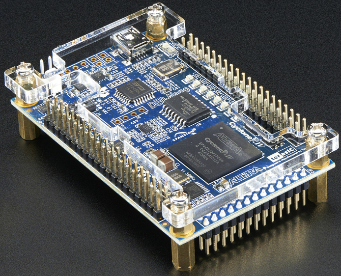

# FPGA bitstream

How to build the Domesday Duplicator's gateware and get it onto the DE0-NANO, with a check to
confirm each step actually worked.

{ width="500" }

The gateware runs on a **Terasic DE0-NANO** carrying an Intel (Altera) **Cyclone IV
EP4CE22F17C6**. It generates the ADC sampling clock, buffers samples across the clock-domain
boundary, and feeds them to the FX3 over the GPIF II bus.

The board has an **onboard USB-Blaster**, so no separate programming pod is needed — the
DE0-NANO's mini-USB connector is both its power supply and its programming interface.

There are two ways to program it, and you will usually want both:

| | Writes to | Survives a power cycle | Use for |
| --- | --- | --- | --- |
| **FPGA configuration SRAM** (`.sof`) | Volatile memory in the FPGA | **No** | Testing a bitstream before committing to it |
| **EPCS64 serial configuration device** (`.jic`) | The DE0-NANO's onboard flash | **Yes** | Normal use |

Start with the `.sof`. It cannot leave the board in a bad state — a power cycle restores
whatever the flash holds — so it is the safe way to find out whether a bitstream works before
making it permanent. This mirrors the RAM-then-EEPROM order on the
[FX3 firmware](fx3-firmware.md) page, and for the same reason.

## Before you start

1. **Set up device access** — [Linux device access](linux-device-access.md). Without it,
   Quartus reports `Unable to lock chain - Insufficient port permissions` and cannot program
   anything.
2. **Get Quartus Prime Lite.** It is free and needs no licence file, but it is a
   multi-gigabyte download and is `x86_64` Linux or Windows only. The project builds against
   **version 25.1**.

!!! tip "You may not need to build anything"

    Prebuilt `.sof` and `.jic` files are attached to
    [releases](https://github.com/simoninns/DomesdayDuplicator/releases), along with a
    `bitstream-provenance.txt` recording the commit and Quartus version they came from. If you
    only want to program a board, skip to [step 2](#2-program-the-board).

## 1. Build the bitstream

### With Nix

From anywhere in a checkout, on `x86_64-linux`:

```bash
nix build .#bitstream
ls result/
```

```
application/  factory/  provisioning/  reports/  bitstream-provenance.txt
```

The gateware is **two** images that live in one flash: the capture gateware in
`application/`, and a small resident boot loader in `factory/` that a unit falls back to if
a gateware update is ever interrupted. `provisioning/` holds the one `.jic` that carries
both, and that is the file a board is programmed with. The model is described on the
[EPCS layout and boot flow](../epcs-layout-and-boot-flow.md) page.

There is deliberately **no `.jic` of the capture gateware alone**: programming one would
write it over the factory image, leaving a unit with nothing to fall back to.

Quartus comes from the flake, so nothing needs installing first. **The first build is slow**:
Quartus is not redistributable, so it can never come from a binary cache and must be fetched
from Altera. The build is restricted to the Cyclone IV device family, which removes five of
the six component downloads.

### With Quartus installed by hand

Put Quartus' `bin` directory on `PATH`, then:

```bash
./fpga/build-local.sh
```

That copies the sources to `fpga/build/`, compiles both images, converts them into one
provisioning `.jic` — and into the `.svf` carrying the same content as JTAG vectors — and
writes the provenance record. Or drive the tools yourself — the GUI
is not required for any step:

```bash
cd factory      && quartus_sh --flow compile DomesdayDuplicatorFactory
cd application  && quartus_sh --flow compile DomesdayDuplicator
cd provisioning && quartus_cpf -c DomesdayDuplicatorProvisioning.cof   # both .sof -> one .jic
cd provisioning && quartus_cpf -c -q 4.5MHz -g 3.3 -n p \
    DomesdayDuplicatorProvisioning_write_jic.cdf \
    DomesdayDuplicatorProvisioning.svf                                # the same, as vectors
```

!!! warning "Do not compile in `fpga/application/` or `fpga/factory/`"

    `quartus_sh` **rewrites the `.qsf` project file in place** to record the Quartus version
    that last touched it, and scatters about thirty build products beside the sources. Both
    routes above copy the project to a build directory first. If you compile in the source
    directories you will find the repository has uncommitted changes you did not make.

### Check: what did you just build?

The build writes a `bitstream-provenance.txt` recording where the bitstream came from:

```
Source
------
  commit                    1b86b65a
  device                    EP4CE22F17C6
  family                    Cyclone IV E

Toolchain
---------
  quartus                   Version 25.1std.0 Build 1129 10/21/2025 SC Lite Edition
```

A `-dirty` suffix on the commit means the working tree had uncommitted changes, so the hash
alone does not describe what you built. Worth noticing before you program anything.

## 2. Program the board

Each `.cdf` file names its own inputs, so run it from the directory holding the bitstream it
names — under `result/` for a Nix build, `fpga/build/` for a local one.

### 2a. The `.sof` — the test path

```bash
cd application && quartus_pgm DomesdayDuplicator_write_sof.cdf
```

or, to look at the factory image on its own:

```bash
cd factory && quartus_pgm DomesdayDuplicatorFactory_write_sof.cdf
```

```
Info (213045): Using programming cable "USB-Blaster [7-3.2]"
Info (213011): Using programming file ./DomesdayDuplicator.sof with checksum 0x001D67A1 for device EP4CE22F17@1
Info (209016): Configuring device index 1
Info (209017): Device 1 contains JTAG ID code 0x020F30DD
Info (209007): Configuration succeeded -- 1 device(s) configured
Info (209011): Successfully performed operation(s)
```

`0x020F30DD` is the Cyclone IV EP4CE22's JTAG ID. If you see a different one, the `.cdf` is
talking to a different board.

**This is volatile.** Power cycle and it is gone, replaced by whatever is in the EPCS64
flash. That is the point: if the bitstream is broken, you have lost nothing.

### 2b. The provisioning `.jic` — the production path

Do this once you are satisfied the bitstream works.

```bash
cd provisioning && quartus_pgm DomesdayDuplicatorProvisioning_write_jic.cdf
```

!!! tip "Or without Quartus at all"

    `ddd-jtag DomesdayDuplicatorProvisioning.svf` writes the same content through the same
    on-board cable, driving it over libusb rather than through Quartus — see
    [USB-Blaster and SVF programming](../usb-blaster-and-svf.md). The `.svf` comes from the
    same build as the `.jic` and describes the same flash, so the two routes are
    interchangeable; everything on the rest of this page — the power cycle, the silicon
    identifier, what the board comes up as — applies to both. Quartus's own `jtagd` holds
    the cable open whenever it is running, so stop it first.

This writes the EPCS64 serial configuration device, which the FPGA loads from at every
power-up, with **both** images: the factory image at address 0 and the capture gateware at
`0x200000`. It takes appreciably longer than the `.sof` path, because it programs the flash
through the FPGA rather than configuring the FPGA directly.

The programmer prints the flash's silicon identifier as it works. It must read `0x16`, the
EPCS64's, which is the same value the firmware checks before it will write a byte.

**Then power cycle the board, and treat that as part of the procedure rather than as
housekeeping.** The programmer reaches the flash by loading a serial flash loader into the
FPGA, and it leaves that running — so until the board is power cycled the FPGA is running
Altera's loader and not this project's gateware at all. It answers nothing on the register
link, and an update attempted in that state is refused with *"the FPGA is not answering"*.

What it comes up as depends on what was in the flash before, because **the erase is
page-selective and the boot block sector is outside the pages this file writes**:

- a board being provisioned for the first time has no boot block, so it comes up running the
  **factory image** — the resident boot loader rather than the capture gateware. The capture
  application reports it as running recovery gateware. Writing the boot block is the last
  step of a gateware update rather than part of this file, so that is the expected state;
- a board being *re*-provisioned keeps its existing boot block, and if the application image
  just written still matches the CRC that block records, it boots straight into the capture
  gateware.

Both are correct. The [EPCS layout and boot flow](../epcs-layout-and-boot-flow.md) page
describes the states and what makes an application image count.

**This is the last time a cable is needed.** From here the capture gateware is updated over
the same USB cable the Duplicator already uses.

## Confirming what is running

### The LEDs

The gateware generates no pattern of its own. It lights **LED 0 alone** coming out of reset
and then leaves the row to the FX3, which drives it over the register link as a status
display. So the LEDs answer a different question than they used to, and a more useful one:

| What you see | What it means |
| --- | --- |
| Nothing lit | The FPGA is unconfigured — its pins are high-Z |
| One LED, steady | Gateware configured and running, and the FX3 has not spoken to it yet |
| A firmware pattern | The FX3 is talking to it. The patterns are listed on the [FPGA register interface](../fpga-register-interface.md#led-0x11) page |
| One LED, blinking every few seconds | **Not a pattern.** The FPGA is configuring repeatedly — see below |

The blinking case is worth knowing on sight, because it is what a broken handover looks like
and it is easy to read as a heartbeat. Each brief flash is a configuration completing, the
FX3 not getting far enough to write the register, and the board reverting; the lap time is a
few seconds. A unit doing this is not running the capture gateware at all, whatever the
cable says.

The old bouncing-LED check — one lit LED sweeping up the row and back — belonged to gateware
predating the register interface, where it doubled as a PLL-lock indicator. The equivalent
check now is the register bank answering at all: the identity block cannot be read unless the
design is clocked and the PLL is locked.

### The device on USB

The FPGA does not appear on USB itself. What it does is supply the FX3's interface clock, so
the check is that the FX3 still enumerates at full speed:

```bash
$ lsusb -v -d 1209:2347 | grep -E "bcdUSB|iProduct"
  bcdUSB               3.00
  iProduct                2 Domesday Duplicator (d0566b3e)
```

!!! warning "This does not prove the capture path works"

    The FX3 enumerates when *it* boots, which may have been before you reprogrammed the FPGA.
    A device still present at SuperSpeed afterwards is consistent with working gateware but is
    not evidence of it.

    The only test that exercises the path carrying samples is a capture. Dropped samples do
    not announce themselves — a capture with a fault completes normally and produces a file
    that looks fine and is wrong. See below.

### The capture-integrity test — the one that counts

After any gateware change, run a test capture:

1. Launch the capture application and **enable test mode**. This switches the FPGA from ADC
   data to an internally generated counter ramp.
2. Capture for **at least 60 seconds**, so the buffers wrap many times. A short capture can
   pass while a longer one drops samples.
3. Analyse the capture: **Edit → Analyse test data...**, or from a shell,
   `DomesdayDuplicator --analyse-test-data <file>`.

**Zero sequence breaks is a pass.** Any break at all means a sample was lost somewhere
between the FPGA and the disk, and is a blocker rather than a flake — the ramp is
deterministic, so there is no such thing as an intermittent false positive here.

## Reproducibility

Quartus fitting is deterministic: the same source, on the same Quartus version and the same
architecture, produces the same placement and routing. The project pins the two settings that
depends on — the Fitter seed and the parallel-processor count — in the `.qsf`.

What that means for the files:

| File | Across rebuilds |
| --- | --- |
| `DomesdayDuplicator.jic` | **Byte-identical** |
| `DomesdayDuplicator.sof` | Differs in about 34 bytes, all header metadata — a compile timestamp, a per-run design hash, and the checksum covering them |

So `bitstream-provenance.txt` publishes two digests per file: a **release** digest over the
file as shipped, for checking a download, and a **canonical** digest over the configuration
content, for checking a rebuild. For the `.jic` they are the same number.

To verify a released bitstream yourself, rebuild it with the same Quartus version and compare
the canonical digests:

```bash
nix build .#bitstream
./fpga/bitstream-provenance.py --build-dir result
```

## Troubleshooting

| Symptom | Cause and fix |
| --- | --- |
| `Unable to lock chain - Insufficient port permissions` | Device permissions. See [Linux device access](linux-device-access.md) |
| `No JTAG hardware available` | The USB-Blaster is not visible at all. Check the DE0-NANO's mini-USB cable is connected and is a data cable, not charge-only |
| `jtagconfig` reports `USB-Blaster variant` rather than `USB-Blaster` | Also permissions — Quartus cannot open the device far enough to identify the cable |
| `Can't find the programming file` | The `.cdf` names its inputs relative to the working directory. Run `quartus_pgm` from the directory holding the `.sof`/`.jic` |
| A different JTAG ID than `0x020F30DD` | Not a Cyclone IV EP4CE22 — check which board is plugged in |
| LEDs dark or frozen after programming | The PLL is not locking, or the FPGA is held in reset. Check the FX3 board's reset button, and that both boards are seated in their headers |
| Board captures nothing but garbage | The FX3 firmware and the gateware may be out of step. They share a protocol defined in both — update both across a release that changed it |
| Quartus rewrote files in `fpga/application/` or `fpga/factory/` | You compiled in a source directory. See the warning in step 1 |

### You cannot brick the DE0-NANO by programming it

The `.sof` path never touches non-volatile memory. The `.jic` path writes the EPCS64, but the
FPGA can always be reconfigured over JTAG regardless of what the flash contains — the
USB-Blaster talks to the FPGA directly. If a bad image reaches the flash, program a good
`.sof` over JTAG and rewrite the `.jic`.

## Related

- [FX3 firmware](fx3-firmware.md) — the other half, and it must be kept in step with this one
- [Linux device access](linux-device-access.md) — the USB-Blaster needs a udev rule, the same
  as the FX3 does
- [Software guide](../software-guide.md) — what each Verilog module does
