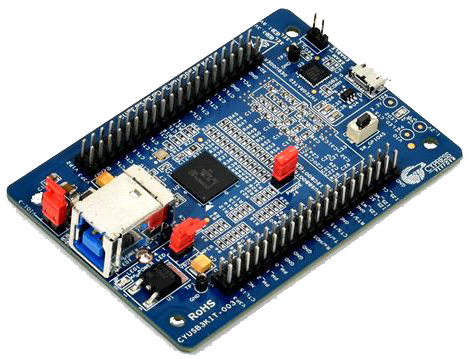

# FX3 firmware

How to build the Domesday Duplicator's USB 3.0 firmware and get it onto the device, with a
check to confirm each step actually worked.

{ width="400" }

The FX3 is a **Cypress EZ-USB FX3 SuperSpeed Explorer Kit (CYUSB3KIT-003)** that plugs into
the Domesday Duplicator PCB. Everything on this page happens over the FX3's own USB
connector.

There are two ways to program it, and you will usually want both:

| | Writes to | Survives a power cycle | Use for |
| --- | --- | --- | --- |
| **RAM** (`-u`) | Volatile memory | **No** | Testing a build before committing to it |
| **I2C EEPROM** (`-p`) | The kit's onboard EEPROM | **Yes** | Normal use |

Start with RAM. It cannot leave the device in a bad state — a power cycle undoes it
completely — so it is the safe way to find out whether an image works before making it
permanent.

!!! note "There is no SPI flash here"

    The SuperSpeed Explorer Kit boots from an I2C EEPROM. Older versions of
    `fx3-programmer`'s help text described `-p` as programming "SPI flash"; that was wrong,
    and there has never been an SPI code path. If you are reading documentation that mentions
    SPI flash for this board, it is out of date.

## Before you start

1. **Set up device access** — [Linux device access](linux-device-access.md). Without it
   every command below reports that no device was found.
2. Locate the **PMODE jumper, J4**, on the FX3 board. You will be moving it.

## 1. Build the firmware

### With Nix

From anywhere in a checkout:

```bash
nix build .#fx3-firmware
ls result/
```

```
firmware.elf  firmware.img  firmware.map
```

`firmware.img` is the one you program. Nothing needs installing first — the ARM cross
compiler, the image builder and the SDK all come from the flake.

### Without Nix

You need `arm-none-eabi-gcc`, CMake, a host C compiler and Python 3.

```bash
cmake -B fx3/firmware/build -S fx3/firmware \
      -DCMAKE_TOOLCHAIN_FILE=../arm-none-eabi-toolchain.cmake
cmake --build fx3/firmware/build
```

The artefacts land in `fx3/firmware/build/`. Full prerequisites and options are in
[`fx3/firmware/README.md`](https://github.com/simoninns/DomesdayDuplicator/blob/main/fx3/firmware/README.md).

### Check: does the build know what it is?

The firmware stamps the commit it was built from into its USB product descriptor, which is
how you will confirm later that the device is running *your* image and not the one that was
already on it. The configure step prints it:

```
-- Firmware version: d0566b3e
```

A value of `unknown` means the build could not determine a version — pass one explicitly with
`-DFIRMWARE_VERSION=<hash>`. A `-dirty` suffix means the working tree had uncommitted
changes, so the hash alone does not describe what you built. Both are worth noticing before
you program anything.

## 2. Put the FX3 into bootloader mode

Both programming modes need the FX3's **boot ROM** in control. Once the device is running
firmware, the boot ROM is not, and neither `-u` nor `-p` will work.

1. **Fit the PMODE jumper (J4).**
2. **Power cycle the board** — unplug the FX3's USB cable and plug it back in.

### Check: is it in bootloader mode?

```bash
$ lsusb -d 04b4:
Bus 007 Device 013: ID 04b4:00f3 Cypress Semiconductor Corp. FX3 micro-controller (DFU mode)
```

`04b4:00f3` and "DFU mode" is what you want. And through the tool:

```bash
$ fx3-programmer -l
Found 1 FX3 device(s):

[0] VID:PID=04b4:00f3 Bus=007 Device=013 Mode=Bootloader (FX3)
```

If it still shows `1d50:603b` / `Mode=Application`, the jumper is not fitted or the board was
not actually power cycled. Note that a warm reboot of your PC may not cut USB bus power —
unplug the cable.

## 3a. Load into RAM — the test path

```bash
fx3-programmer -d 0 -u result/firmware.img
```

```
Uploading result/firmware.img (111348 bytes) to FX3 device 0...
Target device: VID:PID=04b4:00f3
........................................................
Program entry address: 0x400074e8

Successfully uploaded 111300 bytes to FX3 device 0
```

The bootloader transfers control to the image as soon as the download finishes — there is no
separate start step. The device disappears from the bus and comes back as the Domesday
Duplicator a second or so later.

**This is volatile.** Power cycle and it is gone. That is the point: if the image is broken,
you have lost nothing.

## 3b. Write the EEPROM — the production path

Do this once you are satisfied the image works.

```bash
fx3-programmer -d 0 -p result/firmware.img -v
```

```
Downloading flash programmer /…/share/domesday-duplicator/cyfxflashprog.img to device 0...
Successfully uploaded 106408 bytes to FX3 device 0
Found FX3 flash programmer (device 0)
Programming result/firmware.img (111348 bytes, padded to 111360) to FX3 I2C EEPROM...
..
Successfully programmed 111360 bytes to FX3 I2C EEPROM
Verifying result/firmware.img against FX3 I2C EEPROM (111348 bytes, padded to 111360)...
..
Verification successful: EEPROM matches result/firmware.img
Power cycle the device (remove J4/PMODE to boot from EEPROM)
```

Three things worth understanding in that output:

- **A Cypress secondary loader is downloaded first.** The FX3 boot ROM can only write RAM, so
  reaching the EEPROM needs a helper program running on the device. `fx3-programmer` ships it
  and finds it automatically.
- **The device re-enumerates as `04b4:4720` partway through.** That is the loader running.
  It is expected and goes away at the next power cycle.
- **`-v` is worth using.** It re-reads the EEPROM and compares it against the file. Each
  chunk is also verified as it is written, but `-v` checks the whole image afterwards.

Then:

1. **Remove the PMODE jumper (J4).**
2. **Power cycle the board.**

It should now boot the programmed firmware on its own, with no host involvement.

## Confirming what is running

This is the step people skip, and it is the only one that proves anything.

```bash
$ lsusb -d 1d50:603b
Bus 008 Device 005: ID 1d50:603b OpenMoko, Inc. Raspiface
```

Then read the descriptors:

```bash
$ lsusb -v -d 1d50:603b | grep -iE "bcdUSB|iManufacturer|iProduct"
  bcdUSB               3.00
  iManufacturer           1 Domesday86
  iProduct                2 Domesday Duplicator (d0566b3e)
```

Three things to check, in order of importance:

| Field | Expect | If it is wrong |
| --- | --- | --- |
| `iProduct` | `Domesday Duplicator (<commit>)` | The hash in brackets is the commit the firmware was built from. **If it is not the one your build printed, the device is running something else** — most likely the previous EEPROM contents, meaning your programming did not take |
| `bcdUSB` | `3.00` | At `2.10` or lower the device fell back to USB 2.0. Try a different cable or port — this halves your capture bandwidth and causes dropped samples |
| `iManufacturer` | `Domesday86` | Anything else is not this firmware |

You can also confirm the negotiated link speed:

```bash
$ for d in /sys/bus/usb/devices/*/; do
    [ "$(cat $d/idVendor 2>/dev/null)" = "1d50" ] && \
    echo "$(cat $d/speed) Mbps — $(cat $d/product)"
  done
5000 Mbps — Domesday Duplicator (d0566b3e)
```

**5000 Mbps** is SuperSpeed and is what you need. 480 Mbps means USB 2.0.

## Troubleshooting

| Symptom | Cause and fix |
| --- | --- |
| `No FX3 devices found`, but `lsusb` shows it | Device permissions. See [Linux device access](linux-device-access.md) |
| `Error: device 0 is not in bootloader mode` | The FX3 is running firmware. Fit J4 and power cycle |
| `Error: Device must be in bootloader mode to launch flash programmer` | Same — `-p` needs the boot ROM |
| `Error: cyfxflashprog.img not found` | The Cypress secondary loader is missing. It ships with the programmer; if you are running from a build tree rather than an install, set `FX3_FLASH_PROG` to its path |
| Device never reappears after `-u` | The image is not bootable. Power cycle with J4 fitted to get back to the bootloader — RAM loading cannot brick anything |
| `iProduct` still shows the old commit | The EEPROM write did not take, or J4 is still fitted so it booted over USB instead. Re-check step 3b and that J4 is **removed** |
| `iProduct` shows `unknown` | The firmware was built without version information. Rebuild passing `-DFIRMWARE_VERSION=` |
| Device enumerates at 480 Mbps | USB 2.0 fallback. Use a USB 3.0 port and a cable rated for it |

### There is no software reset

`fx3-programmer` has no reset option, and one is not possible: the FX3 boot ROM offers no
reset command, and the Domesday Duplicator firmware implements only its own capture control
requests. **Changing boot mode always means a physical power cycle**, with J4 fitted or
removed to choose where the device boots from.

### Recovering a device that will not boot

You cannot brick the FX3 by programming it, because the PMODE jumper bypasses the EEPROM
entirely. Fit J4, power cycle, and the boot ROM takes over regardless of what is in the
EEPROM. Then reprogram.
