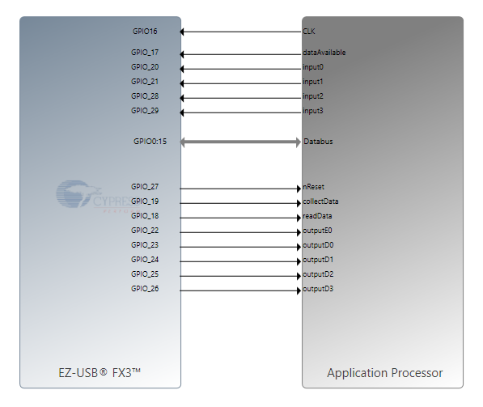
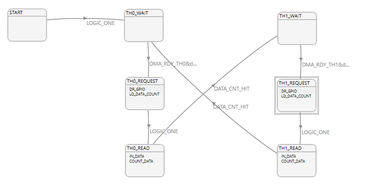
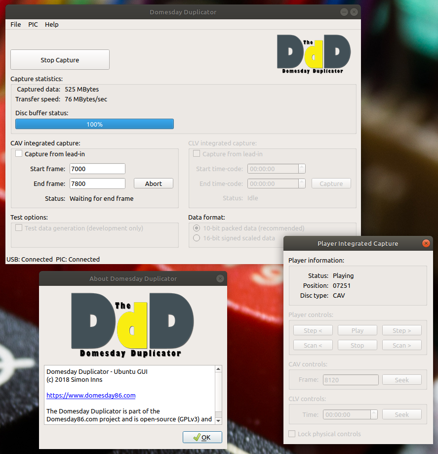
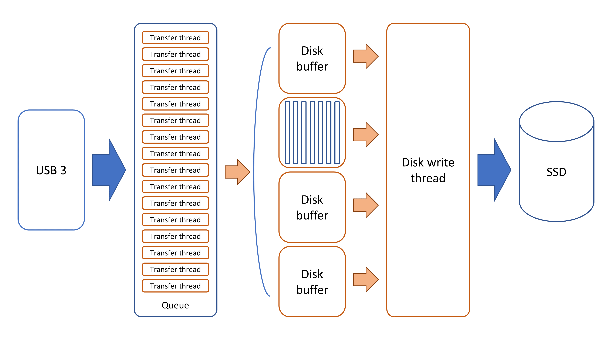

# Domesday Duplicator Software Guide

The Domesday Duplicator is a completely open-source and open-hardware solution.  All required files to construct the hardware and all of the source-code is available on Github. The Github repository contains the following items:

* Kicad schematics and PCB design
* FPGA Verilog HDL code for the DE0-Nano
* GPIF II state-machine design for the FX3
* FX3 firmware for the Cypress FX3 board
* Qt 6 GUI capture application for Linux, Windows and macOS

The Github repository is accessible via the following link: [Domesday Duplicator Github](https://github.com/simoninns/DomesdayDuplicator) 

Every component builds with ordinary, distribution-packaged tools, and the repository provides a Nix flake that supplies them all — see [Building locally](building-locally.md). The one exception is Cypress GPIF II Designer, which produces the FX3's parallel-interface state machine and is Windows-only. Its output is committed to the repository, so it is only needed in order to change the state machine.

# FPGA code
## Purpose
The DE0-Nano FPGA board is used to bridge the Domesday Duplicator's ADC hardware with the Cypress FX3 USB 3.0 board.  The code provides data manipulation, error checking and a 16K word FIFO to allow buffering in case of short constrictions of USB bandwidth to the host computer.  The FPGA code also contains a test data generation function that allows testing of the Domesday Duplicator with known test data (that can be verified as intact once received by the host application).

## Development environment
The FPGA code is built with **Intel Quartus Prime Lite 25.1**. Quartus is free and needs no licence file, but it is a multi-gigabyte download and is `x86_64` Linux or Windows only.

The project files were originally written by Quartus 16.0.2 and 18.0.0. Version 25.1 compiles them unchanged — no upgrade prompt and no source edits — although it does rewrite the `.qsf` in place to record the version that last touched it, which is why builds should be run out of tree.

**The GUI is not required at any point.** Compiling, converting and programming are all command-line tools, and the repository provides a development shell that supplies them:

```bash
nix develop .#fpga-quartus     # Quartus, plus the free tooling below
```

For editing, linting and simulating the Verilog you need no Quartus at all — those tools are free and cross-platform:

```bash
nix develop .#fpga             # verible, verilator, iverilog, gtkwave
./fpga/tests/run-lint.sh       # lint the hand-written modules
./fpga/tests/run-sim.sh        # run the testbenches
```

## USB device configuration
Programming the DE0-Nano needs user-space access to its onboard USB-Blaster. The repository ships the required udev rule, and the procedure — including the NixOS module that installs it alongside the FX3 rules — is on the **[Linux device access](hardware-programming/linux-device-access.md)** page.

!!! warning "If you followed an older version of this page"

    This section used to tell you to hand-write `/etc/udev/rules.d/40-altera-usbblaster.rules`. **Delete that file if you have it.** It grants access through `MODE="0666"` alone, which hands write access to every user and process on the machine rather than to the user at the console, and having two files matching the same device makes permission problems much harder to diagnose.

## Building and programming the DE0-Nano
Both steps are covered in full, with the output to expect at each stage and a troubleshooting table, on the **[FPGA bitstream](hardware-programming/fpga-bitstream.md)** page. In brief:

```bash
nix build .#bitstream                              # or ./fpga/build-local.sh
cd result
quartus_pgm DomesdayDuplicator_write_sof.cdf       # volatile, lost on power cycle
quartus_pgm DomesdayDuplicator_write_jic.cdf       # permanent, into the EPCS64
```

The `.cof` conversion setup and both `.cdf` programming files are committed, so no settings need entering by hand. Program the `.sof` first: it cannot leave the board in a bad state, so it is the safe way to test a bitstream before making it permanent.

The DE0-Nano User Manual, which documents the EPCS64 serial configuration device in section 9.1, is available from Terasic.

## Source code modules
### DomesdayDuplicator.v
This module is the top-level verilog module and contains the hardware mapping information for the communication between the FPGA and the ADC as well as the communication between the FPGA and the FX3. The module also includes instantiation code for the Intel IP PLL function, which generates the single 80 MHz system clock the whole design runs from. The ADC's 40 MHz sampling clock is a divide-by-two of that clock generated in the fabric, and the register that divides it also provides the sample enable, so the sampling instant and the ADC clock edge are aligned by construction. The top-level module includes the sub-modules 'dataGenerator', 'buffer' (and the 'fifo' it is built from, and the 'bufferMonitor' that watches it), 'fx3StateMachine' and 'spiRegisters'.  The purpose of these modules is described below.

### dataGenerator.v
The data generator module is responsible for generating data either from the ADC or (if in test mode) internally. When in test mode the generator outputs a repeating sequence of 10-bit numbers, 0 to 1020 inclusive.

The data generator also inserts a sequence number into the top 6 bits of each sample, so that the DomesdayDuplicator application can detect missing samples. The sequence numbers count repeatedly from 0 to 62 inclusive, incrementing every 65536 samples.

Data from the ADC is read on the system clock edge that also takes the ADC clock high — one sample every second cycle — and passed to the FIFO buffer.

The lengths of the test sequence (1021) and the sequence number sequence (63) were chosen in order to maximise the length of time before a USB transfer has the same contents as a previous transfer in test mode (about 210 seconds). The number of samples per sequence number was chosen to allow a length of blocks of missing samples up to 0.1s to be detected correctly; experimentation on a machine with an early USB3 controller showed maximum dropouts of about 0.01s under artifically heavy CPU load, so this gives some additional margin.

(In versions of the firmware before June 2022, there were no sequence numbers, and the test sequence ran from 0 to 1023. The DomesdayDuplicator application will still work with older firmware.)

### buffer.v
The buffering functionality is provided by a single FIFO of 16384 16-bit words, implemented in `fifo.v` rather than by vendor IP. It is written one word per sample and read one word per system clock cycle while the FX3 is taking a packet.

The FIFO is twice the packet size, and the packet size (8192 16-bit words) is chosen to match the USB end-point buffer size provided by the FX3 (16 Kbytes). The headroom above the packet is what a USB stall is paid for out of: 8192 words at 40 MSPS is about 205 µs of grace. The module has no collect enable: it buffers whatever `dataGenerator` produces for as long as the FPGA is out of reset.

`dataAvailable` is raised when a whole packet is queued and is then held for the length of that packet, so the FX3 is never told a packet is ready and then made to wait part-way through one. Samples are already 16 bits wide by the time they reach the buffer — `dataGenerator` packs the 10-bit ADC value and the 6-bit sequence number into one word — so no padding happens here. Data is only read from the FIFO while the `isReading` input is asserted, which `fx3StateMachine` holds for the duration of a transfer.

If the FX3 stops reading for long enough to fill the FIFO, the samples that do not fit are dropped and `bufferError` is raised and held long enough for the FX3 to see it. The sequence numbers in the stream let the host find the resulting gap.

(Before 2026 this module was two dual-clock `DCFIFO` instances in a 'ping-pong' arrangement, because a dual-clock FIFO cannot report an exact occupancy and so "is a whole packet ready" had to be answered by filling one buffer completely and swapping. With a single clock domain the occupancy is exact and one FIFO answers it directly.)

### bufferMonitor.v
The buffer monitor watches the FIFO and reports what it did, so that a host can tell a capture that was comfortable from one that nearly failed. It keeps the highest occupancy reached since it was last read and since reset, the number of overflow bursts and the samples they cost, the packets the FX3 has taken, and the time spent at or above three quarters of the depth. The host reaches all of it through registers `0x40` to `0x56` of the SPI register bank — see the [FPGA register interface](fpga-register-interface.md) page for the block and for the read that samples it.

**Every port but one is an output, and the exception reaches nothing else.** The module is given the occupancy, the write enable, the overflow condition and the read strobe, and it is given a one-clock pulse when a host reads the block; that pulse touches only this module's own registers. There is no path from the instrument back into the FIFO, its pointers, `dataAvailable` or the GPIF handshake, so a defect here can misreport a capture but cannot damage one. That is why it is a module of its own rather than a handful of counters added to `buffer.v`.

Reading it is a sampling operation rather than a stream: the link the figures leave by moves about a byte every 80 µs and the occupancy changes every 12.5 ns, so a read copies every counter into a shadow bank in a single clock and clears the interval counters. What comes back over the link is one coherent instant rather than nine counters caught at nine different ones.

A figure worth knowing before reading any of it: on a capture that is keeping up the peak is 8194 of 16384 words on every interval, because the FIFO fills to the 8192-word packet threshold, `dataAvailable` is registered on the next clock, and the FX3 begins draining a cycle or two later while the sampler is still adding a word every second clock. The overshoot is two words, and it is the same two words every time. A peak that *stops* being constant is the FX3 having been late.

### fx3StateMachine.v
The fx3StateMachine module implements the required mirror state-machine for the GPIF II implementation (detailed below).  The state-machine has two states:

1. state\_waitForRequest - The state-machine waits for the GPIF II state-machine to indicate a transfer is about to begin.
2. state\_sendPacket - The state-machine waits for 8192 clock cycles (whilst data is transferred) before returning to the waitForRequest state.

### spiRegisters.v
The spiRegisters module holds the registers that the FX3 reads and writes over the private SPI link between the two boards. It replaced statusLED.v, which used to run a chasing pattern on the DE0-Nano's eight LEDs to show that the gateware was alive.

The registers are a read-only identity block — a fixed signature, the register map version, build flags and the commit the gateware was built from — plus test mode, the LEDs, and (in the application image only) the capture buffer instrument's window at `0x40`–`0x56`. The LEDs are now driven by the FX3, which uses them to report capture state. The gateware lights one of them coming out of reset, so a board that is configured but has not yet been spoken to by the FX3 still looks different from one that is not configured at all.

The commit comes from `version.vh`, which `fpga/generate-version.sh` writes at build time. The copy committed beside the sources reports no commit, which is the honest answer for a lint or simulation run.

The module is a shift register and two counters, framed by chip select. It is deliberately one module rather than a slave and a register file with an interface between them, because what is worth testing is the whole path from an edge on a pin to a register that changed — and `fpga/tests/tb_spiRegisters.v` does exactly that, driving the link at the fastest rate the specification allows.

# Cypress FX3 firmware
## Purpose
The Cypress FX3 firmware provides a DMA driven data transfer between the FPGA and the USB 3 compatible host computer.  A GPIF state-machine design is used to automatically read data from the FPGA and transmit it via USB 3 with minimal interaction of the FX3's ARM processor. 

In addition the FX3 provides a set of generic input and output GPIOs to and from the FPGA.  Currently the firmware monitors the inputs from the FPGA and produces debugging information (via the serial console) if any signal is set, this is to assist with debugging the FPGA code.  Configuration of the FPGA is done through a register bank in the gateware, which the FX3 reaches over a private SPI link and exposes to the host through the vendor-specific commands 0xB7 and 0xB8 described below.

## Development environment
The FX3 firmware is C, built with `arm-none-eabi-gcc` and CMake against the Cypress FX3 SDK 1.3.5. A subset of that SDK is vendored in the repository at `fx3/sdk/`, so no SDK installation is needed. `fx3-mkimage`, this project's own tool, converts the linked ELF into the boot-loadable image; it replaces the SDK's proprietary `elf2img`. The GPIF II state-machine design is developed in Cypress GPIF II Designer 1.0, which is only available for Windows.

Full build instructions, covering both the Nix route and the toolchain-only route, are in `fx3/firmware/README.md` in the repository.

## Programming the FX3
The FX3 is programmed with `fx3-programmer`, a small libusb command-line tool built from this repository. It replaces the Cypress `cyusb_linux` GUI that earlier versions of this page described.

The full procedure — device access, both programming modes, and what to check at each step — is on the **[FX3 firmware](hardware-programming/fx3-firmware.md)** page. In brief:

```bash
# Close jumper J4 (PMODE) and power cycle the board to enter bootloader mode
fx3-programmer -l                   # list connected FX3 devices
fx3-programmer -u firmware.img      # load into RAM: volatile, lost on power cycle
fx3-programmer -p firmware.img -v   # write the I2C EEPROM and verify: permanent
```

Program to RAM first. It cannot leave the device in a bad state — a power cycle undoes it completely — so it is the safe way to find out whether an image works before making it permanent. Remove the J4 jumper and power cycle again once you are done.

## GPIF II
### IO Matrix
The following diagram shows the IO matrix configuration for the FX3 GPIF implementation: 



_Cypress GPIF I/O Matrix view_

The purpose of the signals are as follows:

* CLK - This is the GPIF clock supplied by the FPGA (80 MHz)
* dataAvailable - This signal indicates that there is sufficient data in the FPGA's FIFO buffer for a transfer
* Databus - The 16-bit data bus from the FPGA to the FX3
* nReset - (not) reset condition signal from the FX3 to the FPGA
* collectData - Flag from the FX3 to the FPGA that indicates if the FPGA should collect ADC data. The current gateware ignores this signal and collects continuously — see the note under command 0xB5 below
* readData - Flag from the FX3 to the FPGA indicating that a transfer is about to begin
* input0 - Generic input GPIO from the FPGA to the FX3 - carries the buffer overflow flag in the current gateware
* input1 - Generic input GPIO from the FPGA to the FX3 - unused by the current gateware
* input2 - Generic input GPIO from the FPGA to the FX3 - unused by the current gateware
* input3 - Generic input GPIO from the FPGA to the FX3 - unused by the current gateware
* spiClock - SPI clock from the FX3 to the FPGA, for the register interface below (was outputE0)
* spiMosi - SPI data from the FX3 to the FPGA (was outputD0)
* spiMiso - SPI data from the FPGA to the FX3 (was outputD1)
* spiChipSelectN - SPI chip select from the FX3 to the FPGA, active low (was outputD2)
* (reserved) - Wired but unused, held for a future out-of-band signal (was outputD3)

These five lines used to be five independent configuration bits, of which only test mode was ever used. Four of them now carry an SPI link to a register bank inside the gateware, which is what the vendor commands below reach.

### State machine
The following diagram shows the GPIF II state machine design for the FX3 GPIF implementation:



_Cypress GPIF State-machine view__

The state machine is designed to use the automatic transfer feature of the FX3 where the incoming data from the FPGA is automatically moved to the USB interface by the GPIF module with minimal interaction with the FX3's ARM processor.  The design uses two GPIF 'threads' to ensure minimum delay between transfers.  The GPIF design is configured with 16Kbyte buffers and data is automatically committed to the USB interface once a buffer is full. 

As the GPIF interface is synchronous both threads enter a wait state until the FPGA signals that enough data is available for a transfer.  Once this flag is received the GPIF changes to the 'request' state where it signals to the FPGA that a transfer is about to start (the TH0\_REQUEST and TH1\_REQUEST states repeat for 3 clock cycles to allow time for the FX3 to send the signal and the FPGA to receive it). 

Once the state-machine enters the read state, 8192 16-bit words of data are transferred between the FPGA and the FX3 (filling the available 16Kbyte buffer), the state-machine then commits the data to the USB interface and returns to a wait state.  This design allows for a deterministic transfer with minimal signalling complexity whilst allowing for the non-deterministic nature of the DMA ready state on the FX3 (the buffer 'ready' is unpredictable due to the reliance on the host computer to transfer data in a timely manner).  By using a combination of deterministic and non-deterministic states the GPIF design provides an asynchronous data transfer via the synchronous interface with minimal overhead to ensure high-bandwidth of data transfer. 

Since the FPGA to USB interface is 80MHz (twice the rate of capture) this design allows the USB interface to 'catch-up' rapidly whenever there is a drop in the bandwidth across the USB interface.

## Source code modules
### cyfx\_gcc\_startup.S
This file contains the proprietary start-up code necessary for the FX3 to function - Cypress why-oh-why would you not release this open-source?

### cyfxtx.c
This file contains the Cypress USB 3.0 Platform source file - again under a proprietary license (and necessary for the FX3 to function)

### domesday-duplicator.c
This file contains the main functions for the Domesday Duplicator firmware: device and GPIO initialisation, the application thread, the USB setup and event callbacks, and the start and stop of the capture path.

### domesday-duplicator.h
This file contains the definitions, buffer sizes and function prototypes for `domesday-duplicator.c`.

### domesday-duplicator-gpif.h
This file contains the state-machine definition code generated by the GPIF II designer application. It is generated, not hand-written — the original GPIF II Designer project is also included in the repository. 

### usb-descriptor.c
This file contains the USB descriptor information for the Domesday Duplicator USB device. The product string descriptor is generated at build time so that it carries the commit the firmware was built from.

## Vendor specific USB commands
The firmware handles three vendor specific USB commands: 0xB5, 0xB7 and 0xB8.

### Vendor specific command 0xB5 - Start/Stop data collection
The vendor specific command 0xB5 accepts a value of either 0 or 1. If called with a value of 1 the firmware drives the collectData signal high to tell the FPGA to begin sample data collection; a value of 0 drives it low again. The firmware also uses the command to bracket a capture for link power management purposes, described below.

!!! note "Not currently in use"

    Neither half of this command is live today. The capture application does not send 0xB5, and the current gateware ignores the collectData signal and collects continuously. The command is still implemented in the firmware and the pin is still wired, so restoring the mechanism would be a change to the gateware and the capture application rather than to the firmware.

### Vendor specific commands 0xB7 and 0xB8 - FPGA registers
The gateware holds a small bank of registers that the FX3 reaches over the private SPI link described above, and these two commands relay them to the host.  They replaced command 0xB6, which set the five configuration GPIO pins directly — those pins are now the SPI link itself.

`0xB7` reads registers: `wValue` is the first register address and `wLength` the number of bytes.  The address auto-increments in the gateware, so the whole identity block is one request.  `0xB8` writes one register, with the address in the high byte of `wValue` and the value in the low byte, which keeps it to a setup packet with no data stage.

Because the commands address registers rather than named settings, a register added to the gateware later needs no new firmware command and no new request number to become reachable from the host.

The registers are a read-only identity block — a signature, the register map version, build flags and the commit the gateware was built from — plus test mode and the status LEDs.  The FX3 refuses to relay a host write to the LED register, because it drives the LEDs itself to report capture state.

A device whose FPGA is unconfigured, or whose gateware predates this interface, stalls both commands.  That is not an error condition: capture works normally, and only the gateware version and the status LEDs are lost.

The full contract — pin assignment, SPI mode and timing, the register map, and why this is SPI rather than I2C — is on the [FPGA register interface](fpga-register-interface.md) page.


## USB power management
A USB 3.0 link spends its time in one of four power states: U0 (active), U1 and U2 (progressively deeper idle states, entered and left by the link hardware), and U3 (suspend, which only the host may put the device into and only the device may leave, by signalling remote wakeup). How the firmware treats each is a deliberate design point, because a capture device that gets it wrong either drops samples or stops the host machine from going to sleep.

### U1 and U2
The USB driver's own handling of U1 and U2 is left in place while the device is idle, so an attached-but-unused device does not hold the link at full power. While a capture is running — which the firmware learns from the 0xB5 start and stop commands — U1 and U2 entry is refused, both by `CyU3PUsbLPMDisable()` and by the firmware's LPM request callback. U2's exit latency is up to 2ms, which is long enough for the FPGA's FIFO to overflow mid-capture. Normal handling is restored on stop, and on every USB reset, connect and disconnect, as the FX3 SDK requires for USB compliance. Because nothing sends 0xB5 today, that suppression is dormant; the FX3's own driver still declines U1 and U2 whenever it has packets waiting to go out.

### U3, host sleep and hibernate
When the host suspends the bus, the firmware stops the FPGA collecting, discards anything still buffered, and then leaves the link alone. It does **not** try to bring the link back to U0: requesting U0 from U3 *is* remote wakeup signalling, and a device that does it wakes the machine up again the moment it tries to sleep. The device does not advertise remote wakeup in its configuration descriptors, because it has nothing to wake a sleeping host for.

On resume the firmware rebuilds the capture path from scratch — endpoint, DMA channel and GPIF state machine — rather than assuming any of it survived. A resume does not necessarily bring a `SET_CONFIGURATION` with it, so nothing else would restore the DMA channel, and a device that enumerates but never delivers another sample is indistinguishable from one that has died.

Hibernating a host removes VBus. That reaches the firmware as a VBus removal event, and the response is to take the USB connection down explicitly and wait for VBus to return before presenting the device again, so it re-enumerates cleanly rather than resuming onto a connection that was torn down underneath it.

### Link speed
The capture path is only started on a SuperSpeed connection; 40 million samples per second is far beyond what a USB 2.0 link can carry. On a 2.0 connection the device still enumerates and still answers control requests, so the host can reset the port and re-train at SuperSpeed — which is what some machines do when resuming from hibernate.

## Serial debug
The FX3 Superspeed explorer board provides a USB 2.0 service debug output.  Connecting this output to a suitable machine with a serial terminal allows monitoring of the debug information from the FX3 firmware. The FX3 serial debug output is 115200 bps 8N1. In order to access any serial port the Ubuntu user account must be a member of the dialout group.  Add your current user account to the dialout group using the following command:

```sudo adduser $USER dialout```

If you have problems getting the ttyACM device configured for use with the Cypress FX3 board, create (as root) the following file:

```/etc/udev/rules.d/49-cypressserial.rules```

Then place the following configuration in the rules file:

```
# 04b4:0007 - Cypress FX3 serial debug port
ATTRS{idVendor}=="04b4", ATTRS{idProduct}=="0007", ENV{ID\_MM\_DEVICE\_IGNORE}="1"
ATTRS{idVendor}=="04b4", ATTRS{idProduct}=="0007", ENV{MTP\_NO\_PROBE}="1"
SUBSYSTEMS=="usb", ATTRS{idVendor}=="04b4", ATTRS{idProduct}=="0007", MODE:="0666"
KERNEL=="ttyACM\*", ATTRS{idVendor}=="04b4", ATTRS{idProduct}=="0007", MODE:="0666"
```

Then issue the following command to re-read the USB configuration rules:

```sudo udevadm control --reload-rules```

# GUI capture application
## Purpose
The GUI application provides a capture front-end for the user. The application also provides a high-speed multi-threaded USB implementation that allows extremely high-speed data transfer from the FX3 in real-time. In addition, a multi-buffer disk IO implementation deals with writing the large amounts of capture data to disk in a timely manner. The application is also capable of sending vendor-specific USB commands to the Domesday Duplicator in order to control and configure the capture device. 



_Domesday Duplicator GUI application_

## Development environment
The application is C++20, built with CMake against Qt 6.2 or later (Core, Gui, Widgets and SerialPort), libusb-1.0 and libFLAC. It builds for Linux, Windows and macOS; Windows uses WinUSB in place of libusb. For instructions on how to build it please see [Building Locally](building-locally.md), which covers all three components, or
[Building from source](../legacy-gui/building-from-source.md) for the capture application alone.

## Source code modules
The application is split into a Qt front-end in `gui/src/DomesdayDuplicator/` and a Qt-free core in `gui/src/common/`, so the parts that handle sample data can be unit tested without Qt, libusb or hardware.

The Qt front-end modules are as follows:

* aboutdialog - the About window dialogue containing application info, GPL licence terms and credits
* advancednamingdialog - the advanced naming dialogue window and associated GUI logic
* amplitudemeasurement - the live RF amplitude plot shown during a capture
* automaticcapturedialog - the automatic capture dialogue window and associated GUI logic
* configuration - a class dealing with saving and loading the persistent configuration (used to save preferences)
* configurationdialog - the preferences dialogue window and associated GUI logic
* main - the Qt application start-up code
* mainwindow - the main window and associated GUI logic
* playercommunication - simple blocking serial communication to the LaserDisc player
* playercontrol - threaded player communication and automatic capture state-machine logic
* playerremotedialog - the player remote control dialogue window and associated GUI logic
* testdataanalysisdialog - the dialogue that reports the results of a test-data analysis
* ILogger / QtLogger - the logging interface and its Qt implementation
* StringUtilities - header-only UTF-8 and UTF-16 conversion helpers
* UsbDeviceBase - the capture pipeline, disk buffering and sample processing, independent of any USB library
* UsbDeviceLibUsb / UsbDeviceWinUsb - the two USB back-ends, libusb-1.0 and WinUSB
* qcustomplot - vendored third-party plotting library

The Qt-free core modules are as follows:

* captureformat - the capture output formats and their parameters
* samplecodec - the 10-bit and 16-bit sample packing and unpacking
* capturereader - reading captured files back
* flacwriter - Ogg FLAC capture output
* testdataanalyser - walks a captured file checking the test-pattern ramp is unbroken; this is the host half of the project's end-to-end capture integrity check, and is a product feature rather than a test

## Multi-threaded USB transfer architecture
The following diagram shows the approximate structure of the multi-threaded architecture used by the GUI application to achieve the required USB and disk bandwidth: 



_GUI transfer architecture. The queue entries are asynchronous transfers in flight rather than separate threads_

The USB interface is read through a queue of transfers that are all in flight at once, so the device is never left waiting for the host to ask for more data. These are asynchronous transfers rather than a thread each: libusb's asynchronous API on Linux and macOS, and overlapped IO through WinUSB on Windows. Each completion is written into the current disk buffer slot and the request is immediately resubmitted. The queue size and the disk buffer size are both configurable from the preferences dialogue.

The disk buffers are much larger than the individual transfers as, for optimal disk write performance, it is more efficient to write larger blocks of data rather than many smaller writes. Once a disk buffer is full it is marked as ready, and a separate processing thread picks it up, checks the sequence numbers for dropped samples, packs the sample data (10-bit, 16-bit or Ogg FLAC) and commits the result to disk.

A capture runs on three worker threads — a capture thread that owns the run, the USB transfer thread and the processing thread — alongside the Qt main thread that drives the interface. Both worker threads request realtime scheduling priority where the platform allows it, and the buffers are locked into physical memory so that a page fault cannot stall the capture.