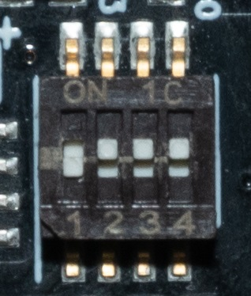

# Gain control and capture notes

Hardware configuration and operational notes that apply once the Domesday Duplicator is
built and programmed.

Programming itself is covered in [Hardware programming](../hardware-programming/index.md).

# DdD Gain Control (4 DIP Switch)

{ width="300" }

0000 is 1-2-3-4 dips, In orientation to bottom numbers up is 1 and down is 0

All selected in this up position is 1111 or 2.02 Minimum Gain When dip’s 2-3-4 are down it's 1000 this is the maximum gain of 8.5, the table below shows all possible positions.

| **Configuration** | **Switch Position** | **Gain** |
| ----------------- | ------------------- | -------- |
| 15                | 1111                | 2.02     |
| 7                 | 0111                | 2.17     |
| 11                | 1011                | 2.27     |
| 13                | 1101                | 2.45     |
| 3                 | 0011                | 2.54     |
| 14                | 1110                | 2.59     |
| 5                 | 0101                | 2.79     |
| 6                 | 0110                | 3.02     |
| 9                 | 1001                | 3.04     |
| 10                | 1010                | 3.34     |
| 1                 | 0001                | 3.8      |
| 12                | 1100                | 4        |
| 2                 | 0010                | 4.4      |
| 4                 | 0100                | 6        |
| 8                 | 1000                | 8.5      |

## Finishing Things to Note

- The .sha3-512 files are checksums that can be used to validate if a file is damaged and is easy to verify with [GTKHash](https://github.com/gtkhash/gtkhash/releases/tag/v1.5) or [RapidCRC](https://www.ov2.eu/programs/rapidcrc-unicode).

- Only use the DdD on its own USB 3.0 controller. Other devices can crash it. (You may want to add a dedicated USB 3.2 Gen 2 card if a desktop user who already uses your ports.)

- 16-bit sample mode outputs `.raw` rename to `.s16` for decoders to be able to use them.

- Start capture before starting player this applies to tapes more so.

- Keep RF cable runs as short as possible 15-20cm and ideally 100cm max externally with no harsh bends or kinks in the run inside or from the player.

- Windows control/capture application is portable, the installation directory does not matter.

- LED’s should be a striping blinking pattern when the DE0 is flashed correctly. 

- The DdD is not immune from stray RF and EMI, a shielded case is ideal to prevent this.

# Capture Application Setup

Downloads:

- [Linux](https://github.com/simoninns/DomesdayDuplicator/wiki/User-Guide\#installation)
- [Windows](https://github.com/simoninns/DomesdayDuplicator/releases/)
- [MacOS](https://github.com/simoninns/DomesdayDuplicator/releases/)

## RF Capture Modes 

40msps `.lds` (10-bit packed)

40msps `.raw` (singed 16-bit raw)

10msps `.cds` (4:1 decimated not used/supported anymore)

## Proper Readout Measurement

We now have a measurement of the signal in real-time, this allows you to adjust the gain level in real-time during your initial test capture and see if something is wrong or clipping in general.

In order to assemble the boards, you will need to cut two pins on the DdD board where the FX3 has 2 blank holes. A generic pair of flush cutters will do the trick.

Simply line up the boards and press carefully in the centre and sides to push the pin headers together.

DomesdayDuplicator should now show up in Device Manager.

DdD USB Device Driver Install (Windows) - required to re-do on each new system.

1) Open Device Manager and check if the device is present and flashed properly.

2) Use Windows DdD Device Driver -> zadig-2.5.exe -> WinUSB (or manually install the WinUSB driver to complete the DdD setup).

