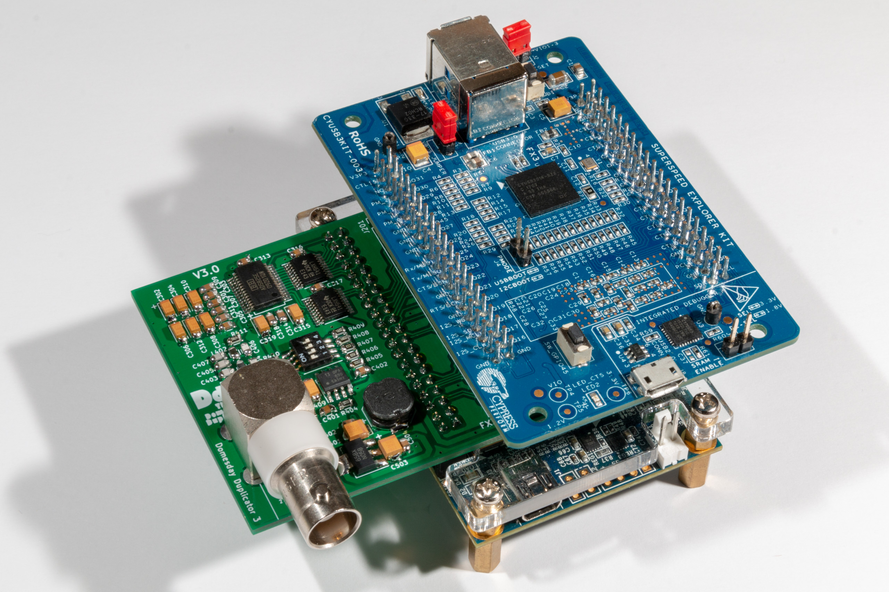
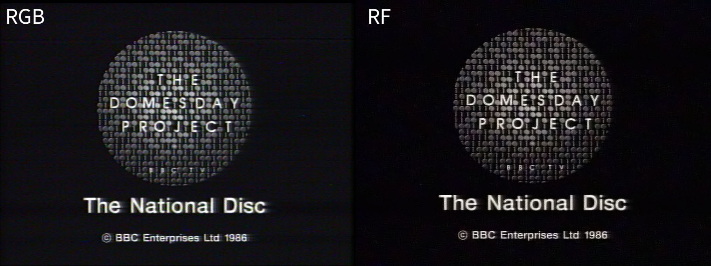
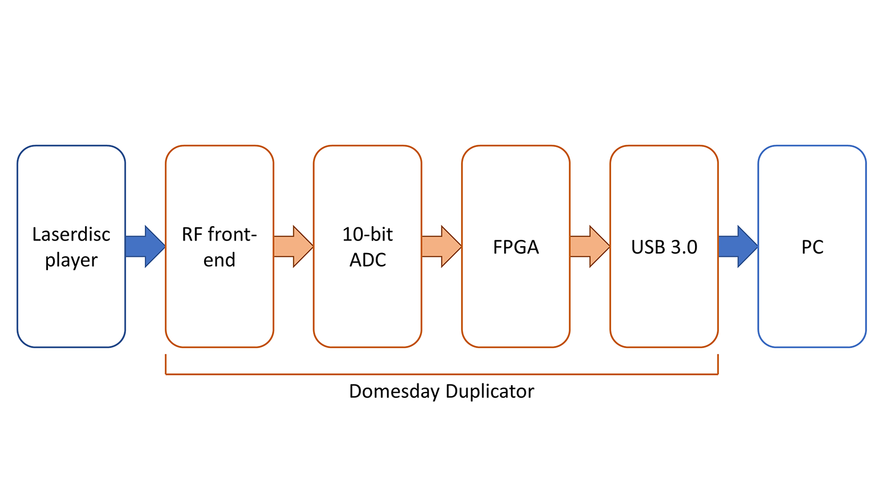
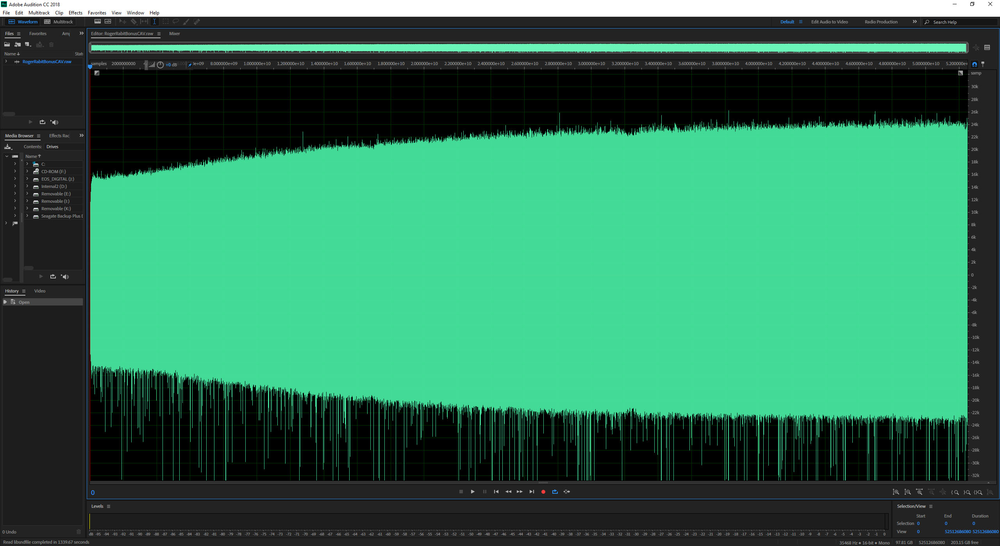
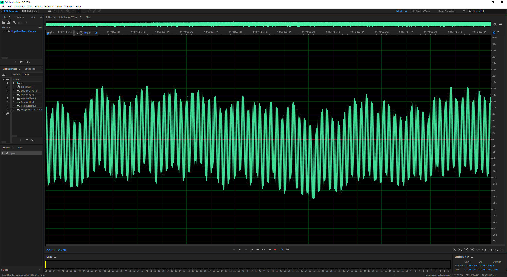
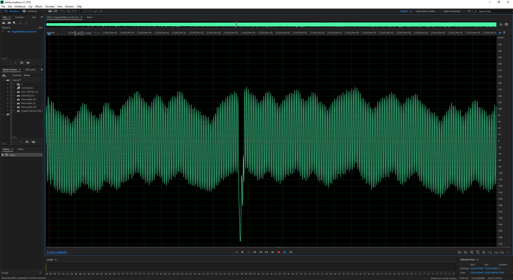

# Overview of the Domesday Duplicator

The Domesday Duplicator is intended to allow high-quality back-ups of the analogue information contained on the BBC Domesday laserdiscs by bypassing most of the 30-year-old electronics in the Philips VP415 player. Direct RF sampling also allows all information on the laserdiscs to be duplicated (unlike conventional RGB sampling of the video output). Since the BBC Domesday AIV laserdiscs are a combination of video, pictures, sound and data (as well as numerous VBI streams), direct RF sampling is the preferred method of preservation.  The Domesday Duplicator is not limited to duplicating just Domesday AIV laserdiscs and can be used to capture any type of laserdisc supported by the attached laserdisc player.

Note that the Pioneer LD-V4300D is used as a **reference and test player** by the project (and is noted as such in the documentation and guides) however, the Domesday Duplicator is proven to work with any well calibrated LaserDisc player (i.e. the player **does not** have to be a 4300).  Your chosen player should have a service manual available so you can a) find and access the RF test-point and b) calibrate the player according to the service manual instructions.

The Domesday Duplicator captures the raw RF signal from a laserdisc player’s laser.  The player provides the mechanical tracking, focus and movement of the laser over the disc’s surface and the duplicator records the signal.  This effectively turns the laserdisc player into a highly accurate optical scanner.  The resulting sample is the spiral of analogue data represented by the continuous track on the disc. The aim is to ensure that the sample resolution is higher than the resolution by which the disc was originally recorded.  This way you could (in theory) produce another disc from the copy – and that ‘round-trip’ preservation loop means you capture everything on the disc, even if you can’t decode it yet (or if there is data you didn’t know about).

Since the resulting sample is still a laserdisc, you need a laserdisc player to play it. Therefore, the next stage of development is to produce an emulated laserdisc player in software that will play the ‘disc’ and output the resulting sound, video and data (data being a complex mix of Acorn VFS partitions, frame data, VBI, teletext, etc.).  Of course, the better the emulator, the better the resulting video and sound – and it’s fairly easy to see how a fully digital emulated player could out-perform a 30 year old analogue VP415 (and the ‘samples’ won’t wear out or degrade like physical discs). 

The Domesday Duplicator project is completely open-source and open-hardware.  For details of how to obtain the source code and hardware files please see the [software overview page](../development/software-guide.md). The hardware is a USB3 based 10-bit analogue to digital converter that uses an FPGA to control the real-time sampling and USB3 to transfer the captured data in real-time to a PC. 

_The Domesday Duplicator 3_0_

The hardware/software solution was originally designed to act as a sampling front-end to the ld-decode (software decode of laserdiscs) project [https://github.com/happycube/ld-decode](https://github.com/happycube/ld-decode) and replaces the generic TV capture card to provide high-frequency sampling with 4 times the sample resolution.  Increasing the sample resolution allows better capture of disc overall however, the primary advantage is that the Domesday Duplicator provides better performance for weaker RF signals especially at the start of a laserdisc (where the RF output has lower amplitude) and when the disc is degraded due to age and surface damage. 

Domesday86 would like to thank Chad Page (the author of the ld-decode project) - without his tireless work producing ld-decode and his assistance in modifying the library to support the Domesday Duplicator project, this preservation method would not have been possible. 

The following image shows a comparison between RGB capture from a laserdisc player using standard video capture hardware and the output from the Domesday Duplicator RF capture after processing with ld-decode:

_Image showing a comparison of the same frame captured as RGB and as RF_

The following block-diagram shows the 4 high-level components of the Domesday Duplicator:

_Domesday Duplicator block diagram_

These components are described in more detail in the following sections: 

[Domesday Duplicator Capture Application](../capture-gui/index.md) 

[Domesday Duplicator Hardware Guide](../development/hardware-guide.md) 

[Domesday Duplicator Software Guide](../development/software-guide.md) 

The reference laserdisc player for the Domesday Duplicator project is the Pioneer LD-V4300D (**note**: this is the **reference player** (for development and testing) used by the project - the Domesday Duplicator works with any LaserDisc player that has an available service manual).  Information about the reference player is available from the following link:

[Pioneer LD-V4300D Overview](https://www.domesday86.com/?page_id=1176) 

The following diagram shows an RF sample of one side of a PAL laserdisc (103 Gbytes of data) sampled at 35.5 million samples per second (the 'spikes' from the lower part of the sample are optical drop-outs caused by imperfections on the disc surface as well as dust, etc.).  Note how the signal strength increases towards the end (outside) of a laserdisc: 

_PAL CAV Laserdisc RF sample (whole side)_

The following diagram shows a close up of the sampled RF signal: 

_Close-up of RF sample_

The following diagram shows a close-up of an optical drop-out (these imperfections cause the small black lines in the picture typical of laserdisc playback): 

_Disc snippet showing drop-out_
